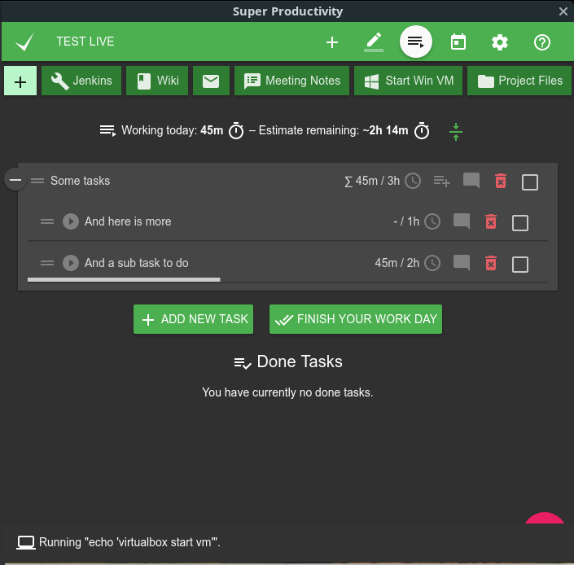
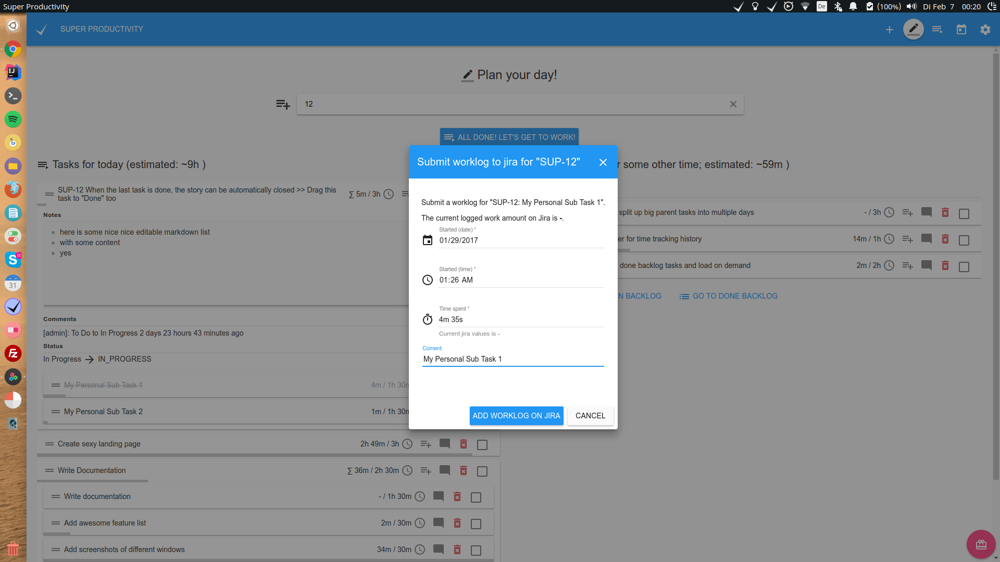
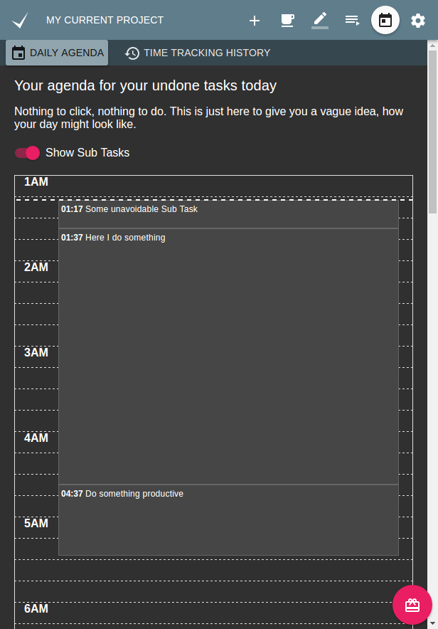
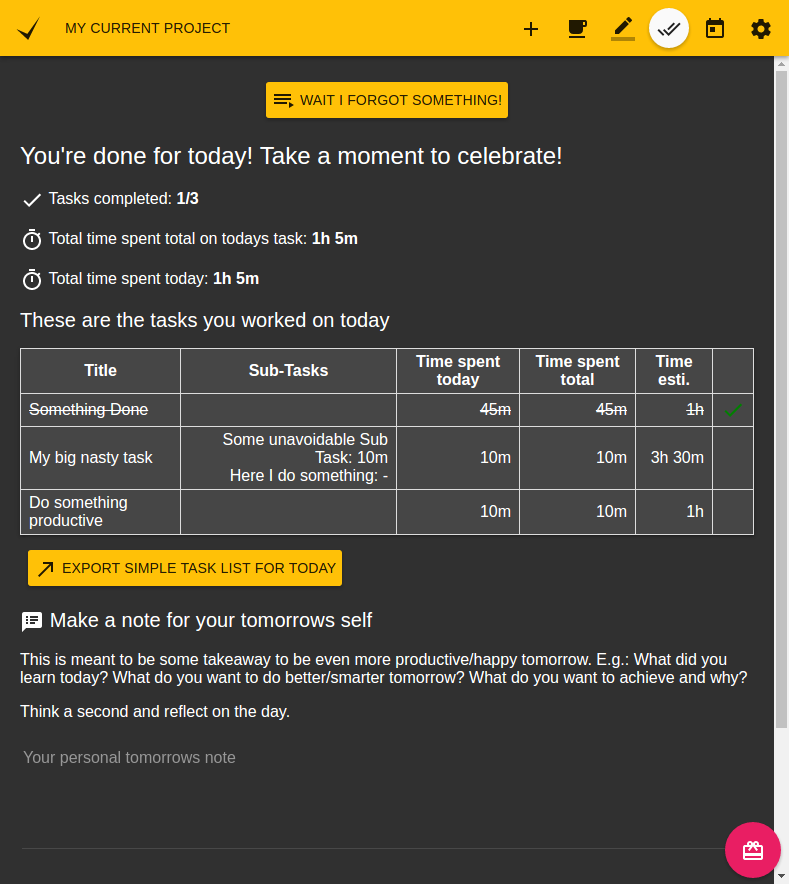
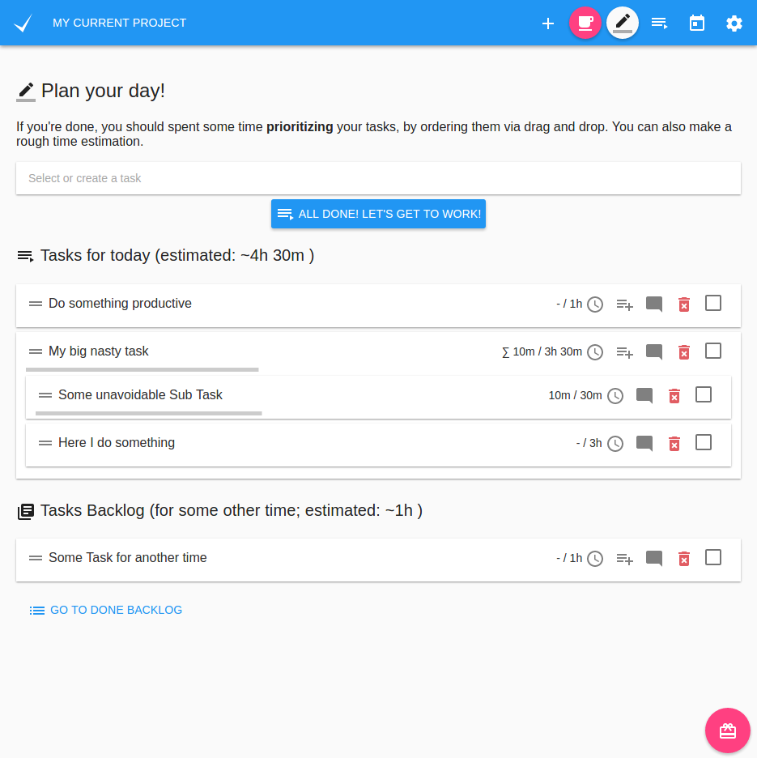
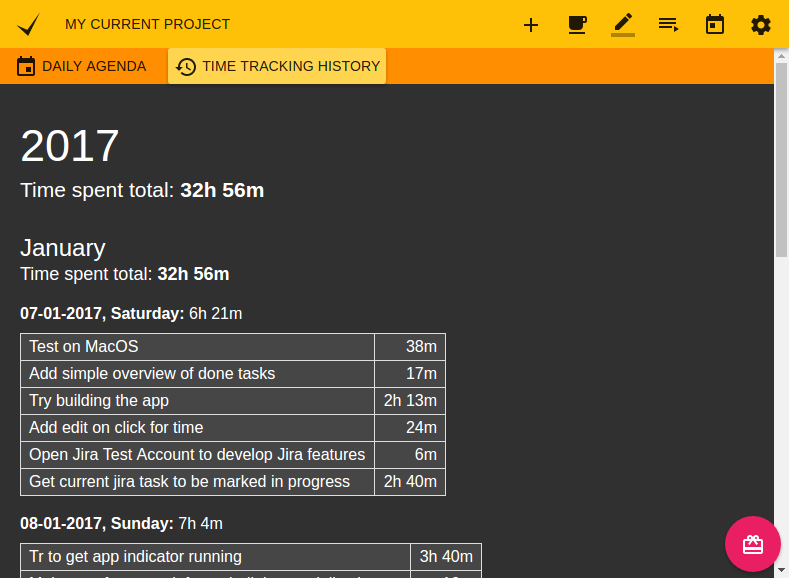

# Super Productivity

This is a ToDo List / Time Tracker / Personal Jira Task Manager for Linux, MacOS and Windows to make you work super productively. 



## Features
* Configurable and automatable Jira integration for: 
  * searching and adding tasks from jira
  * creating (local/personal) sub tasks for your jira tickets
  * worklogs (tracking your work to jira)
  * Setting transitions aka setting tickets to in progress or done
  * Automatic notifications once your (current) task has changed or been commented on jira => no messy email notifications required any more
* Time Tracking 
* Customizable Pomodoro Timer
* Sub Tasks
* Sexy global pinboard to add quick links and project related files
* Export your time sheets to Google Sheets 
* 'Take a break' reminder
* Daily Schedule
* Daily Summary
* Full Keyboard Support
* (Anti-) Distraction Pad
* Different Themes!

And much more!

## Web Version
Check out the [web-version](http://super-productivity.com) to get a quick idea of the app. But keep in mind it is more limited (no Jira integration, time tracking only works if the app is open).

## Downloads & Install
### Linux
Run `sudo snap install superproductivity` or install it manually from the [releases page](https://github.com/johannesjo/super-productivity/releases).

#### Ubuntu / Debian
```
#  add to sources
echo "deb https://dl.bintray.com/johannesjo/super-productivity stable super-productivity" | sudo tee -a /etc/apt/sources.list

# add bin tray key
wget -O - https://bintray.com/user/downloadSubjectPublicKey\?username\=bintray | sudo apt-key add -

# update sources and install
sudo apt-get update
sudo apt-get install superproductivity
```

### MacOS
* Install [superProductivity-latest.dmg from the releases page](https://github.com/johannesjo/super-productivity/releases).

### Windows
* Install [superProductivity_Setup_latest.exe from the releases page](https://github.com/johannesjo/super-productivity/releases).

## Gnome Shell Integration
There is also an extension which integrates the application into the status bar.
* [install most recent](https://github.com/johannesjo/gnome-shell-extension-super-productivity)
* [install from extensions.gnome.org](https://extensions.gnome.org/extension/1348/super-productivity-indicator/)

## Build and run for yourself
```
git clone https://github.com/johannesjo/super-productivity.git
cd super-productivity
# install electron, gulp, bower and node gyp globally
npm install -g electron node-gyp gulp bower
npm install && bower install
gulp build # or for dev run 'gulp'/'gulp serve' in a separate tab
npm start # on windows use "set NODE_ENV=DEV electron ./electron/main.js" instead
```

## Contributing
There are several ways to help. Publishing a bug or a feature request is a good first step. Also making it more popular by posting it on social media etc. is great, because it means more users, which in turn leads to more people testing the app and also more people contributing code.

**Pull requests** are of course also very welcome. Please make sure that you're following the [angular commit guidelines](https://github.com/angular/angular.js/blob/master/DEVELOPERS.md#commits) and to also include the issue number in your commit message, if you're fixing a particular issue (e.g.: `feat: add nice feature with the number #31`).

### Packaging the app
Packaging the app is done via [electron-builder](https://github.com/electron-userland/electron-builder). To start packaging run `npm run dist`. If you want to add new platforms and experiment with the build options the easiest way to do so is manipulating the `build` property in the [package.json](https://github.com/johannesjo/super-productivity/blob/develop/package.json), but you can also the [command line interface of electron builder](https://www.electron.build/cli).


## More Screenshots








Build with the awesome [electron](http://electron.atom.io/).
