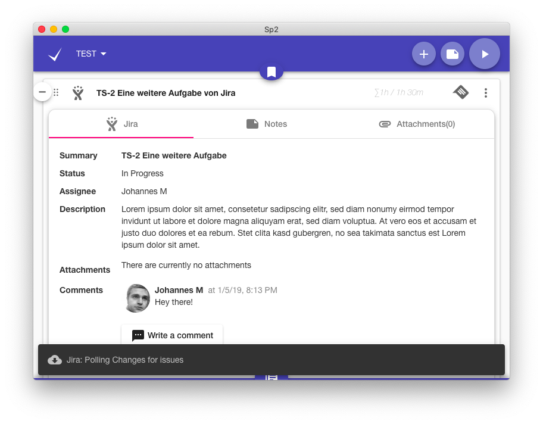
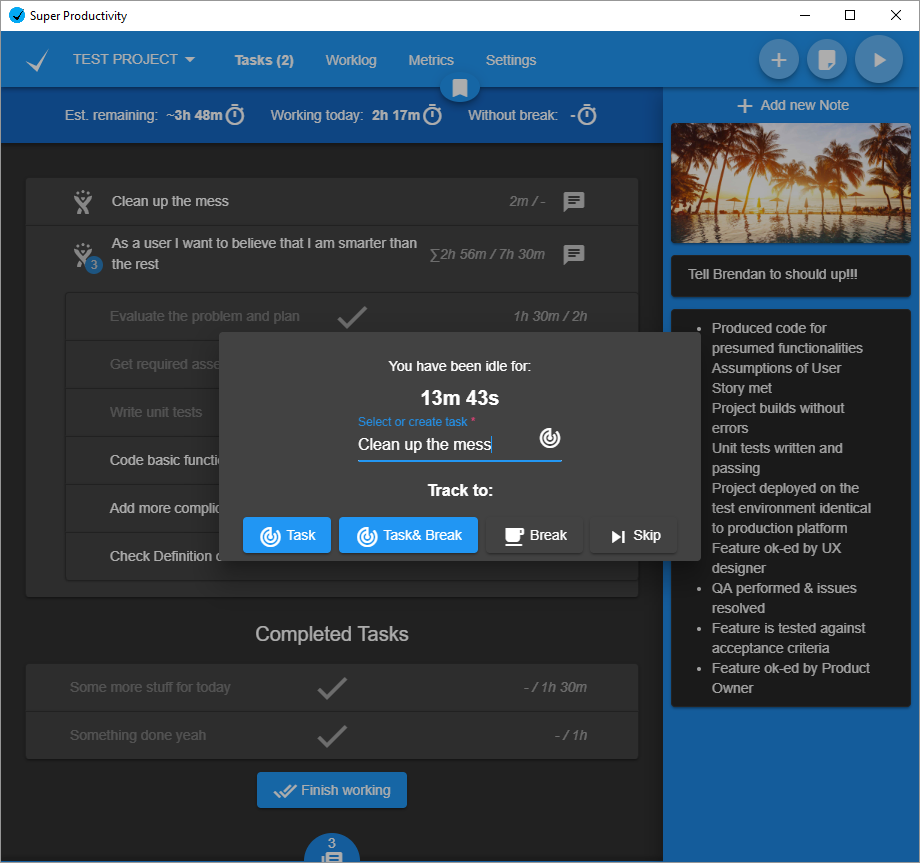
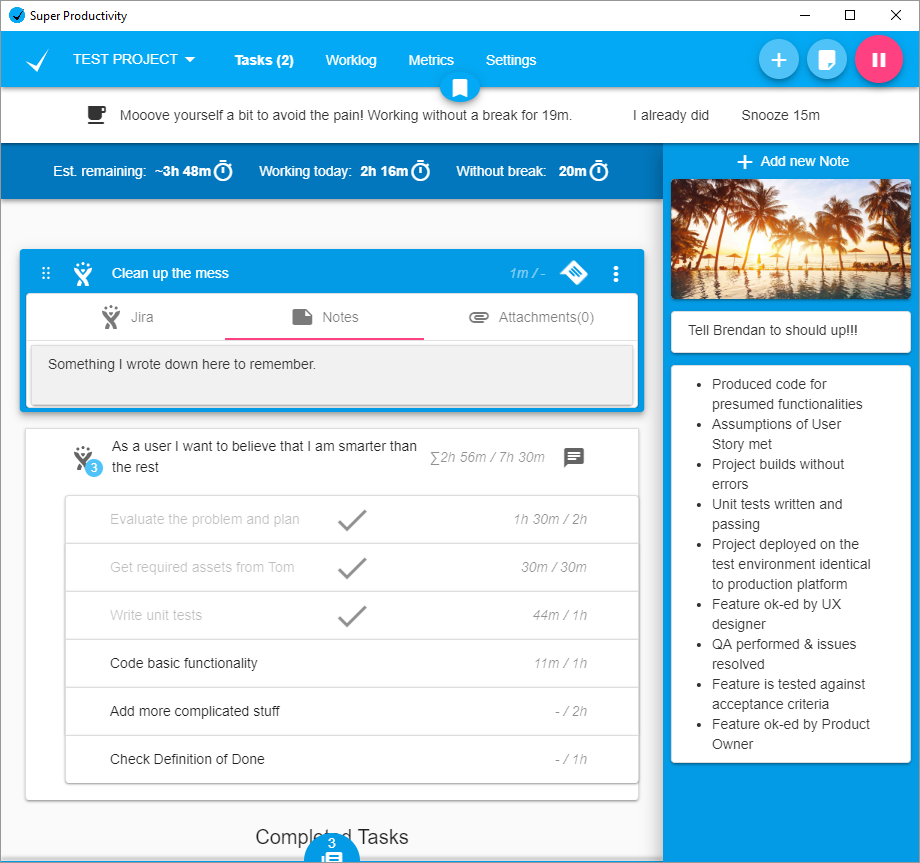
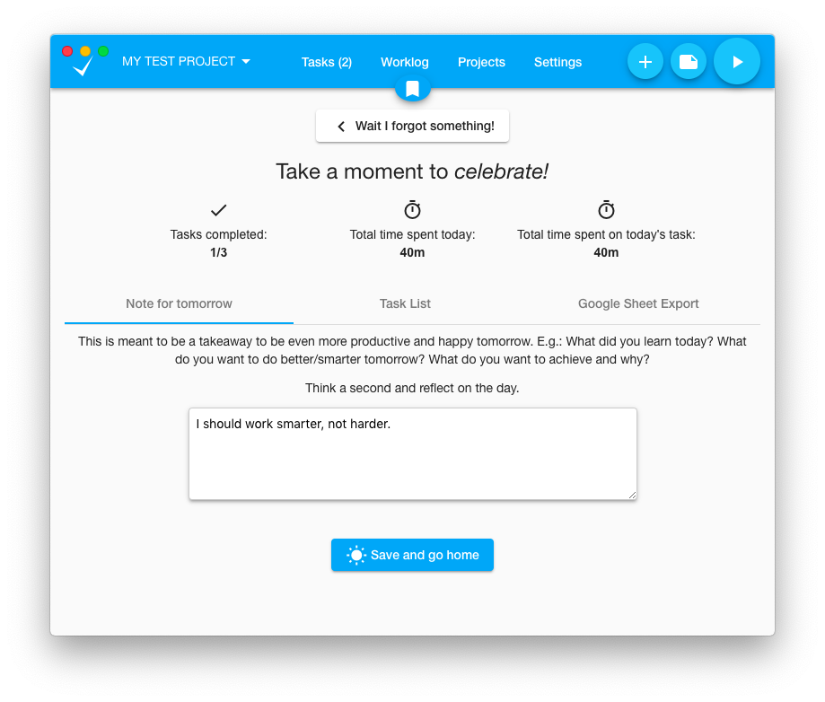
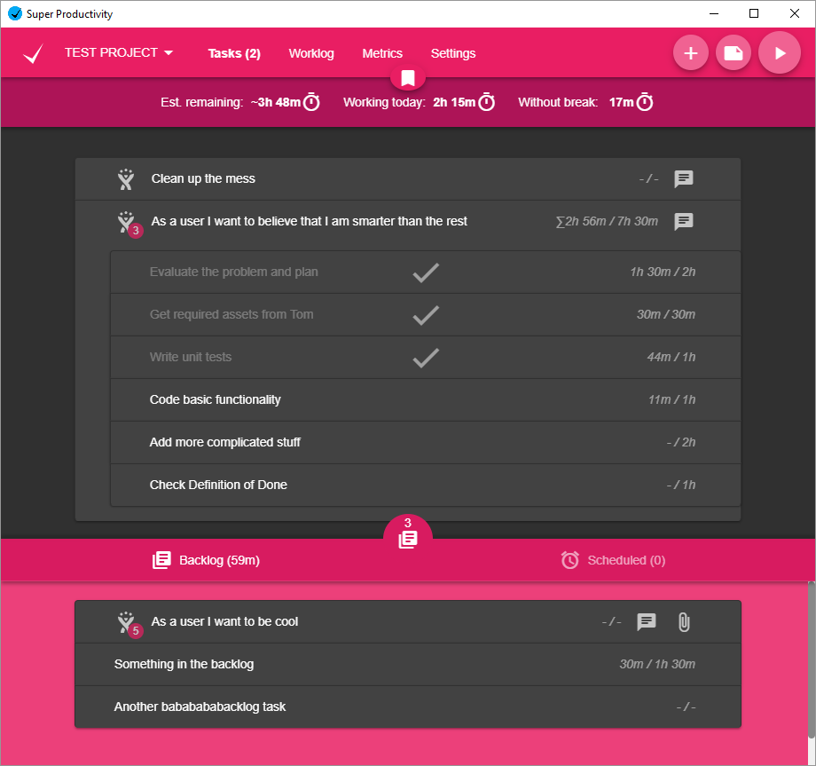
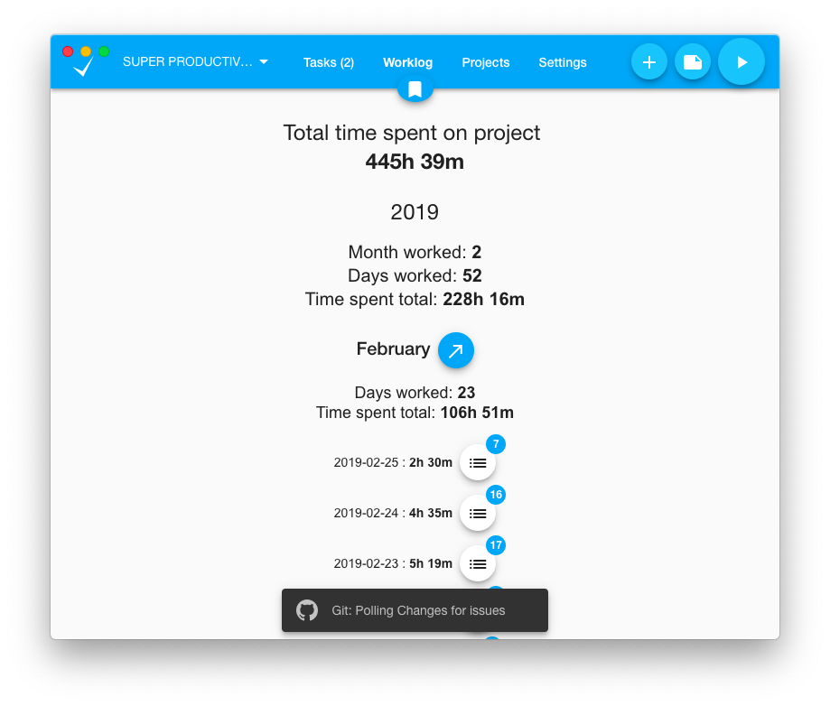
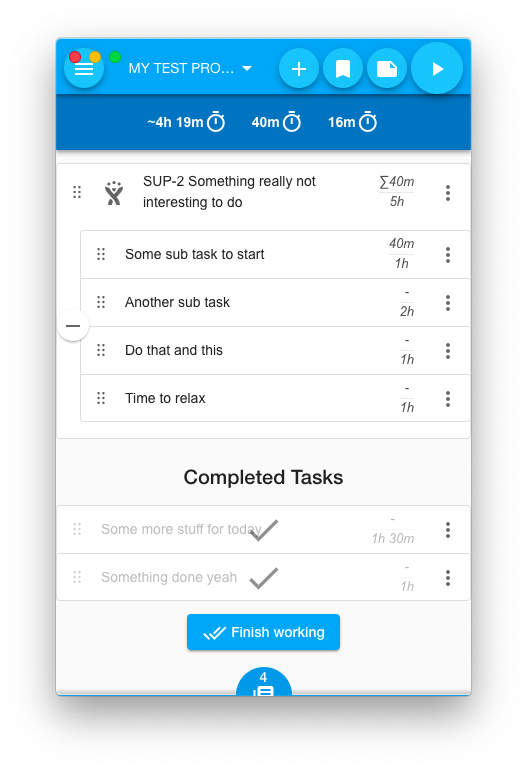

# Super Productivity
[](https://github.com/ellerbrock/open-source-badges/)
<a href="https://snapcraft.io/superproductivity">
  
</a>
<a href='//www.microsoft.com/store/apps/9nhfvg8361tw?cid=storebadge&ocid=badge'></a>
[](https://lbesson.mit-license.org/)

Organize your daily tasks at one place while making time tracking a lot less annoying. Super Productivity is a ToDo List / Time Tracker / Personal Jira Task Manager for Linux, MacOS and Windows aimed at reducing the time you spend with repetive tasks and to provide you with a place to collect all the information you need to do your job.

<a href="https://www.youtube.com/watch?v=VoF2_RSdNXA"></a>

## Features
* **Full control over your data**, no tracking, no user accounts, no cloud
* Sub Tasks
* Time Tracking 
* Sexy global bookmark bar to add quick links, project related files and even commands and applications
* Sexy note functionality with custom reminders 
* Pomodoro timer
* Export your time sheets to Google Sheets  (optional of course)
* 'Take a break' reminder
* Full Keyboard interaction
* Different Themes!
* Sync data between multiple instances 
* Mobile support
* Configurable and automatable Jira integration for: 
  * searching and adding tasks from jira
  * creating (local/personal) sub tasks for your jira tickets
  * Setting transitions aka setting tickets to in progress or done
  * Automatic notifications once your (current) task has changed or been commented on jira => no messy email notifications required any more
* Configurable and automatable Git integration for:
  * searching and adding tasks from git 
  
And much more!

## Web Version
Check out the [web-version](http://super-productivity.com). It is a little bit more limited (time tracking only works if the app is open and idle time tracking is disabled).

If you want the Jira Integration to work you have also to download and install the [Super Productivity Chrome Extension](https://chrome.google.com/webstore/detail/super-productivity/ljkbjodfmekklcoibdnhahlaalhihmlb).

## Downloads & Install
### All Platforms
[Install from the releases page](https://github.com/johannesjo/super-productivity/releases).

### Windows
<a href='//www.microsoft.com/store/apps/9nhfvg8361tw?cid=storebadge&ocid=badge'></a>

### Linux
```
# stable
sudo snap install superproductivity

# edge channel releases
 sudo snap install --channel=beta superproductivity
```
<a href="https://snapcraft.io/superproductivity">
  
</a>

### MacOS
Install via [homebrew cask](https://github.com/caskroom/homebrew-cask) (project might not always be up to date):
```
brew cask install superProductivity
```

## Setup WebDAV Syncing
When starting the app via the command line the path to where emergency backups are saved is printed out to the command line. Just take away the `/backup` sub folder from the path and use the remaining path to sync via the cloud.

## More Screenshots









## Contributing
There are several ways to help. Publishing a bug or a feature request is a good first step. Also making it more popular by posting it on social media etc. is great, because it means more users, which in turn leads to more people testing the app and also more people contributing code.

**Please Share!**

[![alt text][1.1]][1]
[![alt text][2.1]][2]

<!-- icons with padding -->
[1.1]: http://i.imgur.com/tXSoThF.png (twitter icon with padding)
[2.1]: http://i.imgur.com/P3YfQoD.png (facebook icon with padding)

<!-- icons without padding -->
[1.2]: http://i.imgur.com/wWzX9uB.png (twitter icon without padding)
[2.2]: http://i.imgur.com/fep1WsG.png (facebook icon without padding)

<!-- links to your social media accounts -->
[1]: https://twitter.com/intent/tweet?text=Super%20Productivity%20%20https%3A%2F%2Fsuper-productivity.com
[2]: https://www.facebook.com/sharer/sharer.php?u=https://super-productivity.com/


**Pull requests** are of course also very welcome. Please make sure that you're following the [angular commit guidelines](https://github.com/angular/angular.js/blob/master/DEVELOPERS.md#commits) and to also include the issue number in your commit message, if you're fixing a particular issue (e.g.: `feat: add nice feature with the number #31`).

### How to contribute 
#### Setup
Follow these steps if you want to contribute to the project. These instructions are made for Windows but Mac or Linux could be easily extrapolated.
1. Install latest LTS nodejs version 10 from https://nodejs.org. Chose the right version for your OS
2. Fork the original Super Productivity repo into your space
    
3. Clone new Forked repo from your space
    * Usually first create a directory for all your projects (for example c:\source)
    * Open bash or cmd.exe
    * cd c:\source
    * git clone https://github.com/[your-user-name]/super-productivity.git
    * cd super-prodactivity
4. Install dependencies
    * npm install
    * npm install -g @angular/cli

5. Setup remote that points at the original repo, that way you can always integrate all hte latest changes from the original repo

    * git remote add upstream https://github.com/johannesjo/super-productivity

    You now have two remotes for this project on disk: 
    * origin which points to your GitHub fork of the project. You can read and write to this remote.*
    * upstream which points to the main project’s GitHub repository. You can only read from this remote.
6. Update your repo with latest code
    * git checkout master
    * git pull upstream master && git push origin master
7. Do some work in a new branch!!!!
    
      Checkout a new branch for example
    * git checkout -b hotfix/readme-update
8. Do you normal developement checkin code (git add, git commit -am "My Cool checkin" etc.)
9. Create a pull request
    * git push -u origin hotfix/readme-update
    * This will create the branch on your GitHub project. The -u flag links this branch with the remote one, so that in the future, you can simply type git push origin
10. Go to your Fork in the browser https://github.com/[your-user-name]/super-productivity
    * You will see your recently pushed branches
    * Now you can press the button "Compare & pull request"
11. Respond to a code review (https://lornajane.net/posts/2015/code-reviews-before-you-even-run-the-code)


#### Developement
Branch! **Always branch for each feature you do** refer to previous section
1. You can run and develop in Chrome with  [redux dev tools](https://chrome.google.com/webstore/detail/redux-devtools/lmhkpmbekcpmknklioeibfkpmmfibljd?hl=de). 
    * Install the extention into Chrome
    * run "ng serve" command from the command promt
    * Afterwards you can open http://localhost:4200 in your browser. 
    * Do some fun developent

2. If you want to run the app standalone do the following:
```
ng serve

# in a new console tab
npm start
```

### Packaging the app
Packaging the app is done via [electron-builder](https://github.com/electron-userland/electron-builder). To start packaging run `yarn dist`. If you want to add new platforms and experiment with the build options the easiest way to do so is manipulating the `build` property in the [package.json](https://github.com/johannesjo/super-productivity/blob/develop/package.json), but you can also use the [command line interface of electron builder](https://www.electron.build/cli).
