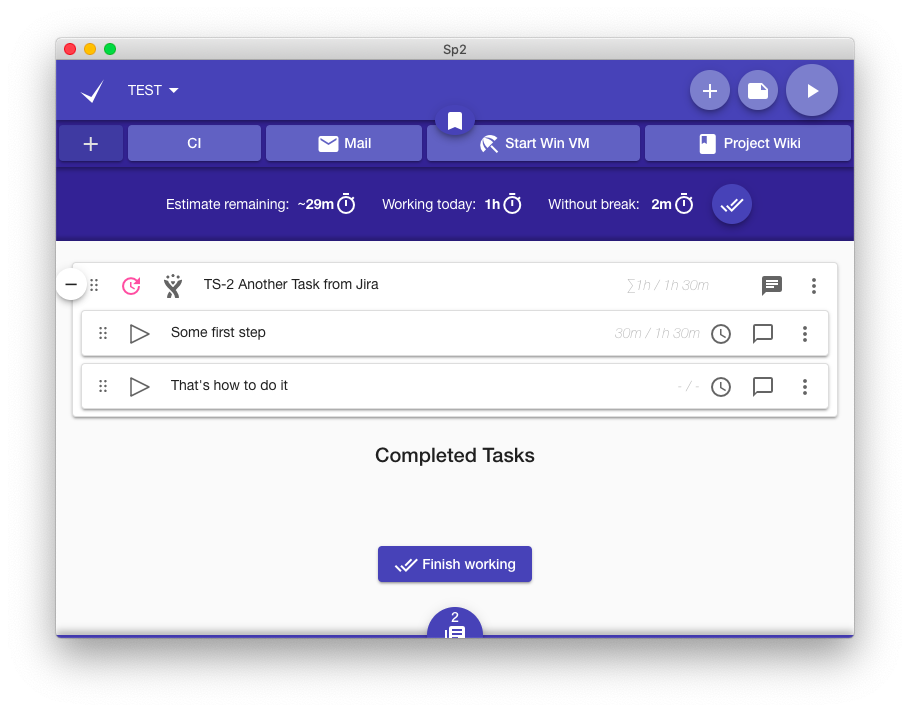
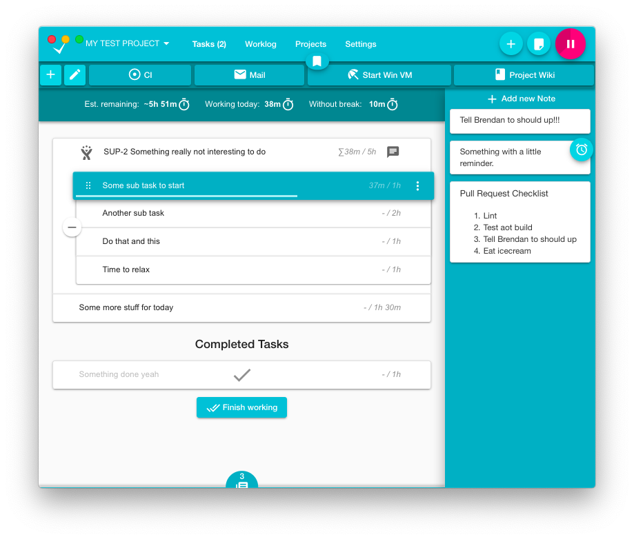

# Super Productivity
[](https://github.com/ellerbrock/open-source-badges/)
<a href="https://snapcraft.io/superproductivity">
  
</a>
<a href='//www.microsoft.com/store/apps/9nhfvg8361tw?cid=storebadge&ocid=badge'></a>
[](https://lbesson.mit-license.org/)


This is a ToDo List / Time Tracker / Personal Jira Task Manager for Linux, MacOS and Windows to make you work super productively. Organize yourself at one place while making time tracking a lot less annoying.


## Features
* **Full control over your data**, no tracking, no user accounts, no cloud
* Sub Tasks
* Time Tracking 
* Sexy global bookmark bar to add quick links, project related files and even commands and applications
* Sexy note functionality with custom reminders 
* Pomodoro timer
* Export your time sheets to Google Sheets  (optional of course)
* 'Take a break' reminder
* Full Keyboard interaction
* Different Themes!
* Sync data between multiple instances 
* Mobile support
* Configurable and automatable Jira integration for: 
  * searching and adding tasks from jira
  * creating (local/personal) sub tasks for your jira tickets
  * Setting transitions aka setting tickets to in progress or done
  * Automatic notifications once your (current) task has changed or been commented on jira => no messy email notifications required any more
* Configurable and automatable Git integration for:
  * searching and adding tasks from git 
  
And much more!

## Web Version
Check out the [web-version](http://super-productivity.com). It is a little bit more limited (time tracking only works if the app is open and idle time tracking is disabled).

If you want the Jira Integration to work you have also to download and install the [Super Productivity Chrome Extension](https://chrome.google.com/webstore/detail/super-productivity/ljkbjodfmekklcoibdnhahlaalhihmlb).

## Downloads & Install
### All Platforms
[Install from the releases page](https://github.com/johannesjo/super-productivity/releases).

### Windows
<a href='//www.microsoft.com/store/apps/9nhfvg8361tw?cid=storebadge&ocid=badge'></a>

### Linux
```
# stable
sudo snap install superproductivity

# edge channel releases
 sudo snap install --channel=beta superproductivity
```
<a href="https://snapcraft.io/superproductivity">
  
</a>

### MacOS
Install via [homebrew cask](https://github.com/caskroom/homebrew-cask) (project might not always be up to date):
```
brew cask install superProductivity
```

## Setup WebDAV Syncing
When starting the app via the command line the path to where emergency backups are saved is printed out to the command line. Just take away the `/backup` sub folder from the path and use the remaining path to sync via the cloud.

## More Screenshots




## Build and run for yourself
```
git clone https://github.com/johannesjo/sp2.git
cd super-productivity
yarn # or npm install
ng serve
```

## Contributing
There are several ways to help. Publishing a bug or a feature request is a good first step. Also making it more popular by posting it on social media etc. is great, because it means more users, which in turn leads to more people testing the app and also more people contributing code.

**Pull requests** are of course also very welcome. Please make sure that you're following the [angular commit guidelines](https://github.com/angular/angular.js/blob/master/DEVELOPERS.md#commits) and to also include the issue number in your commit message, if you're fixing a particular issue (e.g.: `feat: add nice feature with the number #31`).

### Packaging the app
Packaging the app is done via [electron-builder](https://github.com/electron-userland/electron-builder). To start packaging run `yarn dist`. If you want to add new platforms and experiment with the build options the easiest way to do so is manipulating the `build` property in the [package.json](https://github.com/johannesjo/super-productivity/blob/develop/package.json), but you can also use the [command line interface of electron builder](https://www.electron.build/cli).
