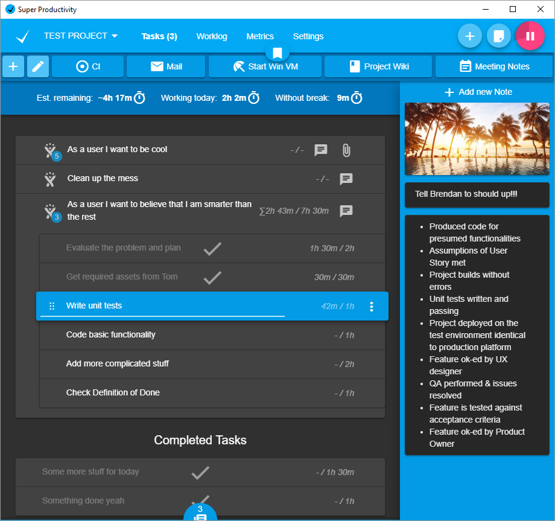

<a href="https://super-productivity.com/">
  
</a>

<br>
<br>

<p align="center">
<strong>An advanced todo list app with timeboxing & time tracking capabilities that supports importing tasks from your calendar, Jira, GitHub and others</strong>
<p>
  
<p align="center">:globe_with_meridians: <a href="https://app.super-productivity.com">Open Web App</a> or :computer: <a href="https://github.com/johannesjo/super-productivity/releases">Download</a></p>

<br>

<p align="center">
<a href="https://youtu.be/_mvMXWLsL-8">
    
</a>
</p>
<br>

<p align="center">
      
</p>

<br>
<br>

[](https://vshymanskyy.github.io/StandWithUkraine)

<p align="center" style="text-align: center;">
<a href="https://lbesson.mit-license.org">
  
</a>
<a href="https://github.com/johannesjo/super-productivity/releases">
  
</a>
<a href="https://community.chocolatey.org/packages/super-productivity">
  
</a>
<a href="https://www.producthunt.com/posts/super-productivity">
  
</a>
<a href="https://www.reddit.com/r/superProductivity/">
  
</a>
<a href="https://mastodon.social/@superproductivity">
  
</a>
<a href="https://x.com/intent/post?text=Super%20Productivity%20%20https%3A%2F%2Fsuper-productivity.com">
  
</a>
</p>

<p align="center" style="text-align: center;">
  
<a href='https://flathub.org/apps/com.super_productivity.SuperProductivity' target="_blank">
  
  </a>
  
<a href="https://snapcraft.io/superproductivity" target="_blank">
  
</a>
<a href='//www.microsoft.com/store/apps/9NHFVG8361TW?cid=storebadge&ocid=badge' target="_blank">
  
</a>
<a href='//apps.apple.com/de/app/super-productivity/id1482572463?l=en&mt=12' target="_blank">
  
</a>
<a href='//play.google.com/store/apps/details?id=com.superproductivity.superproductivity' target="_blank">
  
</a>
<a href='//f-droid.org/en/packages/com.superproductivity.superproductivity' target="_blank">
  
</a>
<a href='http://apps.obtainium.imranr.dev/redirect.html?r=obtainium://add/https://github.com/johannesjo/super-productivity/releases'>
  
</a>
</p>

<br>

## :heavy_check_mark: Features

- **Keep organized and focused!** Plan and categorize your tasks using sub-tasks, projects and tags and color code them as needed.
- Use **timeboxing** and **track your time**. Create time sheets and work summaries in a breeze to easily export them to your company's time tracking system.
- Helps you to **establish healthy & productive habits**:
  - A **break reminder** reminds you when it's time to step away.
  - The **anti-procrastination feature** helps you gain perspective when you really need to.
  - Need some extra focus? A **Pomodoro timer** is also always at hand.
  - **Collect personal metrics** to see, which of your work routines need adjustments.
- Integrate with **Jira**, **Trello**, **GitHub**, **GitLab**, **Gitea** and **OpenProject**. Auto import tasks assigned to you, plan the details locally, automatically create work logs, and get notified immediately, when something changes.
- Basic [**CalDAV**](https://github.com/johannesjo/super-productivity/blob/master/docs/caldav.md) integration.
- Back up and synchronize your data across multiple devices with **Dropbox** and **WebDAV** support
- Attach context information to tasks and projects. Create **notes**, attach **files** or create **project-level bookmarks** for links, files, and even commands.
- Super Productivity **respects your privacy** and **does NOT collect any data** and there are no user accounts or registration. **You decide where you store your data!**
- It's **free** and **open source** and always will be.

And much more!

<a href="https://youtu.be/_mvMXWLsL-8"></a>

## :question: How to use it

If you need some help, [this article on dev.to is the best place to start](https://dev.to/johannesjo/getting-started-with-super-productivity-2791).

If you prefer, there is also a (long) [YouTube video available](https://www.youtube.com/watch?v=VoF2_RSdNXA).

There is another older – the app looks and feels much better now ;) – [article](https://dev.to/johannesjo/super-productivity-how-to-grow-fond-of-time-tracking-and-task-management-22ee) on how I personally might use the app - and still [another one](https://dev.to/johannesjo/the-prioritising-scheme-how-to-eat-the-frog-with-super-productivity-mlk) on how I implement the 'eat the frog' prioritizing scheme in the app.

[If you have further questions, please refer to the discussions page](https://github.com/johannesjo/super-productivity/discussions).

<details>
<summary> <b>⌨ Keyboard shortcuts and short-syntax</b></summary>

### Keyboard shortcuts (most important)

- `Shift`+`P`: Open create project dialog
- `Shift`+`A`: Open add task bar
- `Enter`: Edit currently focussed task title
- `Arrow keys`: Navigate around task list
- `D`: Mark currently focused task as done
- `A`: Add subtask to currently focused task
- `Y`: Toggle tracking time to currently focused task
- `S`: Open schedule dialog for currently focused task
- `Backspace`: Delete currently focused task
- `ArrowRight`: Open additional info panel for currently focused task
- `Ctrl`+`Shift`+`ArrowUp`: Move currently focused task up in list
- `Ctrl`+`Shift`+`ArrowDown`: Move currently focused task down in list

### Short-Syntax

Can be used when adding a task. <strong>(Each of these can be disabled in settings->short syntax)</strong>

- `# <tag-name>`: add a tag to the task  
  (`"task-description #tag1"`)
- `<number>m` or `<number>h`: set time-estimate for the task  
  (`"task-description 10m"` or `"task-description 5h"`)
- `@<time>`: add due time to the task
  (`"task-description @fri 10pm"`)
- `+ <project-name>`: add the task to an existing project  
  (`"task-description +Important Project"`)
- `Ctr + 2`: toggle between moving the new task to the bottom and top of the list

</details>

## :globe_with_meridians: Web Version

Check out the web version even though it is a bit limited: Time tracking only works if the app is open and for idle time tracking to work, the chrome extension must be installed.

If you want the Jira integration and idle time tracking to work, you also have to download and install the [Super Productivity Chrome Extension](https://chrome.google.com/webstore/detail/super-productivity/ljkbjodfmekklcoibdnhahlaalhihmlb).

## :computer: Downloads & Install

### All Platforms

[Install from the releases page](https://github.com/johannesjo/super-productivity/releases).

### Windows

Due to certification issues it's recommended to download the app from the Microsoft Store:

<a href='//www.microsoft.com/store/apps/9nhfvg8361tw?cid=storebadge&ocid=badge'></a>

You can also install the app using [Chocolatey](https://community.chocolatey.org/packages/super-productivity):

```powershell
choco install super-productivity
```

### Linux

#### Snap - Most distributions

Install via command-line:

```bash
# stable
sudo snap install superproductivity

# edge channel releases
sudo snap install --channel=edge superproductivity

# it is also recommended to disable updates to the app while it is running:
sudo snap set core experimental.refresh-app-awareness=true
```

<a href="https://snapcraft.io/superproductivity">
  
</a>

#### Flatpak - Most distributions

Must install Flatpak first. See [setup instructions for all distributions](https://flathub.org/setup).

Install via command-line:

```bash
# install
flatpak install flathub com.super_productivity.SuperProductivity

# run
flatpak run com.super_productivity.SuperProductivity
```

<a href='https://flathub.org/apps/com.super_productivity.SuperProductivity'>
    
  </a>

#### Aur - Arch Linux

```bash
git clone https://aur.archlinux.org/superproductivity-bin.git
cd superproductivity-bin
makepkg -si
```

#### AppImage

If you encounter problems, please have a look here:
https://github.com/johannesjo/super-productivity/issues/3193#issuecomment-2131315513

### MacOS

Install via [homebrew cask](https://github.com/caskroom/homebrew-cask):

```bash
brew install --cask superproductivity
```

<a href='//apps.apple.com/de/app/super-productivity/id1482572463?l=en&mt=12' target="_blank">
  
</a>

### Android

A new version of the Android app is now available with **Connectivity-Free Mode**, allowing you to use the app without an internet connection.

This update offers more flexibility, supporting both fully offline usage and integration with services like WebDAV and Dropbox for syncing. Enjoy a smoother, more reliable experience whether you're online or offline.

Stay tuned for even more exciting updates!

You can find the Android app here:

<a href='//play.google.com/store/apps/details?id=com.superproductivity.superproductivity' target="_blank">
  
</a>
<a href='//f-droid.org/en/packages/com.superproductivity.superproductivity' target="_blank">
  
</a>

The sources can be [found here](/android).

## Community

The development of Super Productivity is driven by a wonderful community of users and contributors. Thank you all so much for your support!

### :hearts: Contributing

If you want to get involved, please check out the [CONTRIBUTING.md](CONTRIBUTING.md)

There are several ways to help.

1. **Spread the word:** More users mean more people testing and contributing to the app which in turn means better stability and possibly more and better features. You can vote for Super Productivity on [Slant](https://www.slant.co/topics/14021/viewpoints/7/~productivity-tools-for-linux~super-productivity), [Product Hunt](https://www.producthunt.com/posts/super-productivity), [Softpedia](https://www.softpedia.com/get/Office-tools/Diary-Organizers-Calendar/Super-Productivity.shtml) or on [AlternativeTo](https://alternativeto.net/software/super-productivity/), you can [tweet about it](https://twitter.com/intent/tweet?text=I%20like%20Super%20Productivity%20%20https%3A%2F%2Fsuper-productivity.com), share it on [LinkedIn](http://www.linkedin.com/shareArticle?mini=true&url=https://super-productivity.com&title=I%20like%20Super%20Productivity&), [reddit](http://www.reddit.com/submit?url=https%3A%2F%2Fsuper-productivity.com&title=I%20like%20Super%20Productivity) or any of your favorite social media platforms. Every little bit helps!

2. **Provide a Pull Request:** Here is a list of [the most popular community requests](https://github.com/johannesjo/super-productivity/issues?q=is%3Aissue+is%3Aopen+sort%3Areactions-%2B1-desc) and here some info on [how to run the development build](https://github.com/johannesjo/super-productivity#running-the-development-server).
   Please make sure that you're following the [angular commit guidelines](https://github.com/angular/angular.js/blob/master/DEVELOPERS.md#commits) and to also include the issue number in your commit message, if you're fixing a particular issue (e.g.: `feat: add nice feature with the number #31`).

3. **[Answer questions](https://github.com/johannesjo/super-productivity/discussions)**: You know the answer to another user's problem? Share your knowledge!

4. **[Provide your opinion](https://github.com/johannesjo/super-productivity/issues?q=is%3Aissue+is%3Aopen+sort%3Areactions-%2B1-desc+label%3A%22community+feedback+wanted%22):** Some community suggestions are controversial. Your input might be helpful and if it is just an up- or down-vote.

5. **[Provide a more refined UI spec for existing feature requests](https://github.com/johannesjo/super-productivity/issues?q=is%3Aissue+is%3Aopen+label%3A%22needs+concept+and%2For+ui+spec%22)**

6. **[Report bugs](https://github.com/johannesjo/super-productivity/issues/new)**

7. **[Make a feature or improvement request](https://github.com/johannesjo/super-productivity/issues/new)**: Something can be done better? Something essential missing? Let us know!

8. **[Translations](https://github.com/johannesjo/super-productivity/tree/master/src/assets/i18n), Icons, etc.**: You don't have to be a programmer to help. Some of the icons really need improvement and many of the translations could use some love.

[//]: # '[](https://fink.inlang.com/github.com/johannesjo/super-productivity?ref=badge)'
[//]: #
[//]: # 'You can use the Fink Localization Editor to edit, lint, and add translations for different languages. [Contribute via fink Guide](https://inlang.com/g/6ddyhpoi).'

9. **[Sponsor the project](https://github.com/sponsors/johannesjo)**

10. **[Create custom plugins](docs/plugin-development.md)**: Extend Super Productivity with your own features and integrations by developing custom plugins.

### Special Thanks to our Sponsors!!!

Recently support for Super Productivity has been growing! A big thank you to all our sponsors, especially the ones below!

<p style="font-size:21px; color:black;">Browser testing via 
        <a href="https://www.lambdatest.com/?utm_source=superproductivity&utm_medium=sponsor" target="_blank">
            
        </a>
    </p>

_(If you are, intend to or have been a sponsor and want to be shown here, [please let me know](mailto:contact@super-productivity.com)!)_

## Running the development server

If you don't want or cannot use Codespaces for any reason, here are the instructions for local development.

To run the development server you need to have Node installed (version 20 or higher required). Go to https://nodejs.org for installation instructions.

**Clone repo**

```bash
git clone https://github.com/johannesjo/super-productivity.git
```

**Install dependencies**

```bash
cd super-productivity
npm i -g @angular/cli
npm i
# prepare the env file once
npm run env
```

**Run the dev server**

```bash
ng serve
```

Afterwards you can open http://localhost:4200 in your browser. For most adjustments this should be enough and also enables you to use the [redux dev tools](https://chrome.google.com/webstore/detail/redux-devtools/lmhkpmbekcpmknklioeibfkpmmfibljd?hl=de).

If you want to run the app standalone do the following:

```bash
ng serve

# in a new console tab
npm start
```

### :rocket: Try with GitHub Codespaces

You can develop and run Super Productivity instantly in your browser using [GitHub Codespaces](https://github.com/features/codespaces): no need to install Node.js or any dependencies locally. On the top of the repository page, click on "Code", "Codespaces", and then on the plus button, "Create Codespace".

Your VS Code settings can sync as usual, so your environment feels just like home. The development server starts automatically, and the dev container auto-forwards the port. Open the "Ports" tab and Ctrl+Click the available link to preview your running Super Productivity app.

Further customizations to the Codespaces dev container can be performed by editing the .devcontainers/devcontainers.json file according to the [Codespaces documentation](https://docs.github.com/en/codespaces/setting-up-your-project-for-codespaces/adding-a-dev-container-configuration/introduction-to-dev-containers#creating-a-custom-dev-container-configuration) and the [devcontainers full specification](https://containers.dev/implementors/spec/).

### Packaging the app

Packaging the app is done via [electron-builder](https://github.com/electron-userland/electron-builder). To start packaging run `npm run dist`. If you want to add new platforms and experiment with the build options the easiest way to do so is manipulating the `build` property in the [package.json](https://github.com/johannesjo/super-productivity/blob/develop/package.json), but you can also use the [command line interface of electron builder](https://www.electron.build/cli).

### Building for Android

_This feature was added on October 7, 2024. See [Pull Request #57](https://github.com/johannesjo/super-productivity-android/pull/57)._

To build the Android version of Super Productivity, please refer to the [Android Build Documentation](./android/README.md), which includes instructions on configuring **Connectivity-Free Mode** and **Online-Only Mode (Compatibility Mode)**.

Ensure you follow the setup steps properly to configure the environment for building the app.

## Run as Docker Container

```bash
docker run -d -p 80:80 johannesjo/super-productivity:latest
```

> [!NOTE]
> The command will automatically pull the container that matches the host's platform. Use `--platform` to specify a different one.
>
> Currently supported architectures: `linux/amd64`, `linux/arm64`, `linux/arm/v7`.

Now you can access the web app from your browser at `http://localhost`.

This container only serves the web app, and the user data is stored in the browser. Therefore, it does not have any persistent storage.

### Integrate with WebDAV backend server

You can integrate the container with a WebDAV server container to provide WebDAV service with base url `http://localhost/webdav`.

**Download pre-configured files**

Download the pre-configured `docker-compose.yaml` and `webdav.yaml` from this repository to a local directory, say `sp/`.

```bash
# Alternatively, you can get them by cloning this repository
git clone https://github.com/johannesjo/super-productivity.git
mkdir -p sp
cp super-productivity/docker-compose.yaml sp/
cp super-productivity/webdav.yaml sp/
cd sp
```

**Setup user accounts**

Edit `webdav.yaml` to configure username and password. Remember to create and assign different directories to different users (within `/data`) to avoid mixing up user data.

**Start the services**

```bash
docker compose pull
docker compose up -d
```

Additionally to accessing the web app from your browser at `http://localhost`, you can set up WebDAV synchronization with base url `http://localhost/webdav/`.

### Other configuration of docker container

You can provide the default values for WebDAV settings in the "Sync" section of the "Settings" page, via setting some environment variables of the docker container. This could be used for single user instances. Check out `docker-compose.yaml` in this repository for available environment variables.

## Custom themes (desktop only)

In addition to color coding your projects and tags and to the dark and light theme you can also load completely custom CSS to restyle everything. To load a custom theme you simply need to put them into a new file named `styles.css` directly in the [user data folder](#user-data-folder).

There is a great set of [themes available for download in this repository](https://github.com/johannesjo/super-productivity-themes/tree/main/dist) as well as some [info on how to create your own custom themes](https://github.com/johannesjo/super-productivity-themes).

## Custom WebDAV Syncing

If using the integrated WebDAV Syncing is not working out for you, you can also try to sync all app files, which are located in the [user data folder](#user-data-folder).

## Automatic Backups

For the desktop version automatic backups are stored by default in the `backup` subfolder of the [user data folder](#user-data-folder). Once you locate a backup, you can restore it on the settings page under `Sync & Export/Import/Export/Import from file`.

## User Data Folder

Where user data is stored differs from OS to OS. The most common locations are:

| OS          | Location                                                                                        |
| ----------- | ----------------------------------------------------------------------------------------------- |
| **Mac OS**  | `~/Library/Application Support/superProductivity/`                                              |
| **Windows** | `C:\Users\<YOUR_USER_NAME>\AppData\Roaming\superProductivity/` or `%APPDATA%\superProductivity` |
| **Linux**   | `~/.config/superProductivity/`                                                                  |

The path should be shown when you go to the "Automatic Backups" section on the configuration page (minus the "backup" subfolder). You can also see it printed out when you start the app from the command line.

For web browsers, data is simply stored for the current user inside the browser storage.

### Using a custom folder to save user data

You can specify a custom folder for saving your data by starting the application with the `--user-data-dir` parameter like so:

```bash
superproductivity --user-data-dir=/path/to/my/data
```

### Linux/Wayland Compatibility

If you're experiencing issues running Super Productivity on Wayland (such as rendering problems, VSync errors, or GLib-GObject warnings), you can force the application to use X11 mode by starting it with the `--force-x11` parameter:

```bash
superproductivity --force-x11
```

This will automatically apply compatibility fixes including:

- Forcing the Ozone platform to use X11 instead of Wayland
- Disabling GPU VSync to prevent GetVSyncParametersIfAvailable() errors
- Setting the appropriate environment variables for X11 compatibility

The application will automatically detect Wayland sessions and apply these fixes, but you can use this flag if automatic detection doesn't work properly.
