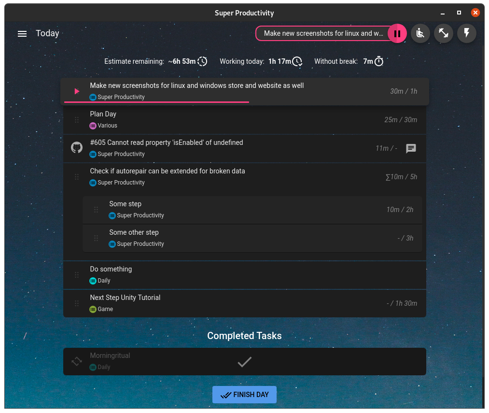

<p align="center" style="text-align: center;">
  <a href="https://super-productivity.com/">
    
  </a>
  <h1 align="center">Super Productivity</h1>
</p>

<p align="center" style="text-align: center;">
  <a href="https://snapcraft.io/superproductivity">
    
  </a>
  <a href="//www.microsoft.com/store/apps/9nhfvg8361tw?cid=storebadge&ocid=badge'>
    
  </a>
  <a href="https://lbesson.mit-license.org">
    
  </a>
  

Organize your daily tasks at one place while making time tracking a lot less annoying. Super Productivity is a ToDo List / Time Tracker / Personal Jira Task Manager for Linux, MacOS and Windows aimed at reducing the time you spend with repetitive tasks and to provide you with a place to collect all the information you need to do your job.


## :heavy_check_mark: Features
* **Full control over your data**, no tracking, no user accounts, no cloud
* Sub Tasks
* Time Tracking 
* Sexy global bookmark bar to add quick links, project related files and even commands and applications
* Sexy note functionality with custom reminders 
* Pomodoro timer
* 'Take a break' reminder
* Full Keyboard interaction
* Different Themes!
* Mobile support
* Repeatable tasks for daily chores
* Configurable and automatable Jira integration for: 
  * searching and adding tasks from jira
  * creating (local/personal) sub tasks for your jira tickets
  * setting transitions aka setting tickets to in progress or done
  * automatic notifications once an issue in your list has changed or been commented on jira => no messy email notifications required any more
* Configurable and automatable Git integration for:
  * searching and adding tasks from git
  * automatic notifications once an issue in your list has changed or been commented 
* Export your time sheets to Google Sheets (optional of course)
* Sync data between multiple instances (optional of course)

And much more!


<a href="https://www.youtube.com/watch?v=VoF2_RSdNXA"></a>

## :question: How to use
I wrote [a little article](https://dev.to/johannesjo/super-productivity-how-to-grow-fond-of-time-tracking-and-task-management-22ee) on how I use the app. There is also [a youtube video available](https://www.youtube.com/watch?v=VoF2_RSdNXA).

## :globe_with_meridians: Web Version
Check out the [web-version](http://super-productivity.com). It is a little bit more limited (time tracking only works if the app is open and idle time tracking is disabled).

If you want the Jira Integration to work you have also to download and install the [Super Productivity Chrome Extension](https://chrome.google.com/webstore/detail/super-productivity/ljkbjodfmekklcoibdnhahlaalhihmlb).

## :computer: Downloads & Install
### All Platforms
[Install from the releases page](https://github.com/johannesjo/super-productivity/releases).

### Windows
Due to certification issues it's recommended to download from the Microsoft Store:

<a href='//www.microsoft.com/store/apps/9nhfvg8361tw?cid=storebadge&ocid=badge'></a>

### Linux
```
# stable
sudo snap install superproductivity

# edge channel releases
 sudo snap install --channel=beta superproductivity
```
<a href="https://snapcraft.io/superproductivity">
  
</a>

### MacOS
Install via [homebrew cask](https://github.com/caskroom/homebrew-cask) (project might not always be up to date):
```
brew cask install superProductivity
```

## Setup WebDAV Syncing
When starting the app via the command line the path to where emergency backups are saved is printed out to the command line. Just take away the `/backup` sub folder from the path and use the remaining path to sync via the cloud.

## :hearts: Contributing
There are several ways to help. Publishing a bug or a feature request is a good first step. Also making it more popular by posting it on social media etc. is great, because it means more users, which in turn leads to more people testing the app and also more people contributing code.

**Please Share!**

[![alt text][1.1]][1]
[![alt text][2.1]][2]

<!-- icons with padding -->
[1.1]: http://i.imgur.com/tXSoThF.png (twitter icon with padding)
[2.1]: http://i.imgur.com/P3YfQoD.png (facebook icon with padding)

<!-- icons without padding -->
[1.2]: http://i.imgur.com/wWzX9uB.png (twitter icon without padding)
[2.2]: http://i.imgur.com/fep1WsG.png (facebook icon without padding)

<!-- links to your social media accounts -->
[1]: https://twitter.com/intent/tweet?text=Super%20Productivity%20%20https%3A%2F%2Fsuper-productivity.com
[2]: https://www.facebook.com/sharer/sharer.php?u=https://super-productivity.com/


**Pull requests** are of course also very welcome. Please make sure that you're following the [angular commit guidelines](https://github.com/angular/angular.js/blob/master/DEVELOPERS.md#commits) and to also include the issue number in your commit message, if you're fixing a particular issue (e.g.: `feat: add nice feature with the number #31`).

### Running the development server
To run the development server you need to have node installed at least in the version 10. Go to https://nodejs.org for installation instructions.

**Clone repo**
```
git clone https://github.com/johannesjo/super-productivity.git
```
**Install dependencies**
```
cd super-productivity
npm install
npm install -g @angular/cli
```
**Run the dev server**
```
ng serve
```
Afterwards you can open http://localhost:4200 in your browser. For most adjustments this should be enough and also enables you to use the [redux dev tools](https://chrome.google.com/webstore/detail/redux-devtools/lmhkpmbekcpmknklioeibfkpmmfibljd?hl=de). 

If you want to run the app standalone do the following:
```
ng serve

# in a new console tab
npm start
```

### Packaging the app
Packaging the app is done via [electron-builder](https://github.com/electron-userland/electron-builder). To start packaging run `yarn dist`. If you want to add new platforms and experiment with the build options the easiest way to do so is manipulating the `build` property in the [package.json](https://github.com/johannesjo/super-productivity/blob/develop/package.json), but you can also use the [command line interface of electron builder](https://www.electron.build/cli).

## :sparkling_heart: Contributors ✨

Thanks goes to these wonderful people ([emoji key](https://allcontributors.org/docs/en/emoji-key)):

<!-- ALL-CONTRIBUTORS-LIST:START - Do not remove or modify this section -->
<!-- prettier-ignore-start -->
<!-- markdownlint-disable -->
<table>
  <tr>
    <td align="center"><a href="https://github.com/johannesjo"><br />
    </a></td>
    <td align="center"><a href="https://github.com/theCalcaholic">
    </a></td>
    <td align="center"><a href="https://github.com/KonTy">
    </a><a href="#ideas-KonTy" title="Ideas, Planning, & Feedback">🤔</a></td>
    <td align="center"><a href="https://github.com/aitboudad">
    </a></td>
    <td align="center"><a href="https://github.com/Morganamilo">
    </a></td>
  </tr>
</table>

<!-- markdownlint-enable -->
<!-- prettier-ignore-end -->
<!-- ALL-CONTRIBUTORS-LIST:END -->

This project follows the [all-contributors](https://github.com/all-contributors/all-contributors) specification. Contributions of any kind welcome!
