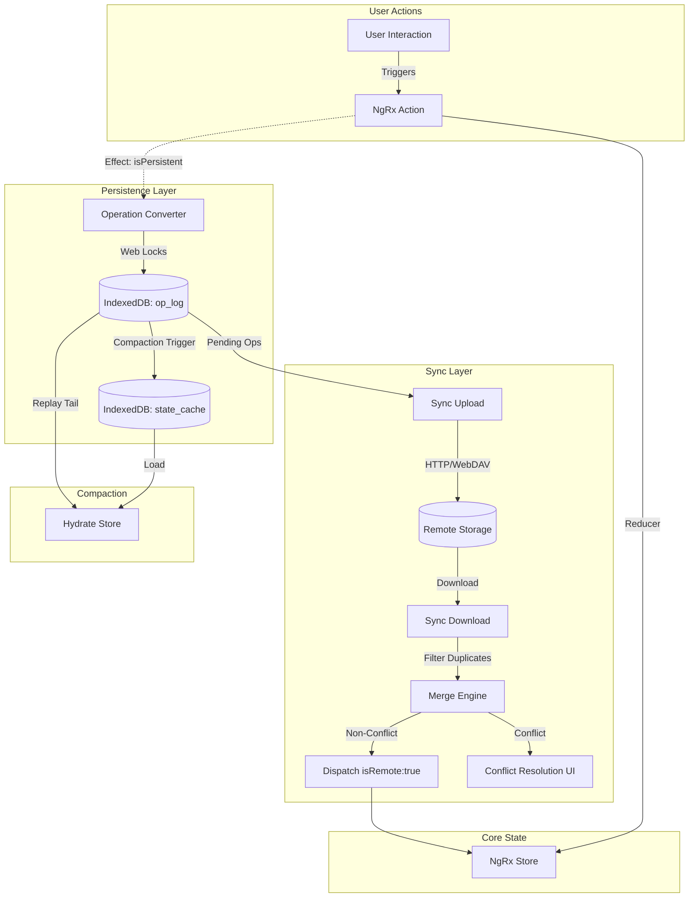
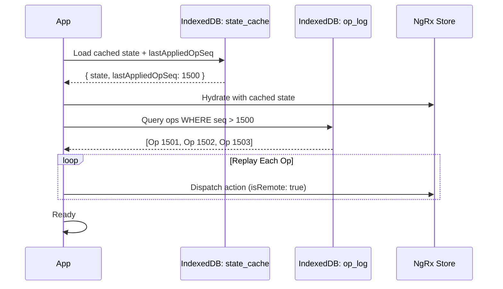
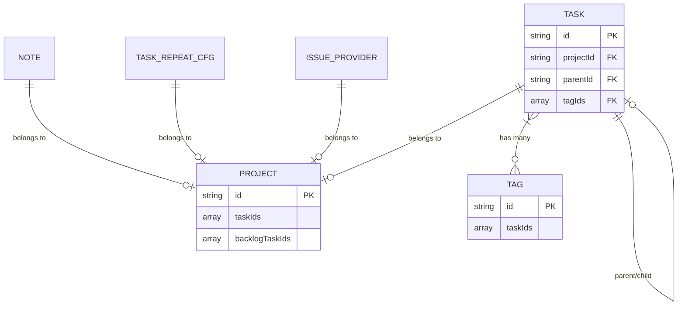

# Architecture V2: Operation Log & Event Sourcing

> ⚠️ **CRITICAL REVIEW NEEDED**: See Section 15 for fundamental questions about whether this approach is the right one.

## 1. Executive Summary

**Goal:** Transition `super-productivity` from a state-snapshot sync model to an operation-based (event sourcing) model.

### 1.1. Current Problems Solved

| Problem                 | Current Behavior                                                  | With Operation Log                                      |
| ----------------------- | ----------------------------------------------------------------- | ------------------------------------------------------- |
| **Data Loss/Overwrite** | "Last write wins" on whole file level overwrites granular changes | Per-operation merge enables granular conflict detection |
| **Performance**         | Sync downloads full state and reloads entire app (`reInit`)       | Only delta operations transferred and replayed          |
| **State Drift**         | Dual source of truth (NgRx vs. IndexedDB)                         | NgRx is single source, IndexedDB is derived             |
| **Conflict Resolution** | User must choose entire file: local vs remote                     | Automatic merge of non-conflicting operations           |

### 1.2. New Paradigm

- **NgRx is the Single Source of Truth.**
- **Persistence is a Log of Operations.**
- **Sync is the Exchange of Operations.**

### 1.3. Key Benefits Over Current Implementation

The current sync system (see [`sync.service.ts`](../../src/app/pfapi/api/sync/sync.service.ts)) already uses vector clocks for conflict detection at the whole-data level. This proposal extends that to per-operation granularity:

```
Current:  [Device A State] vs [Device B State] → Conflict if concurrent
Proposed: [Op1, Op2, Op3]  vs [Op4, Op5]       → Merge non-conflicting, flag conflicts per-entity
```

---

## 2. Core Data Structures

### 2.1. The Vector Clock (Existing)

Already implemented in [`vector-clock.ts`](../../src/app/pfapi/api/util/vector-clock.ts). No changes needed.

```typescript
// Map of Client ID -> Counter
// e.g., { 'client_A': 15, 'client_B': 7 }
export type VectorClock = Record<string, number>;
```

### 2.2. The Operation Schema

All changes to the application state must be representable as a discrete operation.

```typescript
export enum OpType {
  Create = 'CRT',
  Update = 'UPD',
  Delete = 'DEL',
  Move = 'MOV', // For list reordering
  Batch = 'BATCH', // For bulk operations (import, mass update)
}

export interface Operation {
  // IDENTITY
  id: string; // UUID v7 (time-ordered, better for sorting)

  // ACTION MAPPING
  actionType: string; // NgRx Action type (e.g., '[Task] Update')
  opType: OpType; // High-level operation category

  // SCOPE
  entityType: EntityType; // 'TASK' | 'PROJECT' | 'TAG' | 'NOTE' | 'GLOBAL_CONFIG' | 'SIMPLE_COUNTER'
  entityId: string; // ID of the affected entity (or '*' for global config)

  // DATA
  payload: unknown; // The partial update / diff (validated by Typia)

  // CAUSALITY & ORDERING
  clientId: string; // Device generating the op (reuse existing from vector-clock)
  entityVersion: number; // Monotonic per-entity version after applying this op
  causalDeps: Record<string, number>; // Map of entityKey -> version required (for ordering/merge)
  globalVectorClock?: VectorClock; // Optional: for cross-entity ordering during sync
  timestamp: number; // Wall clock time (ISO 8601 or epoch ms), only as tiebreaker

  // META
  schemaVersion: number; // For future migrations
  parentOpId?: string; // For conflict resolution chains
}

export type EntityType =
  | 'TASK'
  | 'PROJECT'
  | 'TAG'
  | 'NOTE'
  | 'GLOBAL_CONFIG'
  | 'SIMPLE_COUNTER'
  | 'WORK_CONTEXT'
  | 'TASK_REPEAT_CFG'
  | 'ISSUE_PROVIDER';
```

### 2.3. The Persistent Log Entry

How operations are stored locally in IndexedDB.

```typescript
export interface OperationLogEntry {
  seq: number; // Local, monotonic auto-increment (IndexedDB primary key)
  op: Operation;
  appliedAt: number; // When this op was applied locally (epoch ms)
  source: 'local' | 'remote'; // Origin of this operation
  syncedAt?: number; // When successfully synced to remote (null if pending)
}
```

### 2.4. Entity-Level Conflict Tracking

For fine-grained conflict resolution:

```typescript
export interface EntityConflict {
  entityType: EntityType;
  entityId: string;
  localOps: Operation[]; // Local ops affecting this entity
  remoteOps: Operation[]; // Remote ops affecting the same entity
  suggestedResolution: 'local' | 'remote' | 'merge' | 'manual';
  mergedPayload?: unknown; // If auto-mergeable
}
```

---

## 3. Architecture Layers

### 3.1. The Unified Flow



### 3.2. The Action Contract (Blacklisting)

By default, most state-modifying actions in NgRx should be persisted. Instead of maintaining a massive whitelist, we employ a **Blacklisting** strategy. Actions are persistent unless explicitly excluded or if they lack the necessary metadata context.

```typescript
// In src/app/core/persistence/operation-log/persistent-action.interface.ts

export interface PersistentActionMeta {
  // isPersistent is REMOVED; assumption is true unless blacklisted
  entityType: EntityType;
  entityId: string;
  opType: OpType;
  isRemote?: boolean; // TRUE if from Sync (prevents re-logging)
  isBulk?: boolean; // TRUE for batch operations
}

export interface PersistentAction<P = unknown> extends Action {
  type: string; // Standard NgRx action type
  meta?: PersistentActionMeta; // Optional, but needed for Entity tracking
  payload?: P;
}

// Helper type guard
export function isPersistentAction(action: Action): action is PersistentAction {
  const a = action as PersistentAction;
  // Must have meta AND not be blacklisted
  return !!a.meta && !ACTION_BLACKLIST.has(a.type);
}
```

### 3.3. Action Blacklist Registry

We explicitly exclude transient UI state and high-frequency updates that shouldn't flood the operation log.

```typescript
// In src/app/core/persistence/operation-log/action-blacklist.ts

export const ACTION_BLACKLIST: Set<string> = new Set([
  // UI / View State
  '[App] Set Current Worklog Task',
  '[Layout] Toggle Sidebar',
  '[Focus Mode] Enter/Exit',
  '[Layout] Toggle Show Notes',

  // High-Frequency Updates (Handled via Throttling - see 3.4)
  '[TimeTracking] Add Time Spent', // Tick every second
]);
```

### 3.4. Handling High-Frequency Updates (Time Tracking)

Time tracking produces a state change every second (`[TimeTracking] Add Time Spent`). Persisting every tick would result in ~28,000 operations for an 8-hour workday, bloating the log and slowing down sync.

**Strategy:**

1.  **Blacklist:** The raw tick action `[TimeTracking] Add Time Spent` is in the `ACTION_BLACKLIST`. It updates the in-memory store (UI updates immediately) but writes nothing to the Operation Log.
2.  **Accumulate:** The application tracks the "uncommitted" time spent in memory.
3.  **Periodic Flush:** A new action `[TimeTracking] Sync Time` (or `Commit Time`) is dispatched periodically.
    - **Triggers:**
      - Every X minutes (e.g., 5 minutes).
      - User pauses the timer.
      - User switches tasks.
      - App is closed/unloaded.
4.  **Persist:** This `Sync Time` action IS persisted. It contains the aggregated time diff since the last sync.

**Result:** 8 hours of work = ~100 operations (vs 28,000), maintaining sync efficiency while keeping the UI reactive.

---

## 4. Critical Workflows

### 4.1. The Write Path (Local User Action)

1. User clicks "Complete Task".
2. Component dispatches `TaskActions.update({ id, changes: { isDone: true } })`.
3. **Reducer:** Updates memory state immediately (optimistic UI).
4. **OperationLogEffect** (new):
   - Listens for actions satisfying `isPersistentAction` (i.e., has metadata and NOT blacklisted).
   - **Ignores** actions with `meta.isRemote: true`.
   - Converts Action → [`Operation`](#22-the-operation-schema) object.
   - Increments local vector clock counter.
   - Writes to IndexedDB using **Web Locks API**.

```typescript
// In src/app/core/persistence/operation-log/operation-log.effects.ts

@Injectable()
export class OperationLogEffects {
  private clientId = this.getOrCreateClientId();

  persistOperation$ = createEffect(
    () =>
      this.actions$.pipe(
        filter(isPersistentAction),
        filter((action) => !action.meta.isRemote),
        concatMap((action) => this.writeOperation(action)),
      ),
    { dispatch: false },
  );

  private async writeOperation(action: PersistentAction): Promise<void> {
    await navigator.locks.request('sp_op_log_write', async () => {
      const currentClock = await this.opLogStore.getCurrentVectorClock();
      const newClock = incrementVectorClock(currentClock, this.clientId);

      const op: Operation = {
        id: uuidv7(),
        actionType: action.type,
        opType: action.meta.opType,
        entityType: action.meta.entityType,
        entityId: action.meta.entityId,
        payload: action.payload,
        clientId: this.clientId,
        vectorClock: newClock,
        timestamp: Date.now(),
        schemaVersion: CURRENT_SCHEMA_VERSION,
      };

      await this.opLogStore.append(op);
    });
  }
}
```

### 4.2. The Read Path (Startup / App Load)

Loading thousands of operations is too slow. We use a **Rolling Snapshot** strategy.



**Implementation:**

```typescript
// In src/app/core/persistence/operation-log/operation-log-hydrator.service.ts

@Injectable({ providedIn: 'root' })
export class OperationLogHydratorService {
  constructor(private replayContext: ReplayContextService) {}

  async hydrateStore(): Promise<void> {
    const snapshot = await this.opLogStore.loadStateCache();

    this.replayContext.enterReplayMode();
    try {
      if (snapshot) {
        this.store.dispatch(hydrateFromSnapshot({ state: snapshot.state }));

        const tailOps = await this.opLogStore.getOpsAfterSeq(snapshot.lastAppliedOpSeq);
        for (const entry of tailOps) {
          const action = this.opToActionConverter.convert(entry.op);
          action.meta.isRemote = true; // Prevent re-logging
          action.meta.isReplay = true; // Signal effects to skip
          this.store.dispatch(action);
        }
      } else {
        await this.handleFreshInstallOrMigration();
      }
    } finally {
      this.replayContext.exitReplayMode();
    }
  }
}
```

### 4.3. The Sync Path (Bidirectional)

#### 4.3.1. Upload (Local → Remote)

```typescript
async uploadPendingOps(): Promise<void> {
  const pendingOps = await this.opLogStore.getUnsynced();

  if (pendingOps.length === 0) return;

  // Batch into chunks (e.g., 100 ops per file for WebDAV)
  const chunks = chunkArray(pendingOps, 100);

  for (const chunk of chunks) {
    const payload = JSON.stringify(chunk);
    const hash = await hashPayload(payload);
    const filename = `ops_${hash}.json`;

    await this.syncProvider.uploadFile(filename, payload);

    // Mark as synced locally; manifest is updated after all files succeed
    await this.opLogStore.markSynced(chunk.map(e => e.seq));
  }

  // Update remote manifest LAST (content-addressable entries, latest snapshot id)
  await this.updateRemoteManifest();
}
```

#### 4.3.2. Download (Remote → Local)

```typescript
async downloadRemoteOps(): Promise<void> {
  const manifest = await this.syncProvider.downloadFile('manifest.json');
  const appliedOpIds = await this.opLogStore.getAppliedOpIds();

  // Find new remote op files
  const newFiles = manifest.opFiles.filter(f => !this.isFileFullyApplied(f, appliedOpIds));

  for (const file of newFiles) {
    const opsData = await this.syncProvider.downloadFile(file);
    const remoteOps: Operation[] = JSON.parse(opsData);

    // Filter already-applied ops
    const newOps = remoteOps.filter(op => !appliedOpIds.has(op.id));

    // Check for conflicts at entity level
    const { nonConflicting, conflicts } = await this.detectConflicts(newOps);

    // Apply non-conflicting ops
    for (const op of nonConflicting) {
      const action = this.opToActionConverter.convert(op);
      action.meta.isRemote = true;
      this.store.dispatch(action);
      await this.opLogStore.markApplied(op.id);
    }

    // Handle conflicts
    if (conflicts.length > 0) {
      await this.conflictHandler.present(conflicts);
    }
  }
}
```

#### 4.3.3. Conflict Detection Algorithm

```typescript
async detectConflicts(remoteOps: Operation[]): Promise<ConflictResult> {
  const pendingByEntity = await this.opLogStore.getUnsyncedByEntity();
  const appliedFrontier = await this.opLogStore.getEntityFrontiers(); // entityKey -> lastAppliedVersion
  const conflicts: EntityConflict[] = [];
  const nonConflicting: Operation[] = [];

  for (const remoteOp of remoteOps) {
    const entityKey = `${remoteOp.entityType}:${remoteOp.entityId}`;
    const localPending = pendingByEntity.get(entityKey) || [];
    const localAppliedVersion = appliedFrontier.get(entityKey) ?? 0;

    const isConcurrentWithPending = localPending.some(
      (op) => op.entityVersion === remoteOp.entityVersion ||
        this.areCausalDepsConcurrent(op.causalDeps, remoteOp.causalDeps),
    );

    const isConcurrentWithApplied =
      remoteOp.entityVersion <= localAppliedVersion
        ? false
        : this.isConcurrentWithFrontier(remoteOp.causalDeps, appliedFrontier);

    if (isConcurrentWithPending || isConcurrentWithApplied) {
      conflicts.push({
        entityType: remoteOp.entityType,
        entityId: remoteOp.entityId,
        localOps: localPending,
        remoteOps: [remoteOp],
        suggestedResolution: this.suggestResolution(localPending, remoteOp),
      });
      continue;
    }

    nonConflicting.push(remoteOp);
  }

  return { nonConflicting, conflicts };
}
```

### 4.4. Multi-Tab Concurrency

Use **Web Locks** + **BroadcastChannel** when available, and fall back to an IndexedDB mutex + storage-event channel. IndexedDB remains the source of truth; broadcasts are only hints.

```typescript
@Injectable({ providedIn: 'root' })
export class MultiTabCoordinatorService {
  private channel = this.createChannel();

  constructor() {
    this.channel.onSignal(async () => {
      await this.pullAndApplyNewOps();
    });
  }

  async writeOperation(op: Operation): Promise<void> {
    await this.withMutex('sp_op_log_write', async () => {
      await this.opLogStore.append(op);
      await this.channel.signal(); // hint other tabs
    });
  }

  private async pullAndApplyNewOps(): Promise<void> {
    const newEntries = await this.opLogStore.getOpsAfterSeq(this.lastAppliedSeq);
    for (const entry of newEntries) {
      if (entry.op.clientId !== this.clientId || entry.source === 'remote') {
        await this.applyOp(entry.op);
      }
      this.lastAppliedSeq = entry.seq;
    }
  }

  private withMutex<T>(name: string, fn: () => Promise<T>) {
    return supportsWebLocks()
      ? navigator.locks.request(name, fn)
      : this.idbMutex.runExclusive(fn);
  }
}
```

### 4.5. Compaction (Garbage Collection)

To prevent the log from growing infinitely.

**Triggers:**

- Every N operations (configurable, default: 500)
- On app close/background
- When log size exceeds threshold (e.g., 10MB)

**Process:**

```typescript
async compact(): Promise<void> {
  await navigator.locks.request('sp_op_log_compact', async () => {
    // 1. Get current NgRx state
    const currentState = await firstValueFrom(this.store.select(selectAllSyncState));

    // 2. Get current vector clock (max of all ops)
    const currentVectorClock = await this.opLogStore.getCurrentVectorClock();

    // 3. Write to state cache
    const lastSeq = await this.opLogStore.getLastSeq();
    await this.opLogStore.saveStateCache({
      state: currentState,
      lastAppliedOpSeq: lastSeq,
      vectorClock: currentVectorClock,
      compactedAt: Date.now(),
    });

    // 4. Publish snapshot remotely BEFORE deleting ops
    const retentionWindowMs = 7 * 24 * 60 * 60 * 1000; // 7 days (configurable)
    const snapshot: RemoteSnapshot = {
      state: currentState,
      vectorClock: currentVectorClock,
      lastAppliedOpSeq: lastSeq,
      snapshotId: uuidv7(),
      createdAt: Date.now(),
      oldestRetainedOpTimestamp: Date.now() - retentionWindowMs,
    };
    await this.syncProvider.uploadFile(
      `snapshots/snapshot_${snapshot.snapshotId}.json`,
      JSON.stringify(snapshot),
    );
    await this.updateRemoteManifest({
      latestSnapshot: snapshot.snapshotId,
      retainedFrom: snapshot.oldestRetainedOpTimestamp,
    });

    // 5. Delete old operations (keep recent for conflict resolution window)
    await this.opLogStore.deleteOpsOlderThan(snapshot.oldestRetainedOpTimestamp);
  });
}
```

---

## 5. Cross-Model Relationships & Referential Integrity

Super Productivity has several cross-model relationships that require special handling in an operation-based sync system:

### 5.1. Entity Relationship Map



### 5.2. Reference Types & Handling Strategies

| Relationship            | Reference Field  | On Foreign Delete                  | On Missing Reference                |
| ----------------------- | ---------------- | ---------------------------------- | ----------------------------------- |
| Task → Project          | `task.projectId` | Orphan (keep task, null projectId) | Queue op, apply when project exists |
| Task → Tag              | `task.tagIds[]`  | Remove from array                  | Skip missing tag, log warning       |
| Task → Parent Task      | `task.parentId`  | Cascade delete subtask             | Queue op, apply when parent exists  |
| Note → Project          | `note.projectId` | Orphan (keep note)                 | Queue op, apply when project exists |
| TaskRepeatCfg → Project | `cfg.projectId`  | Orphan or delete cfg               | Queue op                            |

### 5.3. Operation Ordering & Dependencies

When syncing operations, some must be applied before others. We use a dependency resolver:

```typescript
interface OperationDependency {
  opId: string;
  dependsOn: {
    entityType: EntityType;
    entityId: string;
    mustExist: boolean; // true = hard dependency, false = soft (can apply without)
  }[];
}

// Example dependencies:
// - Create SubTask depends on parent Task existing (hard)
// - Create Task in Project depends on Project existing (soft - can orphan)
// - Add Tag to Task depends on Tag existing (soft - skip missing)
```

**Dependency Resolution Algorithm:**

```typescript
async applyOperationsWithDependencies(ops: Operation[]): Promise<ApplyResult> {
  const pendingQueue: Operation[] = [];
  const applied: Operation[] = [];
  const failed: { op: Operation; reason: string }[] = [];

  // Sort operations by logical order
  const sortedOps = this.topologicalSort(ops);

  for (const op of sortedOps) {
    const deps = this.extractDependencies(op);
    const missingHardDeps = await this.findMissingHardDependencies(deps);

    if (missingHardDeps.length > 0) {
      // Check if dependency will be satisfied by a pending op
      const willBeSatisfied = missingHardDeps.every(dep =>
        pendingQueue.some(pendingOp =>
          pendingOp.entityType === dep.entityType &&
          pendingOp.entityId === dep.entityId &&
          pendingOp.opType === OpType.Create
        )
      );

      if (willBeSatisfied) {
        pendingQueue.push(op);
      } else {
        // Hard dependency missing and won't be created - queue for later sync
        this.queueForRetry(op, missingHardDeps);
      }
      continue;
    }

    // Handle soft dependencies (missing tags, etc.)
    const missingSoftDeps = await this.findMissingSoftDependencies(deps);
    if (missingSoftDeps.length > 0) {
      op.payload = this.removeMissingReferences(op.payload, missingSoftDeps);
      this.logWarning('Applied op with missing soft dependencies', { op, missingSoftDeps });
    }

    // Apply operation
    await this.applyOperation(op);
    applied.push(op);

    // Check if any pending ops can now be applied
    await this.processPendingQueue(pendingQueue, applied);
  }

  return { applied, pending: pendingQueue, failed };
}
```

### 5.4. Cascade Operations

When a parent entity is deleted, related entities must be handled:

```typescript
// In operation-log.effects.ts

// Intercept delete operations and emit cascade ops
handleCascadeDelete$ = createEffect(() =>
  this.actions$.pipe(
    filter(isPersistentAction),
    filter(action => action.meta.opType === OpType.Delete),
    switchMap(action => this.generateCascadeOps(action)),
  )
);

private async generateCascadeOps(deleteAction: PersistentAction): Promise<Action[]> {
  const cascadeOps: Action[] = [];

  switch (deleteAction.meta.entityType) {
    case 'PROJECT':
      // Find all tasks in this project
      const tasks = await this.taskService.getAllTasksForProject(deleteAction.meta.entityId);

      // Option A: Orphan tasks (move to inbox)
      for (const task of tasks) {
        if (!task.parentId) { // Only main tasks
          cascadeOps.push(updateTask({
            task: { id: task.id, changes: { projectId: INBOX_PROJECT.id } },
            meta: {
              isPersistent: true,
              entityType: 'TASK',
              entityId: task.id,
              opType: OpType.Update,
              cascadeFrom: deleteAction.meta.entityId,
            }
          }));
        }
      }
      break;

    case 'TASK':
      // If parent task deleted, delete all subtasks
      const parentTask = await this.taskService.getByIdOnce$(deleteAction.meta.entityId);
      for (const subTaskId of parentTask.subTaskIds) {
        cascadeOps.push(deleteTask({
          task: { id: subTaskId },
          meta: {
            isPersistent: true,
            entityType: 'TASK',
            entityId: subTaskId,
            opType: OpType.Delete,
            cascadeFrom: deleteAction.meta.entityId,
          }
        }));
      }
      break;

    case 'TAG':
      // Remove tag from all tasks (soft cascade)
      // This is handled by the reducer, but we log it
      break;
  }

  return cascadeOps;
}
```

### 5.5. Conflict Resolution with Related Entities

When conflicts occur, we must consider the relationship graph:

```typescript
interface RelatedConflict extends EntityConflict {
  relatedConflicts: EntityConflict[];  // Conflicts in related entities
  relationshipType: 'parent' | 'child' | 'reference';
}

// Example: Task updated locally, but its Project was deleted remotely
// This creates a "cascading conflict" that needs unified resolution

async detectRelatedConflicts(conflict: EntityConflict): Promise<RelatedConflict> {
  const relatedConflicts: EntityConflict[] = [];

  if (conflict.entityType === 'TASK') {
    const task = conflict.localOps[0].payload as Partial<Task>;

    // Check if project was modified/deleted
    if (task.projectId) {
      const projectConflict = await this.findConflictForEntity('PROJECT', task.projectId);
      if (projectConflict) {
        relatedConflicts.push({ ...projectConflict, relationshipType: 'parent' });
      }
    }

    // Check if parent task was modified/deleted
    if (task.parentId) {
      const parentConflict = await this.findConflictForEntity('TASK', task.parentId);
      if (parentConflict) {
        relatedConflicts.push({ ...parentConflict, relationshipType: 'parent' });
      }
    }

    // Check if any referenced tags were modified/deleted
    for (const tagId of (task.tagIds || [])) {
      const tagConflict = await this.findConflictForEntity('TAG', tagId);
      if (tagConflict) {
        relatedConflicts.push({ ...tagConflict, relationshipType: 'reference' });
      }
    }
  }

  return { ...conflict, relatedConflicts };
}
```

### 5.6. Atomic Multi-Entity Operations

Some user actions affect multiple entities atomically. These should be grouped:

```typescript
// Example: Moving a task to another project affects:
// 1. Task.projectId
// 2. Source Project.taskIds (remove)
// 3. Target Project.taskIds (add)

interface AtomicOperationGroup {
  groupId: string; // UUIDv7
  operations: Operation[]; // All ops in this group
  rollbackOnPartialFailure: boolean;
}

// When creating ops for moveToProject:
const moveToProjectOps: AtomicOperationGroup = {
  groupId: uuidv7(),
  operations: [
    {
      id: uuidv7(),
      actionType: '[Task] Update',
      opType: OpType.Update,
      entityType: 'TASK',
      entityId: taskId,
      payload: { projectId: targetProjectId },
      // ... other fields
      groupId: groupId, // Link to group
    },
    // Note: Project.taskIds updates are derived, not stored as separate ops
    // The reducer handles this automatically
  ],
  rollbackOnPartialFailure: true,
};
```

### 5.7. Optimistic Updates with Rollback

For related entities, we need coordinated rollback:

```typescript
class RelatedEntityRollbackService {
  private pendingRollbacks = new Map<string, RollbackState>();

  async applyWithRollback(ops: Operation[]): Promise<void> {
    const groupId = ops[0].groupId || uuidv7();
    const rollbackState: RollbackState = {
      originalStates: new Map(),
      appliedOps: [],
    };

    try {
      for (const op of ops) {
        // Capture original state before applying
        const originalState = await this.captureEntityState(op.entityType, op.entityId);
        rollbackState.originalStates.set(
          `${op.entityType}:${op.entityId}`,
          originalState,
        );

        // Apply operation
        await this.applyOperation(op);
        rollbackState.appliedOps.push(op);
      }

      // All succeeded - clear rollback state
      this.pendingRollbacks.delete(groupId);
    } catch (error) {
      // Rollback all applied operations in reverse order
      for (const appliedOp of rollbackState.appliedOps.reverse()) {
        const key = `${appliedOp.entityType}:${appliedOp.entityId}`;
        const originalState = rollbackState.originalStates.get(key);
        await this.restoreEntityState(
          appliedOp.entityType,
          appliedOp.entityId,
          originalState,
        );
      }
      throw error;
    }
  }
}
```

### 5.8. Handling Orphaned References During Sync

When downloading remote operations, we may encounter references to entities that don't exist locally:

```typescript
enum OrphanHandling {
  QUEUE_AND_RETRY = 'queue', // Wait for the referenced entity to be created
  SKIP_REFERENCE = 'skip', // Apply op but skip the missing reference
  CREATE_PLACEHOLDER = 'placeholder', // Create a minimal placeholder entity
  REJECT = 'reject', // Fail the operation
}

const ORPHAN_HANDLING_POLICY: Record<string, OrphanHandling> = {
  'TASK.projectId': OrphanHandling.QUEUE_AND_RETRY,
  'TASK.parentId': OrphanHandling.QUEUE_AND_RETRY,
  'TASK.tagIds': OrphanHandling.SKIP_REFERENCE,
  'NOTE.projectId': OrphanHandling.QUEUE_AND_RETRY,
  'TASK_REPEAT_CFG.projectId': OrphanHandling.QUEUE_AND_RETRY,
};
```

---

## 6. Integration with Existing pfapi

### 6.1. Coexistence Strategy

The operation log can be introduced **alongside** the existing sync system, not as a replacement:

```
Phase 1: Operation logging only (local persistence, no sync changes)
Phase 2: Dual-write (log ops + maintain current snapshot sync)
Phase 3: Operation-based sync (read from log for sync)
Phase 4: Remove snapshot sync (operation log is primary)
```

### 6.2. pfapi Integration Points

| Existing Component                                                       | Integration Approach          |
| ------------------------------------------------------------------------ | ----------------------------- |
| [`MetaModelCtrl`](../../src/app/pfapi/api/model-ctrl/meta-model-ctrl.ts) | Add op log sequence to meta   |
| [`ModelSyncService`](../../src/app/pfapi/api/sync/model-sync.service.ts) | Keep for snapshot backup      |
| [`SyncService.sync()`](../../src/app/pfapi/api/sync/sync.service.ts:91)  | Add operation exchange phase  |
| Vector Clock utilities                                                   | Reuse existing implementation |

### 6.3. Remote Storage Format

For compatibility with existing WebDAV/Dropbox providers:

```
/superproductivity/
├── main.json              # Legacy: Full state snapshot (kept for backup)
├── meta.json              # Legacy: Metadata with vector clock
├── ops/                   # NEW: Operation logs directory
│   ├── manifest.json      # Index of all op files + last compaction
│   ├── ops_clientA_1700000000.json
│   ├── ops_clientA_1700001000.json
│   ├── ops_clientB_1700000500.json
│   └── ...
└── snapshots/             # NEW: Periodic full snapshots
    ├── snapshot_1700000000.json
    └── ...
```

---

## 7. Migration Strategy

### 7.1. Detection Phase

```typescript
async detectMigrationNeeded(): Promise<MigrationType> {
  const opLogExists = await this.opLogStore.exists();
  const legacyDataExists = await this.legacyStore.hasData();

  if (!opLogExists && legacyDataExists) {
    return MigrationType.LEGACY_TO_OPLOG;
  }
  if (opLogExists && legacyDataExists) {
    return MigrationType.HYBRID; // During transition
  }
  if (!opLogExists && !legacyDataExists) {
    return MigrationType.FRESH_INSTALL;
  }
  return MigrationType.ALREADY_MIGRATED;
}
```

### 7.2. Migration Operations

For existing users upgrading from the current snapshot-based system, emit per-entity CREATE ops sharing one frontier and align an initial snapshot.

```typescript
async migrateFromLegacy(): Promise<void> {
  const legacyState = await this.pfapi.getAllSyncModelData();
  const entities = this.flattenToEntities(legacyState);
  const frontierClock = { [this.clientId]: entities.length };

  let seq = 0;
  for (const entity of entities) {
    seq++;
    const op: Operation = {
      id: uuidv7(),
      actionType: `[${entity.type}] Add ${entity.type}`,
      opType: OpType.Create,
      entityType: entity.type,
      entityId: entity.id,
      payload: entity.data,
      clientId: this.clientId,
      entityVersion: seq,
      causalDeps: {},
      globalVectorClock: { [this.clientId]: seq },
      timestamp: Date.now(),
      schemaVersion: CURRENT_SCHEMA_VERSION,
    };
    await this.opLogStore.append(op);
  }

  await this.opLogStore.saveStateCache({
    state: legacyState,
    lastAppliedOpSeq: entities.length,
    vectorClock: frontierClock,
    compactedAt: Date.now(),
  });
}
```

### 7.3. Rollback Strategy

If issues are detected after migration:

```typescript
async rollbackToLegacy(): Promise<void> {
  // 1. Check if legacy backup exists
  const legacyBackup = await this.legacyStore.getBackup();
  if (!legacyBackup) {
    throw new Error('No legacy backup available for rollback');
  }

  // 2. Restore legacy data
  await this.pfapi.importAllSycModelData({ data: legacyBackup });

  // 3. Clear operation log
  await this.opLogStore.clearAll();

  // 4. Update migration status
  await this.legacyStore.markRolledBack();
}
```

---

## 8. Risks & Mitigations

| Risk                      | Severity | Mitigation                                                    |
| :------------------------ | :------: | :------------------------------------------------------------ |
| **Infinite Loops**        |   High   | Strict `isRemote` flag + action type whitelist + tests        |
| **Startup Slowness**      |  Medium  | Aggressive compaction (default: 500 ops, 7 day retention)     |
| **Lost Updates (Tabs)**   |   High   | Web Locks API + BroadcastChannel coordination                 |
| **Data Bloat**            |  Medium  | Whitelist only essential actions + automatic compaction       |
| **Ordering Glitches**     |  Medium  | Vector clocks + UUID v7 (time-ordered) + deterministic sort   |
| **Memory Pressure**       |  Medium  | Streaming replay for large op sets + pagination               |
| **Sync Provider Limits**  |   Low    | Chunk ops into max 1MB files + manifest index                 |
| **Schema Evolution**      |  Medium  | `schemaVersion` field + forward-compatible payloads           |
| **Partial Sync Failures** |   High   | Transaction-like batching + rollback on failure               |
| **Clock Skew**            |   Low    | Use vector clocks for ordering, wall clock only as tiebreaker |
| **Dangling References**   |   High   | Dependency resolver + orphan handling policies (Section 5)    |
| **Cascade Failures**      |  Medium  | Atomic operation groups + coordinated rollback                |
| **Circular Dependencies** |   Low    | Topological sort with cycle detection                         |

---

## 9. Testing Strategy

### 8.1. Unit Tests

```typescript
describe('OperationLogStore', () => {
  it('should append operations with correct sequence numbers');
  it('should query operations after a given sequence');
  it('should handle concurrent writes with Web Locks');
  it('should compact old operations correctly');
});

describe('OperationLogEffects', () => {
  it('should convert persistent actions to operations');
  it('should ignore remote actions (isRemote: true)');
  it('should increment vector clock on each operation');
});

describe('ConflictDetector', () => {
  it('should identify concurrent changes to same entity');
  it('should auto-resolve sequential changes');
  it('should suggest merge for compatible changes');
});

describe('DependencyResolver', () => {
  it('should detect hard dependencies (subtask -> parent task)');
  it('should handle soft dependencies (task -> tag)');
  it('should queue operations with missing dependencies');
  it('should apply queued ops when dependencies arrive');
  it('should detect and reject circular dependencies');
});

describe('CascadeOperations', () => {
  it('should generate cascade deletes for subtasks when parent deleted');
  it('should orphan tasks when project deleted');
  it('should remove deleted tag from all task.tagIds');
});
```

### 8.2. Integration Tests

```typescript
describe('Multi-Tab Sync', () => {
  it('should coordinate writes across browser tabs');
  it('should broadcast new operations to other tabs');
  it('should handle tab crashes gracefully');
});

describe('Remote Sync', () => {
  it('should upload pending operations');
  it('should download and apply remote operations');
  it('should detect and present conflicts');
  it('should handle operations referencing entities that arrive later');
  it('should resolve related entity conflicts together');
});

describe('Cross-Model Integrity', () => {
  it('should maintain task-project relationship after sync');
  it('should maintain task-tag relationship after sync');
  it('should maintain parent-subtask relationship after sync');
  it('should handle project deletion with associated tasks during sync');
});
```

### 8.3. E2E Tests

```typescript
describe('Operation Log E2E', () => {
  it('should persist task creation across page reload');
  it('should sync changes between two browser sessions');
  it('should handle offline changes and sync on reconnect');
  it('should migrate from legacy data correctly');
});
```

---

## 10. Critical Design Flaws & Required Fixes

This section identifies fundamental architectural problems that must be resolved before implementation.

### 10.1. CRITICAL: Vector Clock Scope Mismatch

**Problem (original plan):** Using a single global vector clock per op caused false per-entity conflicts.

**Resolution:** Section 2.2/4.3.3 now define per-entity versions + causal deps for conflict detection, with an optional global vector clock only for sync ordering. Keep this separation in implementation.

### 10.2. CRITICAL: No Remote Snapshot Publishing

**Problem (original plan):** Local compaction deleted ops without publishing a remote snapshot, stranding new devices.

**Resolution:** Section 4.5 now requires publishing a remote snapshot + manifest update (with retained range) before deleting local ops. Implementation must keep this contract.

### 10.3. CRITICAL: Genesis Operation is an Anti-Pattern

**Problem:** The migration creates one giant operation containing the entire legacy state (lines 927-938).

**Issues:**

- Single op can be megabytes for power users (10k+ tasks)
- Cannot be conflict-resolved at entity level
- Creates a "special case" that violates per-entity operation semantics
- If this genesis op conflicts with remote ops, resolution is impossible

**Required Fix:** Emit per-entity Create operations:

```typescript
async migrateFromLegacy(): Promise<void> {
  const legacyState = await this.pfapi.getAllSyncModelData();
  const genesisVectorClock = { [this.clientId]: 1 };

  // Emit one CREATE op per entity
  const entities = this.flattenToEntities(legacyState);

  for (let i = 0; i < entities.length; i++) {
    const entity = entities[i];
    const op: Operation = {
      id: uuidv7(),
      actionType: `[${entity.type}] Add ${entity.type}`,
      opType: OpType.Create,
      entityType: entity.type,
      entityId: entity.id,
      payload: entity.data,
      clientId: this.clientId,
      vectorClock: { [this.clientId]: i + 1 },
      timestamp: Date.now(),
      schemaVersion: CURRENT_SCHEMA_VERSION,
    };
    await this.opLogStore.append(op);
  }

  // Create snapshot aligned with final vector clock
  await this.opLogStore.saveStateCache({
    state: legacyState,
    lastAppliedOpSeq: entities.length,
    vectorClock: { [this.clientId]: entities.length },
    compactedAt: Date.now(),
  });
}
```

### 10.4. CRITICAL: Effect Side Effects During Replay

**Problem (original plan):** Replaying ops would still trigger effects/notifications.

**Resolution:** Section 4.2 shows a replay context with `isReplay` to bypass effects. All side-effectful effects must check replay context or be dispatched through a replay-safe channel.

### 10.5. HIGH: Reducer Non-Determinism

**Problem:** Reducers may use `Date.now()`, `uuid()`, or calculate derived state. Replaying the same ops on different clients may produce different states.

**Examples in Super Productivity:**

- `created` timestamp on new tasks
- Derived `Project.taskIds` arrays
- Calculated `timeSpentToday`

**Required Fix:**

1. All timestamps/IDs must be in the operation payload, not generated by reducers
2. Derived state must be calculable from the operation stream, not stored
3. Add property-based tests: `reduce(initialState, ops) === deserialize(serialize(reduce(initialState, ops)))`

```typescript
// BAD - non-deterministic:
case addTask.type:
  return {
    ...state,
    entities: {
      ...,
      [action.task.id]: {
        ...action.task,
        created: Date.now(), // NON-DETERMINISTIC!
      }
    }
  };

// GOOD - deterministic:
case addTask.type:
  return {
    ...state,
    entities: {
      ...,
      [action.task.id]: {
        ...action.task,
        created: action.task.created, // From payload
      }
    }
  };
```

### 10.6. HIGH: Derived State Reconstruction Problem

**Problem:** `Project.taskIds` and `Tag.taskIds` are derived from tasks, but ops only update `Task.projectId`.

**Scenario:**

1. Op: "Update Task A, set projectId = Project X"
2. Reducer updates Task A's projectId
3. But Project X's `taskIds` array must also be updated
4. On different clients, the order of tasks in `taskIds` might differ

**Required Fix:** Either:

- **Option A:** Don't persist derived arrays. Recompute on hydration/access
- **Option B:** Emit explicit ops for derived state changes (two ops for moveToProject)
- **Option C:** Use denormalized reducers that always recompute derived arrays from source of truth

Recommended: **Option A** - never persist derived state in ops.

### 10.7. HIGH: Conflict Window vs Retention Window Mismatch

**Problem:** Compaction deletes ops after 7 days (line 505), but conflict detection only checks against unsynced local ops (line 405).

**Scenario:**

1. Client A syncs, all ops are marked "synced"
2. Client B makes changes, syncs
3. Client A makes changes to the same entity, hasn't synced yet
4. 8 days pass
5. Client A compacts, deleting the "synced" ops that show the baseline
6. Client A syncs - cannot detect if B's changes conflict with A's baseline

**Impact:** Silent data loss - conflicts not detected.

**Required Fix:** Maintain per-entity "last known synced version" separate from op log:

```typescript
interface EntitySyncState {
  entityType: EntityType;
  entityId: string;
  lastSyncedVersion: number;
  lastSyncedAt: number;
  lastSyncedVectorClock: VectorClock;
}

// Conflict detection must check:
// 1. Remote op version vs local pending ops (current)
// 2. Remote op version vs lastSyncedVersion (NEW)
```

### 10.8. HIGH: Multi-Tab State Divergence

**Problem (original plan):** BroadcastChannel alone could miss ops if a tab crashed between DB write and broadcast.

**Resolution:** Section 4.4 keeps IndexedDB as the source of truth with mutex + "ops changed" signalling; tabs pull `getOpsAfterSeq` on signal to recover missed writes.

### 10.9. MEDIUM: Operation Idempotency Not Guaranteed

**Problem:** The plan doesn't require operations to be idempotent. If the same op is applied twice:

**Non-idempotent examples:**

- "Add 5 minutes to timeSpent" → Applying twice = +10 minutes (WRONG)
- "Toggle isDone" → Applying twice = original state (WRONG)

**Required Fix:** All operations must be idempotent (set-based, not delta-based):

```typescript
// BAD - not idempotent:
payload: {
  addTimeSpent: 300000;
}

// GOOD - idempotent:
payload: {
  timeSpent: 1500000;
} // Absolute value
```

### 10.10. MEDIUM: WebDAV Upload Atomicity

**Problem (original plan):** Upload-before-manifest risked orphaned files and missing ops.

**Resolution:** Section 4.3.1 now uses content-hash filenames, marks ops synced locally, and writes the manifest last; startup reconciliation should still scan `/ops/` and reconcile orphaned files.

### 10.11. MEDIUM: Vector Clock Unbounded Growth

**Problem:** Every client adds an entry to the vector clock forever. No pruning strategy.

For long-running installations with many devices over years:

- Vector clocks grow to hundreds of entries
- Each operation carries the full clock
- Performance degrades

**Required Fix:** Use existing vector clock pruning, apply to ops:

```typescript
// Prune inactive clients (no activity in 90 days) from vector clock
// When compacting, normalize vector clocks to remove pruned clients
```

### 10.12. MEDIUM: Snapshot State Serialization

**Problem:** Line 490 snapshots NgRx state, but NgRx state may contain:

- Entity adapter internal structures
- Non-serializable objects
- UI state (selectedId, etc.)

**Required Fix:** Define explicit snapshot schema separate from NgRx internal structure:

```typescript
interface SyncSnapshot {
  version: number;
  entities: {
    tasks: Record<string, Task>;
    projects: Record<string, Project>;
    tags: Record<string, Tag>;
    // ... only sync-relevant entities
  };
  vectorClock: VectorClock;
  // NO UI state, NO derived state
}
```

---

## 11. MVP Guardrails and Scope

**Replay without side effects**

- Introduce a replay dispatcher (or global guard) that prevents effects/notifications from firing for `meta.isRemote`/`meta.isReplay`.
- Add tests asserting hydration/sync replays do not call effects.

**Canonical operation codecs**

- Per-entity Typia codecs that normalize payloads to minimal diffs (no derived arrays or redundant fields).
- Persist the normalized patch shape, not raw action payloads.

**Deterministic reducers**

- Audit reducers for randomness/time or hidden side effects; refactor or exclude non-deterministic actions from persistence.
- Property-test: random op streams applied via replay vs. direct reducer baseline must match.

**Conflict frontier**

- Track last-applied op/vector per entity; conflict detection compares remote ops against both unsynced local ops and the applied frontier (not just pending uploads).
- Order application by vector-clock comparison + local seq; do not rely on timestamps.

**Snapshot/manifest contract**

- Before deleting ops, publish a snapshot (state + vector clock + retained op range) to remote storage.
- Keep ops from that snapshot forward; new devices hydrate from the latest published snapshot + tail.

**Atomic multi-entity application**

- Add a batch/transaction path so grouped ops apply atomically (or rollback) instead of partial state on crash.

**Dependency handling with bounds**

- Queue missing-dependency ops with retry budget/diagnostics; process via topological order that tolerates concurrent creates/updates; move exhausted items to a "stuck" queue.

**Cross-platform coordination**

- Feature-detect Web Locks/BroadcastChannel; provide IndexedDB mutex + storage-event (or equivalent) fallback for Electron/Capacitor.

**Upload/idempotency robustness**

- Use content-hash filenames; write manifest last; reconcile uploaded-but-unmanifested files on startup; dedupe by op ID regardless of file overlap.

**Migration slicing**

- Emit per-entity genesis create ops sharing one frontier instead of a single huge batch payload; align the initial snapshot to that frontier.

## 12. Implementation Phases

### Phase 1: Local Operation Logging (2-3 weeks)

- [ ] Create `OperationLogStore` (IndexedDB adapter)
- [ ] Create `Operation` types and per-entity codecs (Typia) with normalization
- [ ] Create `OperationLogEffects` (listen to persistent actions) with replay guard for effects
- [ ] Create action whitelist registry
- [ ] Add `isPersistent` meta to 10-15 core actions
- [ ] Create `OperationLogHydrator` for startup (side-effect-safe replay path)
- [ ] Create compaction service with snapshot/manifest contract
- [ ] Unit tests + replay determinism property test

### Phase 2: Multi-Tab Coordination (1 week)

- [ ] Implement Web Locks for write coordination
- [ ] Implement BroadcastChannel for cross-tab notification with fallbacks
- [ ] Handle tab crash/unexpected close
- [ ] Integration tests

### Phase 3: Dependency & Relationship Handling (1-2 weeks)

- [ ] Implement dependency resolver for operation ordering with bounded retries
- [ ] Implement orphan handling policies
- [ ] Implement cascade operation generation
- [ ] Implement atomic operation groups/batch apply with rollback
- [ ] Unit tests for cross-model scenarios

### Phase 4: Conflict Detection (1-2 weeks)

- [ ] Implement entity-level conflict detection
- [ ] Implement related entity conflict detection
- [ ] Create conflict resolution UI component
- [ ] Implement auto-merge strategies where possible
- [ ] Add "suggest resolution" logic

### Phase 5: Remote Sync Integration (2-3 weeks)

- [ ] Extend sync providers with op file support
- [ ] Implement op manifest handling
- [ ] Implement bidirectional op sync
- [ ] Handle partial sync failures
- [ ] Integrate with existing `SyncService`

### Phase 6: Migration & Rollout (1-2 weeks)

- [ ] Implement legacy detection
- [ ] Implement per-entity migration ops + aligned initial snapshot
- [ ] Implement rollback mechanism
- [ ] Feature flag for gradual rollout
- [ ] E2E tests for migration scenarios

### Phase 7: Legacy Removal (Post-Stable)

- [ ] Remove dual-write mode
- [ ] Remove snapshot sync code
- [ ] Update documentation
- [ ] Announce breaking change (if needed)

---

## 13. Open Questions

1. **Payload Size Limits:** Should we split large payloads (e.g., long notes) into separate operations?
   _Answer: No (KISS principle)._
2. **Selective Sync:** Can users choose which entities to sync (e.g., only project A)?
   _Answer: No (KISS principle)._
3. **Audit Trail:** Should we expose the operation log as a user-visible feature (activity history)?
   _Answer: No (KISS principle)._
4. **Rate Limiting:** How do we handle rapid-fire operations (e.g., typing in a text field)?
   _Answer: These should never be persisted as ops (debounce at action level)._
5. **Encryption:** Should individual operations be encrypted, or only the full op files?
   _Answer: We need full e2e encryption, so per-op encryption is likely needed._
6. **Cascade Delete Policy:** When deleting a project, should tasks be:
   - Moved to Inbox (orphaned)?
   - Deleted along with the project?
   - User prompted to choose?
     _Answer: Removed completely._
7. **Relationship Validation:** Should we validate referential integrity on every operation, or trust the client?
   _Answer: Since we are using Dropbox/WebDAV as storage, we have to rely on the client. Maybe for our own Super Sync implementation we can check integrity later on._
8. **Partial Relationship Sync:** If a task references 3 tags but only 2 exist remotely, how do we handle the third?
   _Answer: We skip missing references and log a warning._
9. **Ordering Guarantees:** Do we need strict causal ordering for related entities, or is eventual consistency acceptable?
   _Answer: Eventual consistency is acceptable._
10. **Cross-Client Consistency:** How do we handle the case where Client A deletes a project while Client B creates a task in that project (both offline)?
    _Answer: We undo the project delete on Client A when syncing Client B's task._

---

## 16. References

- [Event Sourcing Pattern (Martin Fowler)](https://martinfowler.com/eaaDev/EventSourcing.html)
- [CRDT Primer](https://crdt.tech/)
- [Vector Clocks Explained](https://en.wikipedia.org/wiki/Vector_clock)
- [Web Locks API](https://developer.mozilla.org/en-US/docs/Web/API/Web_Locks_API)
- [Existing Vector Clock Implementation](../../src/app/pfapi/api/util/vector-clock.ts)
- [Current Sync Service](../../src/app/pfapi/api/sync/sync.service.ts)
