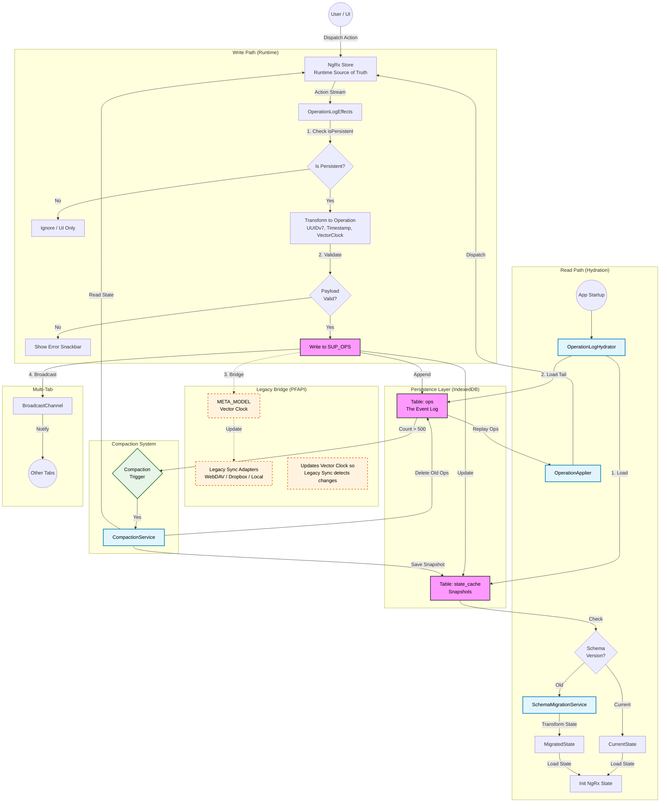
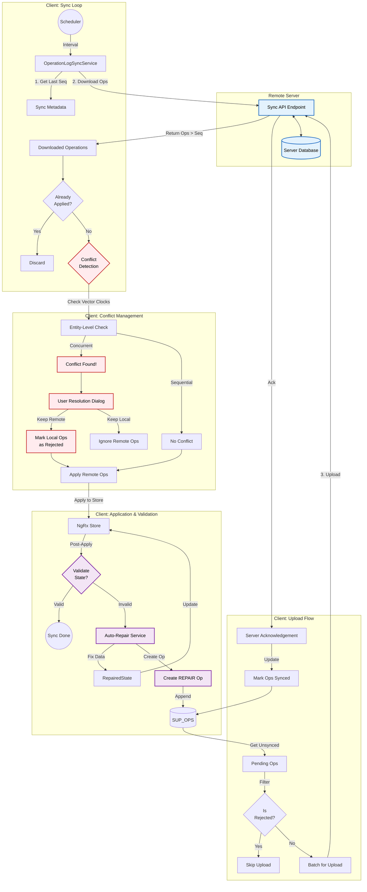

# Operation Log: Architecture Diagrams

## 1. Operation Log Architecture (Local Persistence & Legacy Bridge)

This diagram illustrates how user actions flow through the system, how they are persisted to IndexedDB (`SUP_OPS`), how the system hydrates on startup, and how it bridges to the legacy PFAPI system.

## 2. Operation Log Sync Architecture (Server Sync)

This diagram details the flow for syncing individual operations with a server (`Part C`), including conflict detection, resolution strategies, and the validation loop (`Part D`).

