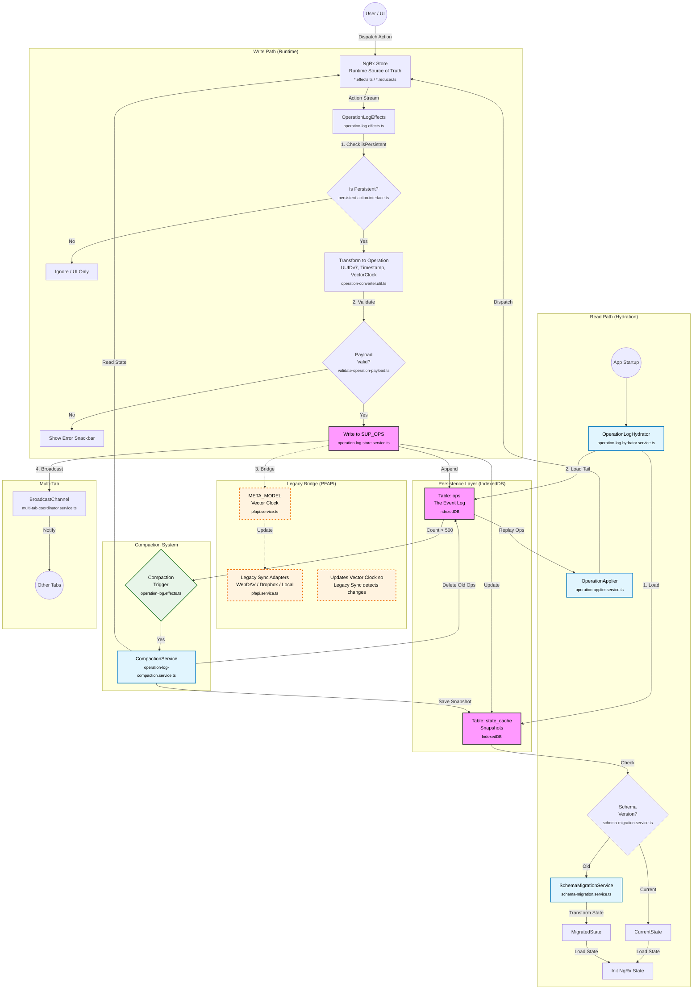
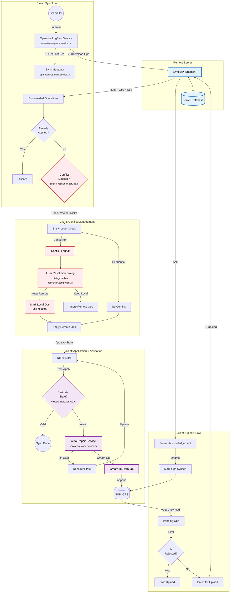
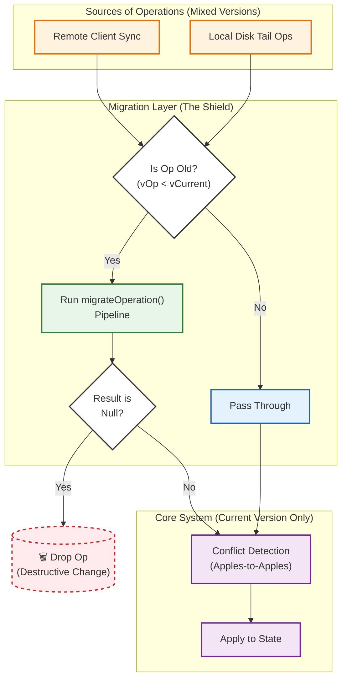
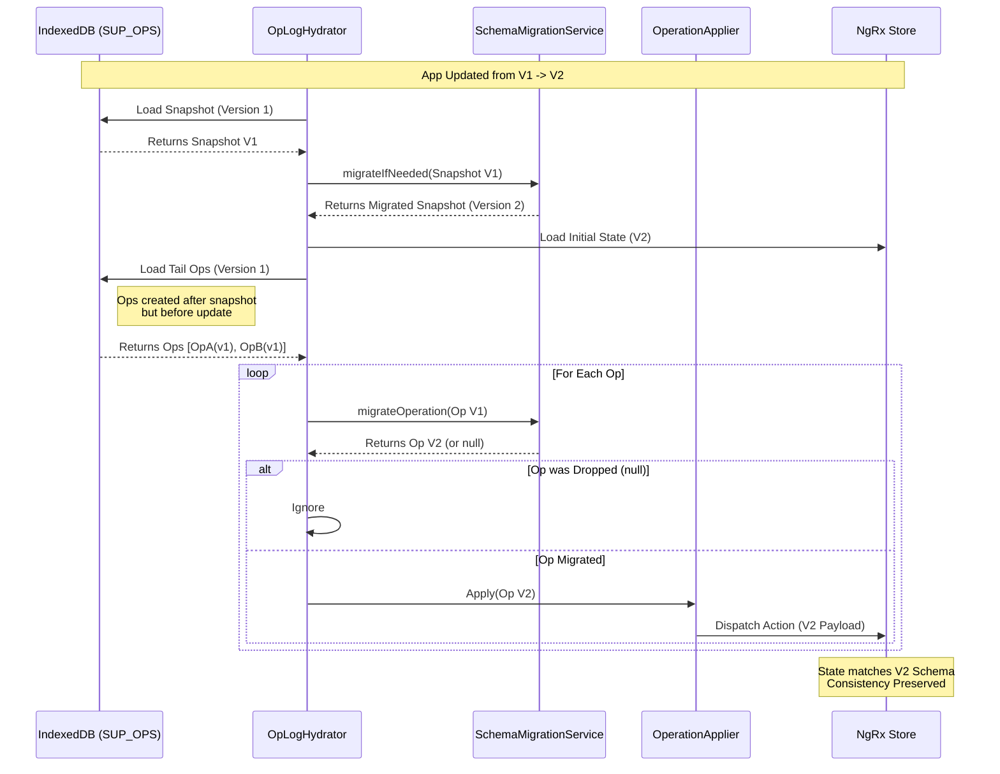
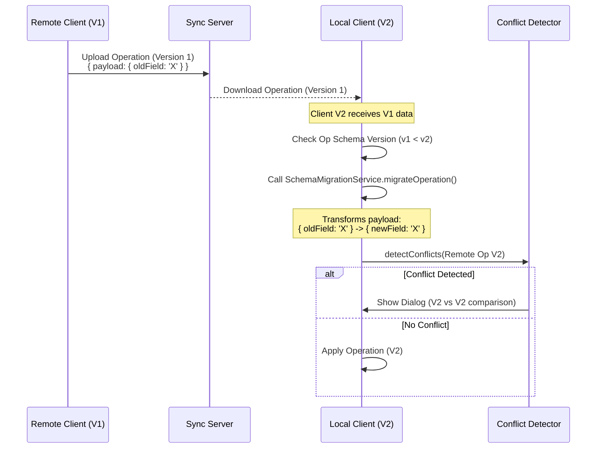
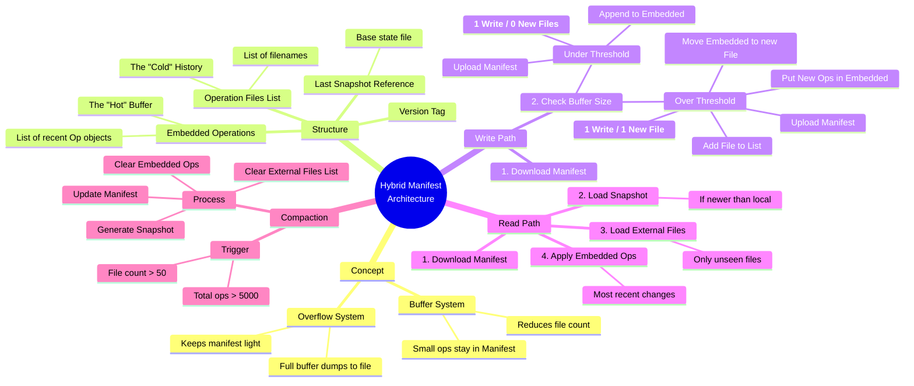

# Operation Log: Architecture Diagrams

## 1. Operation Log Architecture (Local Persistence & Legacy Bridge)

This diagram illustrates how user actions flow through the system, how they are persisted to IndexedDB (`SUP_OPS`), how the system hydrates on startup, and how it bridges to the legacy PFAPI system.



## 2. Operation Log Sync Architecture (Server Sync)

This diagram details the flow for syncing individual operations with a server (`Part C`), including conflict detection, resolution strategies, and the validation loop (`Part D`).



## 3. Conflict-Aware Migration Strategy (The Migration Shield)

This diagram visualizes the "Receiver-Side Migration" strategy. The Migration Layer acts as a shield, ensuring that _only_ operations matching the current schema version ever reach the core conflict detection and application logic.



## 4. Migration Scenarios

### 4.1 Tail Ops Migration (Local Startup Consistency)

Ensures that operations occurring after a snapshot ("Tail Ops") are migrated to the current version before being applied to the migrated state.



### 4.2 Receiver-Side Sync Migration

Demonstrates how a client on V2 handles incoming data from a client still on V1.



## 5. Hybrid Manifest (File-Based Sync)

This diagram illustrates the "Hybrid Manifest" optimization (`hybrid-manifest-architecture.md`) which reduces HTTP request overhead for WebDAV/Dropbox sync by buffering small operations directly inside the manifest file.

```mermaid
graph TD
    %% Nodes
    subgraph "Hybrid Manifest File (JSON)"
        ManVer[Version: 2]:::file
        SnapRef[Last Snapshot: 'snap_123.json']:::file
        Buffer[Embedded Ops (Buffer)<br/>[Op1, Op2, ...]]:::buffer
        ExtFiles[External Files List<br/>['ops_A.json', ...]]:::file
    end

    subgraph "Sync Logic (Upload Path)"
        Start((Start Sync)) --> ReadMan[Download Manifest]
        ReadMan --> CheckSize{Buffer Full?<br/>(> 50 ops)}

        CheckSize -- No --> AppendBuffer[Append to<br/>Embedded Ops]:::action
        AppendBuffer --> WriteMan[Upload Manifest]:::io

        CheckSize -- Yes --> Flush[Flush Buffer]:::action
        Flush --> CreateFile[Create 'ops_NEW.json'<br/>with old buffer content]:::io
        CreateFile --> UpdateRef[Add 'ops_NEW.json'<br/>to External Files]:::action
        UpdateRef --> ClearBuffer[Clear Buffer &<br/>Add Pending Ops]:::action
        ClearBuffer --> WriteMan
    end

    %% Styles
    classDef file fill:#fff3e0,stroke:#ef6c00,stroke-width:2px;
    classDef buffer fill:#e8f5e9,stroke:#2e7d32,stroke-width:2px;
    classDef action fill:#e3f2fd,stroke:#1565c0,stroke-width:2px;
    classDef io fill:#f3e5f5,stroke:#7b1fa2,stroke-width:2px;
```

## 6. Hybrid Manifest Conceptual Map

This mindmap breaks down the core concepts, structure, and decision flows of the Hybrid Manifest architecture, highlighting the "Buffer vs. Overflow" strategy.


