# Super Productivity Sync - Architecture Diagrams

This document contains Mermaid diagrams explaining the sync architecture, organized by server-side and client-side components.

---

# Part 1: Server Architecture

## 1.1 High-Level System Overview

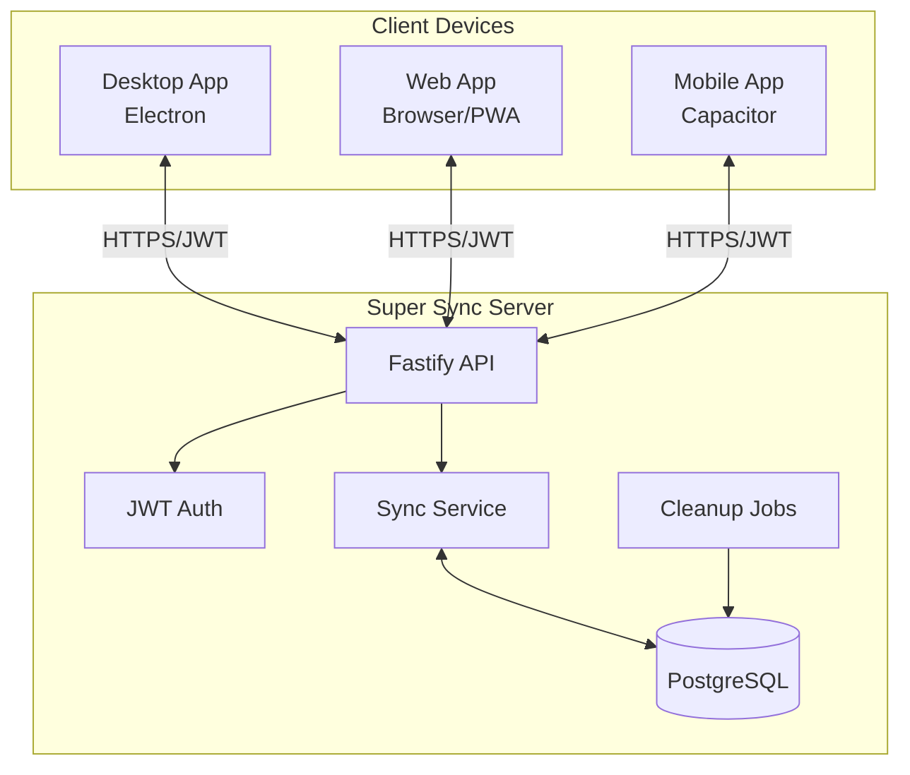
```mermaid
flowchart TB
    subgraph Clients["Client Devices"]
        C1[Desktop App<br/>Electron]
        C2[Web App<br/>Browser/PWA]
        C3[Mobile App<br/>Capacitor]
    end

    subgraph Server["Super Sync Server"]
        API[Fastify API]
        Auth[JWT Auth]
        Sync[Sync Service]
        DB[(PostgreSQL)]
        Jobs[Cleanup Jobs]
    end

    C1 <-->|HTTPS/JWT| API
    C2 <-->|HTTPS/JWT| API
    C3 <-->|HTTPS/JWT| API

    API --> Auth
    API --> Sync
    Sync <--> DB
    Jobs --> DB
```

## 1.2 Server Components

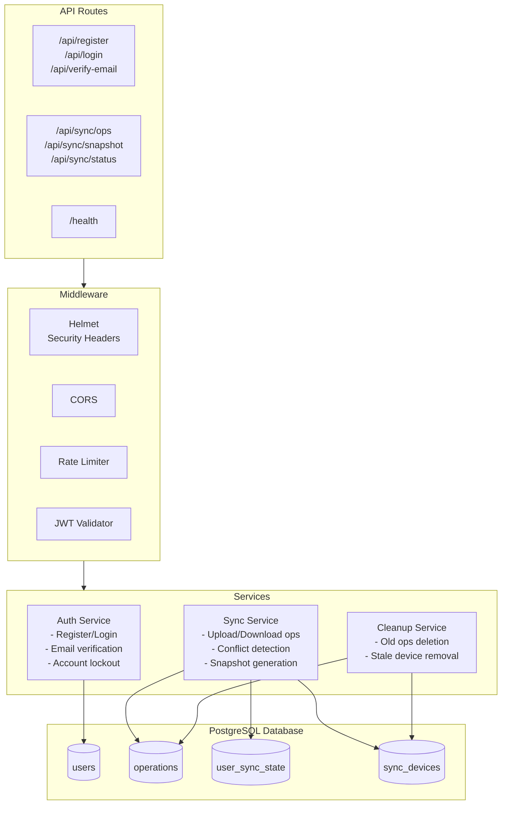
```mermaid
flowchart TB
    subgraph Routes["API Routes"]
        AuthR["/api/register<br/>/api/login<br/>/api/verify-email"]
        SyncR["/api/sync/ops<br/>/api/sync/snapshot<br/>/api/sync/status"]
        Health["/health"]
    end

    subgraph Middleware
        Helmet[Helmet<br/>Security Headers]
        CORS[CORS]
        RateLimit[Rate Limiter]
        JWTAuth[JWT Validator]
    end

    subgraph Services
        AuthS[Auth Service<br/>- Register/Login<br/>- Email verification<br/>- Account lockout]
        SyncS[Sync Service<br/>- Upload/Download ops<br/>- Conflict detection<br/>- Snapshot generation]
        CleanupS[Cleanup Service<br/>- Old ops deletion<br/>- Stale device removal]
    end

    subgraph Database["PostgreSQL Database"]
        Users[(users)]
        Ops[(operations)]
        SyncState[(user_sync_state)]
        Devices[(sync_devices)]
    end

    Routes --> Middleware
    Middleware --> Services
    AuthS --> Users
    SyncS --> Ops
    SyncS --> SyncState
    SyncS --> Devices
    CleanupS --> Ops
    CleanupS --> Devices
```

## 1.3 Database Schema

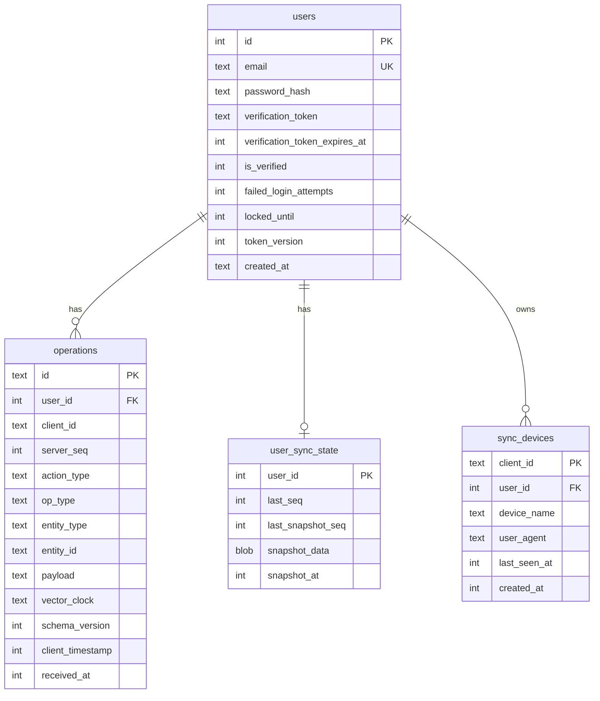
```mermaid
erDiagram
    users ||--o{ operations : has
    users ||--o| user_sync_state : has
    users ||--o{ sync_devices : owns

    users {
        int id PK
        text email UK
        text password_hash
        text verification_token
        int verification_token_expires_at
        int is_verified
        int failed_login_attempts
        int locked_until
        int token_version
        text created_at
    }

    operations {
        text id PK
        int user_id FK
        text client_id
        int server_seq
        text action_type
        text op_type
        text entity_type
        text entity_id
        text payload
        text vector_clock
        int schema_version
        int client_timestamp
        int received_at
    }

    user_sync_state {
        int user_id PK
        int last_seq
        int last_snapshot_seq
        blob snapshot_data
        int snapshot_at
    }

    sync_devices {
        text client_id PK
        int user_id FK
        text device_name
        text user_agent
        int last_seen_at
        int created_at
    }
```

**Schema Notes:**

- `operations.id`: UUID v7 format
- `operations.server_seq`: Auto-increment per user
- `operations.op_type`: CRT, UPD, DEL, MOV, BATCH, etc.
- `operations.entity_type`: TASK, PROJECT, TAG, NOTE, etc.
- `operations.payload`, `operations.vector_clock`: JSON format
- `user_sync_state.snapshot_data`: gzip compressed

## 1.4 Authentication Flow

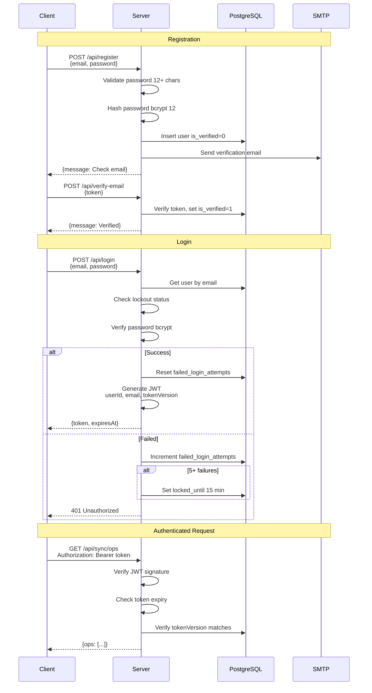
```mermaid
sequenceDiagram
    participant Client
    participant Server
    participant DB as PostgreSQL
    participant Email as SMTP

    Note over Client,Email: Registration

    Client->>Server: POST /api/register<br/>{email, password}
    Server->>Server: Validate password 12+ chars
    Server->>Server: Hash password bcrypt 12
    Server->>DB: Insert user is_verified=0
    Server->>Email: Send verification email
    Server-->>Client: {message: Check email}

    Client->>Server: POST /api/verify-email<br/>{token}
    Server->>DB: Verify token, set is_verified=1
    Server-->>Client: {message: Verified}

    Note over Client,Email: Login

    Client->>Server: POST /api/login<br/>{email, password}
    Server->>DB: Get user by email
    Server->>Server: Check lockout status
    Server->>Server: Verify password bcrypt

    alt Success
        Server->>DB: Reset failed_login_attempts
        Server->>Server: Generate JWT<br/>userId, email, tokenVersion
        Server-->>Client: {token, expiresAt}
    else Failed
        Server->>DB: Increment failed_login_attempts
        alt 5+ failures
            Server->>DB: Set locked_until 15 min
        end
        Server-->>Client: 401 Unauthorized
    end

    Note over Client,Email: Authenticated Request

    Client->>Server: GET /api/sync/ops<br/>Authorization: Bearer token
    Server->>Server: Verify JWT signature
    Server->>Server: Check token expiry
    Server->>DB: Verify tokenVersion matches
    Server-->>Client: {ops: [...]}
```

## 1.5 Conflict Detection (Server-Side)

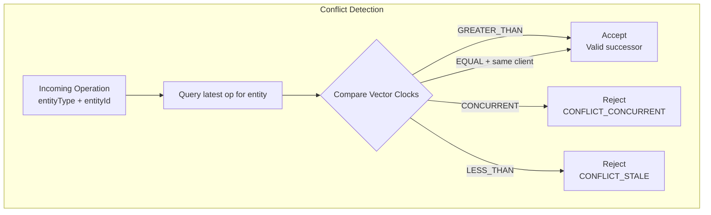
```mermaid
flowchart TB
    subgraph Detection["Conflict Detection"]
        Incoming[Incoming Operation<br/>entityType + entityId]
        Query[Query latest op for entity]
        Compare{Compare Vector Clocks}

        Incoming --> Query
        Query --> Compare

        Compare -->|GREATER_THAN| Accept[Accept<br/>Valid successor]
        Compare -->|EQUAL + same client| Accept
        Compare -->|CONCURRENT| Concurrent[Reject<br/>CONFLICT_CONCURRENT]
        Compare -->|LESS_THAN| Stale[Reject<br/>CONFLICT_STALE]
    end
```

## 1.6 Vector Clock Comparison

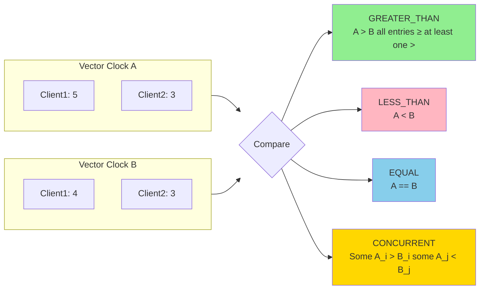
```mermaid
flowchart LR
    subgraph VC_A["Vector Clock A"]
        A1["Client1: 5"]
        A2["Client2: 3"]
    end

    subgraph VC_B["Vector Clock B"]
        B1["Client1: 4"]
        B2["Client2: 3"]
    end

    Compare{Compare}

    VC_A --> Compare
    VC_B --> Compare

    Compare --> GT["GREATER_THAN<br/>A > B all entries ≥ at least one >"]
    Compare --> LT["LESS_THAN<br/>A < B"]
    Compare --> EQ["EQUAL<br/>A == B"]
    Compare --> CC["CONCURRENT<br/>Some A_i > B_i some A_j < B_j"]

    style GT fill:#90EE90
    style LT fill:#FFB6C1
    style EQ fill:#87CEEB
    style CC fill:#FFD700
```

## 1.7 Rate Limiting

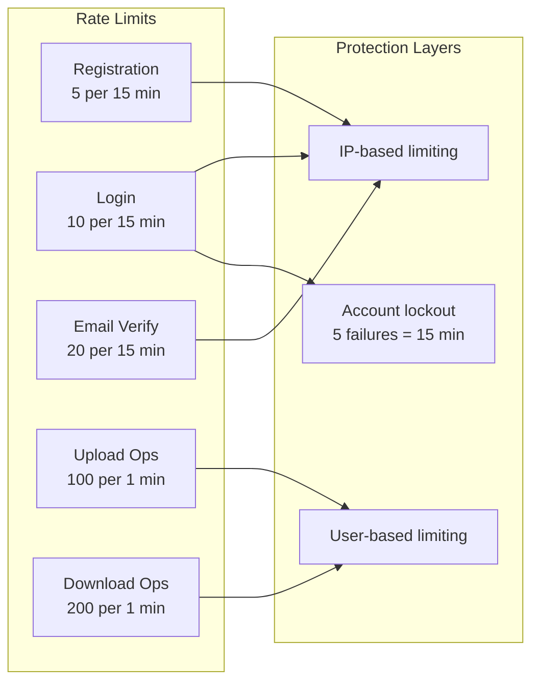
```mermaid
flowchart LR
    subgraph Limits["Rate Limits"]
        Reg["Registration<br/>5 per 15 min"]
        Login["Login<br/>10 per 15 min"]
        Verify["Email Verify<br/>20 per 15 min"]
        Upload["Upload Ops<br/>100 per 1 min"]
        Download["Download Ops<br/>200 per 1 min"]
    end

    subgraph Protection["Protection Layers"]
        IP[IP-based limiting]
        User[User-based limiting]
        Lockout[Account lockout<br/>5 failures = 15 min]
    end

    Reg --> IP
    Login --> IP
    Login --> Lockout
    Verify --> IP
    Upload --> User
    Download --> User
```

## 1.8 Sync API Endpoints

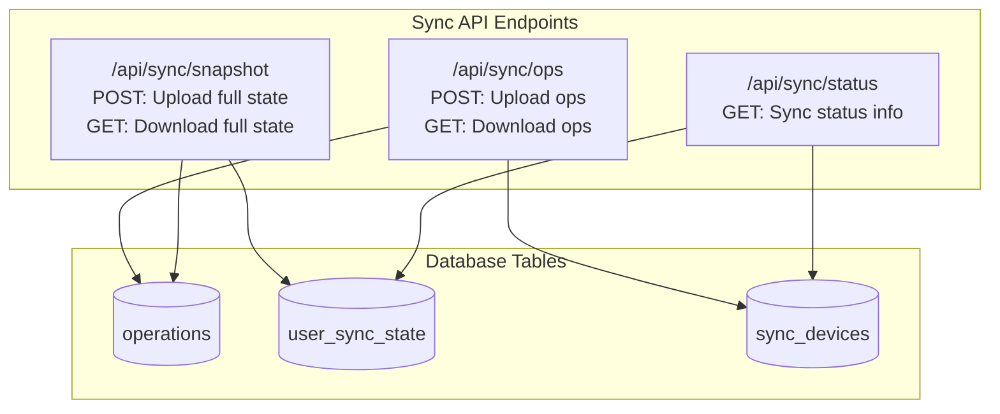
```mermaid
flowchart TB
    subgraph Endpoints["Sync API Endpoints"]
        OpsEndpoint["/api/sync/ops<br/>POST: Upload ops<br/>GET: Download ops"]
        SnapshotEndpoint["/api/sync/snapshot<br/>POST: Upload full state<br/>GET: Download full state"]
        StatusEndpoint["/api/sync/status<br/>GET: Sync status info"]
    end

    subgraph Tables["Database Tables"]
        OpsTable[(operations)]
        StateTable[(user_sync_state)]
        DevicesTable[(sync_devices)]
    end

    OpsEndpoint --> OpsTable
    OpsEndpoint --> DevicesTable
    SnapshotEndpoint --> StateTable
    SnapshotEndpoint --> OpsTable
    StatusEndpoint --> StateTable
    StatusEndpoint --> DevicesTable
```

## 1.9 Upload Operations - POST /api/sync/ops

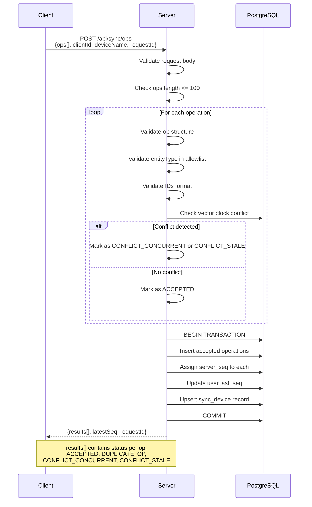
```mermaid
sequenceDiagram
    participant Client
    participant Server
    participant DB as PostgreSQL

    Client->>Server: POST /api/sync/ops<br/>{ops[], clientId, deviceName, requestId}

    Server->>Server: Validate request body
    Server->>Server: Check ops.length <= 100

    loop For each operation
        Server->>Server: Validate op structure
        Server->>Server: Validate entityType in allowlist
        Server->>Server: Validate IDs format
        Server->>DB: Check vector clock conflict
        alt Conflict detected
            Server->>Server: Mark as CONFLICT_CONCURRENT or CONFLICT_STALE
        else No conflict
            Server->>Server: Mark as ACCEPTED
        end
    end

    Server->>DB: BEGIN TRANSACTION
    Server->>DB: Insert accepted operations
    Server->>DB: Assign server_seq to each
    Server->>DB: Update user last_seq
    Server->>DB: Upsert sync_device record
    Server->>DB: COMMIT

    Server-->>Client: {results[], latestSeq, requestId}

    Note over Client,Server: results[] contains status per op:<br/>ACCEPTED, DUPLICATE_OP,<br/>CONFLICT_CONCURRENT, CONFLICT_STALE
```

## 1.10 Download Operations - GET /api/sync/ops

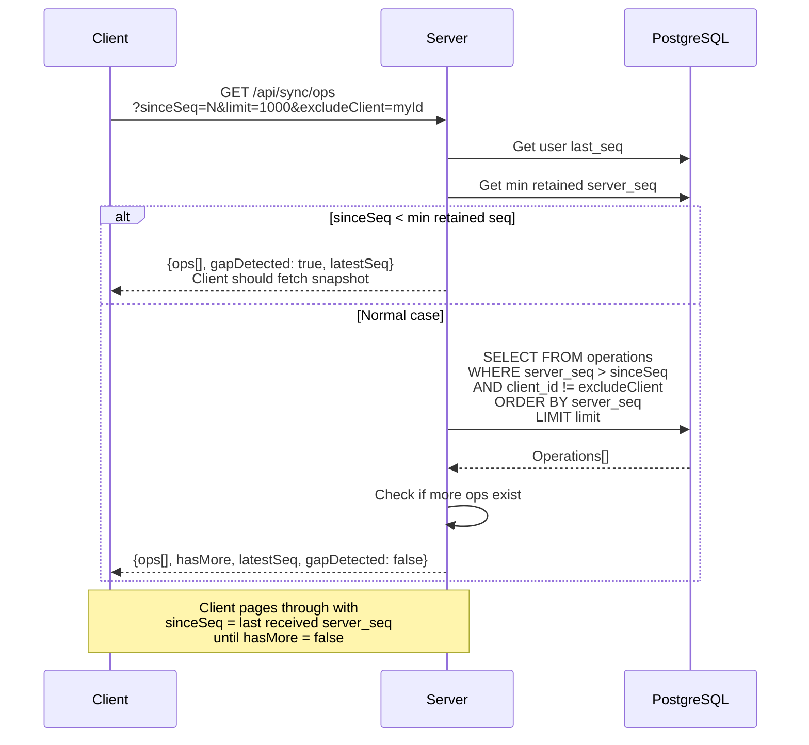
```mermaid
sequenceDiagram
    participant Client
    participant Server
    participant DB as PostgreSQL

    Client->>Server: GET /api/sync/ops<br/>?sinceSeq=N&limit=1000&excludeClient=myId

    Server->>DB: Get user last_seq
    Server->>DB: Get min retained server_seq

    alt sinceSeq < min retained seq
        Server-->>Client: {ops[], gapDetected: true, latestSeq}<br/>Client should fetch snapshot
    else Normal case
        Server->>DB: SELECT FROM operations<br/>WHERE server_seq > sinceSeq<br/>AND client_id != excludeClient<br/>ORDER BY server_seq<br/>LIMIT limit
        DB-->>Server: Operations[]
        Server->>Server: Check if more ops exist
        Server-->>Client: {ops[], hasMore, latestSeq, gapDetected: false}
    end

    Note over Client,Server: Client pages through with<br/>sinceSeq = last received server_seq<br/>until hasMore = false
```

## 1.11 Get Snapshot - GET /api/sync/snapshot

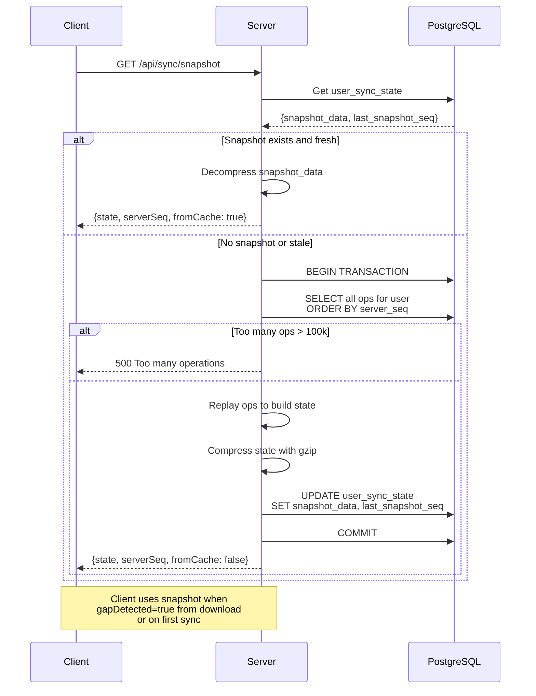
```mermaid
sequenceDiagram
    participant Client
    participant Server
    participant DB as PostgreSQL

    Client->>Server: GET /api/sync/snapshot

    Server->>DB: Get user_sync_state
    DB-->>Server: {snapshot_data, last_snapshot_seq}

    alt Snapshot exists and fresh
        Server->>Server: Decompress snapshot_data
        Server-->>Client: {state, serverSeq, fromCache: true}
    else No snapshot or stale
        Server->>DB: BEGIN TRANSACTION
        Server->>DB: SELECT all ops for user<br/>ORDER BY server_seq
        alt Too many ops > 100k
            Server-->>Client: 500 Too many operations
        else
            Server->>Server: Replay ops to build state
            Server->>Server: Compress state with gzip
            Server->>DB: UPDATE user_sync_state<br/>SET snapshot_data, last_snapshot_seq
            Server->>DB: COMMIT
            Server-->>Client: {state, serverSeq, fromCache: false}
        end
    end

    Note over Client,Server: Client uses snapshot when<br/>gapDetected=true from download<br/>or on first sync
```

## 1.11b Upload Snapshot - POST /api/sync/snapshot

Full-state operations (BackupImport, Repair, SyncImport) are uploaded via the snapshot endpoint instead of /api/sync/ops. This avoids body size limits for large payloads (~20-30MB) that contain the entire application state.

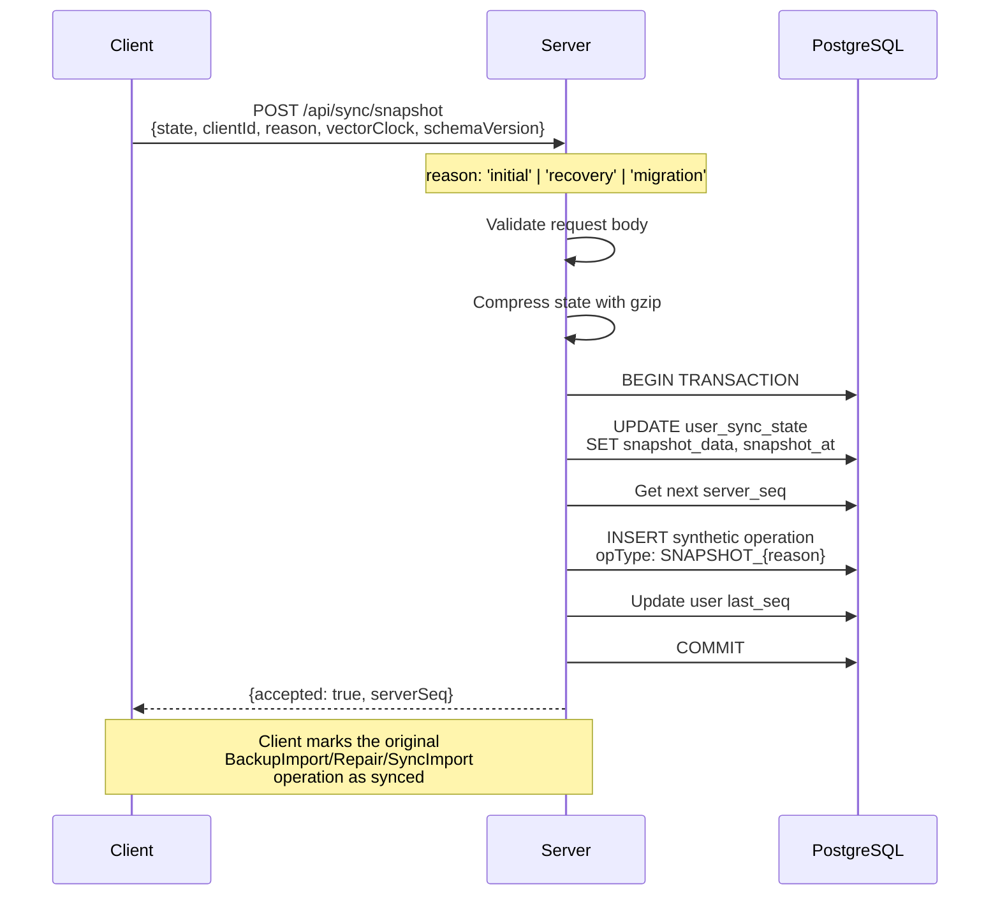
```mermaid
sequenceDiagram
    participant Client
    participant Server
    participant DB as PostgreSQL

    Client->>Server: POST /api/sync/snapshot<br/>{state, clientId, reason, vectorClock, schemaVersion}

    Note over Server: reason: 'initial' | 'recovery' | 'migration'

    Server->>Server: Validate request body
    Server->>Server: Compress state with gzip

    Server->>DB: BEGIN TRANSACTION
    Server->>DB: UPDATE user_sync_state<br/>SET snapshot_data, snapshot_at
    Server->>DB: Get next server_seq
    Server->>DB: INSERT synthetic operation<br/>opType: SNAPSHOT_{reason}
    Server->>DB: Update user last_seq
    Server->>DB: COMMIT

    Server-->>Client: {accepted: true, serverSeq}

    Note over Client,Server: Client marks the original<br/>BackupImport/Repair/SyncImport<br/>operation as synced
```

**Client-Side Routing (OperationLogUploadService):**

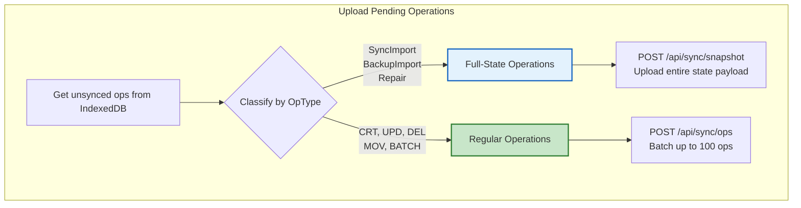
```mermaid
flowchart TB
    subgraph Upload["Upload Pending Operations"]
        GetPending[Get unsynced ops from IndexedDB]
        Classify{Classify by OpType}

        GetPending --> Classify

        Classify -->|SyncImport<br/>BackupImport<br/>Repair| FullState[Full-State Operations]
        Classify -->|CRT, UPD, DEL<br/>MOV, BATCH| Regular[Regular Operations]

        FullState --> SnapshotEndpoint[POST /api/sync/snapshot<br/>Upload entire state payload]
        Regular --> OpsEndpoint[POST /api/sync/ops<br/>Batch up to 100 ops]
    end

    style FullState fill:#e3f2fd,stroke:#1565c0,stroke-width:2px
    style Regular fill:#c8e6c9,stroke:#2e7d32,stroke-width:2px
```

## 1.12 Get Status - GET /api/sync/status

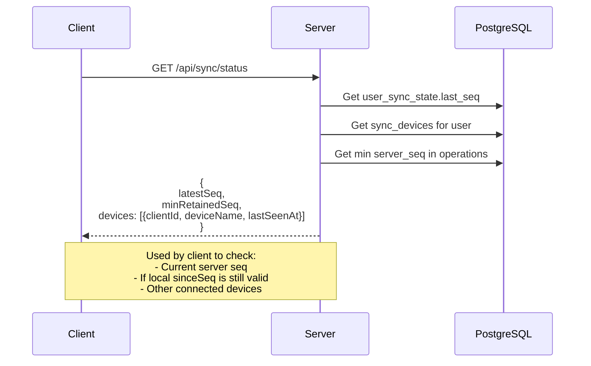
```mermaid
sequenceDiagram
    participant Client
    participant Server
    participant DB as PostgreSQL

    Client->>Server: GET /api/sync/status

    Server->>DB: Get user_sync_state.last_seq
    Server->>DB: Get sync_devices for user
    Server->>DB: Get min server_seq in operations

    Server-->>Client: {<br/>  latestSeq,<br/>  minRetainedSeq,<br/>  devices: [{clientId, deviceName, lastSeenAt}]<br/>}

    Note over Client,Server: Used by client to check:<br/>- Current server seq<br/>- If local sinceSeq is still valid<br/>- Other connected devices
```

## 1.13 Server Storage Model & Compaction

The server uses a **Snapshot + Operation Log** model for efficient sync:

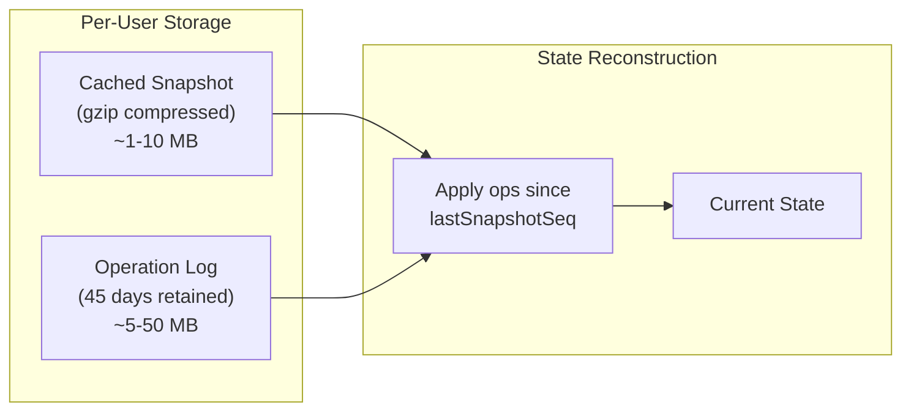
```mermaid
flowchart LR
    subgraph Storage["Per-User Storage"]
        Snapshot["Cached Snapshot<br/>(gzip compressed)<br/>~1-10 MB"]
        Ops["Operation Log<br/>(45 days retained)<br/>~5-50 MB"]
    end

    subgraph Rebuild["State Reconstruction"]
        Snapshot --> Apply["Apply ops since<br/>lastSnapshotSeq"]
        Ops --> Apply
        Apply --> Current["Current State"]
    end
```

**Why keep operations after snapshots?**

| Sync Type     | Data Transferred          | Use Case                                      |
| ------------- | ------------------------- | --------------------------------------------- |
| Incremental   | Few KB (recent ops only)  | Normal sync - device is mostly up-to-date     |
| Full Snapshot | Several MB (entire state) | New device or gap detected (>45 days offline) |

Keeping operations enables **incremental sync** - devices fetch only what changed since their last sync, not the entire state.

**Storage growth pattern:**

```
Day 1-45:   Operations accumulate (linear growth)
Day 45+:    Old ops deleted, storage stabilizes at ~45 days of history
Steady state: Snapshot (~1-10 MB) + 45 days ops (~5-50 MB) per user
```

## 1.14 Server Cleanup Process

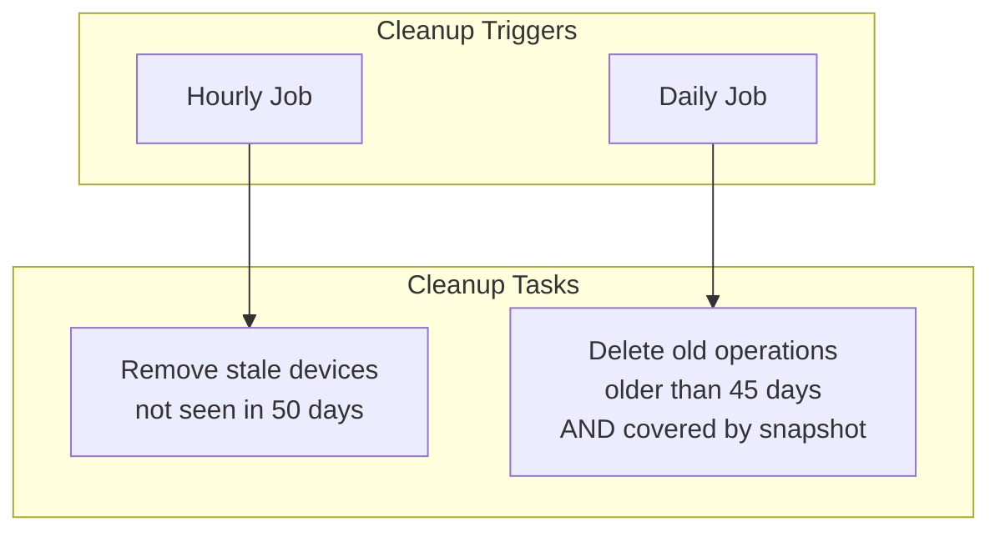
```mermaid
flowchart TB
    subgraph Triggers["Cleanup Triggers"]
        Hourly[Hourly Job]
        Daily[Daily Job]
    end

    subgraph Cleanup["Cleanup Tasks"]
        StaleDevices[Remove stale devices<br/>not seen in 50 days]
        OldOps[Delete old operations<br/>older than 45 days<br/>AND covered by snapshot]
    end

    Hourly --> StaleDevices
    Daily --> OldOps
```

**Operation deletion constraint:**

Operations are only deleted when BOTH conditions are met:

1. `receivedAt < (now - 45 days)` - older than retention period
2. `serverSeq <= lastSnapshotSeq` - covered by a cached snapshot

This ensures we can always reconstruct current state from snapshot + remaining ops.

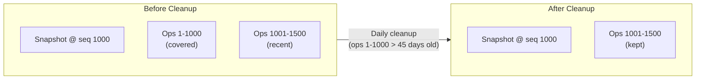
```mermaid
flowchart LR
    subgraph Before["Before Cleanup"]
        S1["Snapshot @ seq 1000"]
        O1["Ops 1-1000<br/>(covered)"]
        O2["Ops 1001-1500<br/>(recent)"]
    end

    subgraph After["After Cleanup"]
        S2["Snapshot @ seq 1000"]
        O3["Ops 1001-1500<br/>(kept)"]
    end

    Before -->|"Daily cleanup<br/>(ops 1-1000 > 45 days old)"| After
```

---

# Part 2: Client Architecture

## 2.1 Client Components

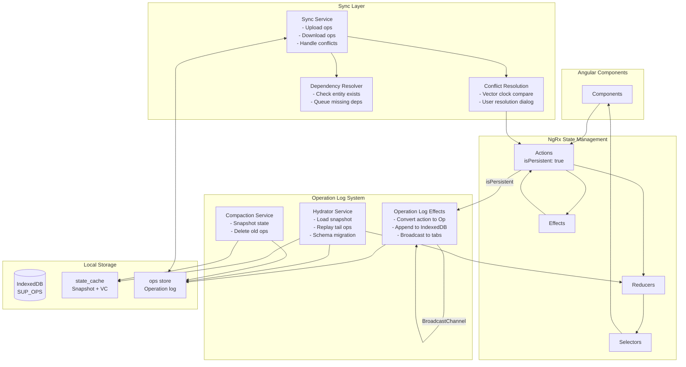
```mermaid
flowchart TB
    subgraph UI["Angular Components"]
        Comp[Components]
    end

    subgraph State["NgRx State Management"]
        Actions[Actions<br/>isPersistent: true]
        Reducers[Reducers]
        Effects[Effects]
        Selectors[Selectors]
    end

    subgraph OpLog["Operation Log System"]
        LogEffects[Operation Log Effects<br/>- Convert action to Op<br/>- Append to IndexedDB<br/>- Broadcast to tabs]
        Hydrator[Hydrator Service<br/>- Load snapshot<br/>- Replay tail ops<br/>- Schema migration]
        Compaction[Compaction Service<br/>- Snapshot state<br/>- Delete old ops]
    end

    subgraph Sync["Sync Layer"]
        SyncService[Sync Service<br/>- Upload ops<br/>- Download ops<br/>- Handle conflicts]
        ConflictRes[Conflict Resolution<br/>- Vector clock compare<br/>- User resolution dialog]
        DependencyRes[Dependency Resolver<br/>- Check entity exists<br/>- Queue missing deps]
    end

    subgraph Storage["Local Storage"]
        IDB[(IndexedDB<br/>SUP_OPS)]
        StateCache[state_cache<br/>Snapshot + VC]
        OpsStore[ops store<br/>Operation log]
    end

    Comp --> Actions
    Actions --> Reducers
    Reducers --> Selectors
    Selectors --> Comp
    Actions --> Effects
    Effects --> Actions

    Actions -->|isPersistent| LogEffects
    LogEffects --> OpsStore
    LogEffects -->|BroadcastChannel| LogEffects

    Hydrator --> StateCache
    Hydrator --> OpsStore
    Hydrator --> Reducers

    Compaction --> StateCache
    Compaction --> OpsStore

    SyncService <--> OpsStore
    SyncService --> ConflictRes
    SyncService --> DependencyRes
    ConflictRes --> Actions
```

## 2.2 Operation Structure

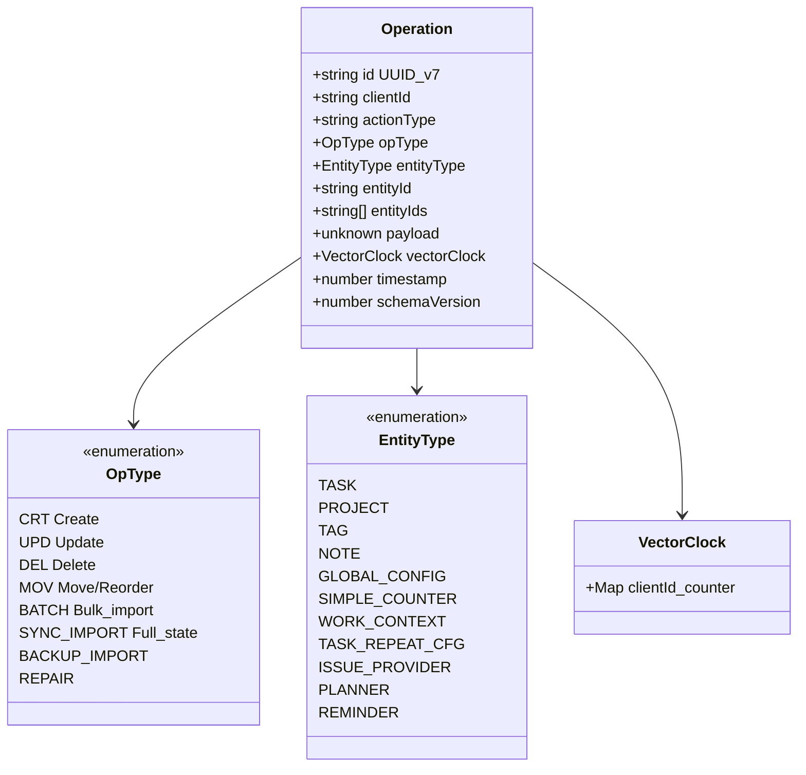
```mermaid
classDiagram
    class Operation {
        +string id UUID_v7
        +string clientId
        +string actionType
        +OpType opType
        +EntityType entityType
        +string entityId
        +string[] entityIds
        +unknown payload
        +VectorClock vectorClock
        +number timestamp
        +number schemaVersion
    }

    class OpType {
        <<enumeration>>
        CRT Create
        UPD Update
        DEL Delete
        MOV Move/Reorder
        BATCH Bulk_import
        SYNC_IMPORT Full_state
        BACKUP_IMPORT
        REPAIR
    }

    class EntityType {
        <<enumeration>>
        TASK
        PROJECT
        TAG
        NOTE
        GLOBAL_CONFIG
        SIMPLE_COUNTER
        WORK_CONTEXT
        TASK_REPEAT_CFG
        ISSUE_PROVIDER
        PLANNER
        REMINDER
    }

    class VectorClock {
        +Map clientId_counter
    }

    Operation --> OpType
    Operation --> EntityType
    Operation --> VectorClock
```

## 2.3 Multi-Tab Coordination

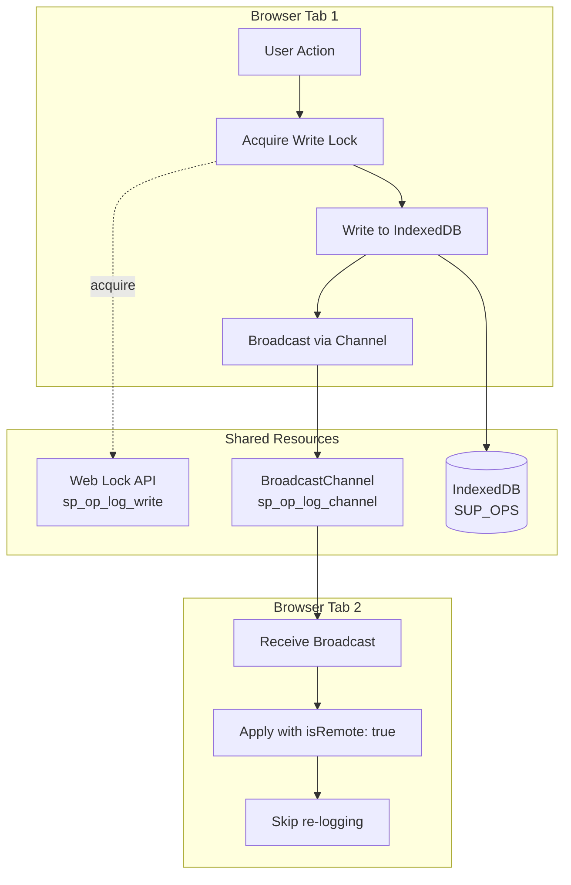
```mermaid
flowchart TB
    subgraph Tab1["Browser Tab 1"]
        T1Action[User Action]
        T1Lock[Acquire Write Lock]
        T1Write[Write to IndexedDB]
        T1Broadcast[Broadcast via Channel]
    end

    subgraph Tab2["Browser Tab 2"]
        T2Receive[Receive Broadcast]
        T2Apply[Apply with isRemote: true]
        T2NoLog[Skip re-logging]
    end

    subgraph Shared["Shared Resources"]
        WebLock[Web Lock API<br/>sp_op_log_write]
        BC[BroadcastChannel<br/>sp_op_log_channel]
        IDB[(IndexedDB<br/>SUP_OPS)]
    end

    T1Action --> T1Lock
    T1Lock -.->|acquire| WebLock
    T1Lock --> T1Write
    T1Write --> IDB
    T1Write --> T1Broadcast
    T1Broadcast --> BC
    BC --> T2Receive
    T2Receive --> T2Apply
    T2Apply --> T2NoLog
```

## 2.4 Compaction Process

```mermaid
flowchart TB
    Trigger{Trigger<br/>Every 500 ops}
    Lock[Acquire Compact Lock]
    ReadState[Read current NgRx state]
    SaveSnapshot[Save to state_cache<br/>+ lastAppliedOpSeq<br/>+ vectorClock]
    FindOld[Find old ops<br/>synced + older than retention]
    Delete[Delete old ops]
    Release[Release lock]

    Trigger --> Lock
    Lock --> ReadState
    ReadState --> SaveSnapshot
    SaveSnapshot --> FindOld
    FindOld --> Delete
    Delete --> Release

    subgraph EmergencyPath["Emergency Compaction"]
        Quota[QuotaExceededError]
        ShortRetention[24hr retention<br/>instead of 7 days]
        CircuitBreaker[Circuit breaker<br/>prevent infinite loop]
    end

    Quota --> ShortRetention
    ShortRetention --> CircuitBreaker
```

## 2.5 Hydration - App Startup

```mermaid
flowchart TB
    Start[App Startup]
    LoadSnap[Load snapshot from state_cache]
    CheckSchema{Schema version<br/>matches?}
    Migrate[Run migrations]
    Dispatch[Dispatch loadAllData]
    LoadTail[Load tail ops<br/>seq > lastAppliedOpSeq]
    CheckImport{Last op is<br/>SyncImport?}
    LoadDirect[Load state directly]
    Replay[Replay ops<br/>isRemote: true]
    Validate[Validate final state]
    Repair{Valid?}
    RunRepair[Run data repair<br/>Create REPAIR op]
    Ready[App Ready]

    Start --> LoadSnap
    LoadSnap --> CheckSchema
    CheckSchema -->|No| Migrate
    CheckSchema -->|Yes| Dispatch
    Migrate --> Dispatch
    Dispatch --> LoadTail
    LoadTail --> CheckImport
    CheckImport -->|Yes| LoadDirect
    CheckImport -->|No| Replay
    LoadDirect --> Validate
    Replay --> Validate
    Validate --> Repair
    Repair -->|No| RunRepair
    Repair -->|Yes| Ready
    RunRepair --> Ready
```

## 2.6 Conflict Resolution (Client-Side)

```mermaid
flowchart TB
    subgraph Resolution["Conflict Resolution"]
        Receive[Receive conflict response]
        Dialog[Show Resolution Dialog]
        Choice{User Choice}

        Receive --> Dialog
        Dialog --> Choice

        Choice -->|Keep Local| KeepLocal[Upload with merged VC]
        Choice -->|Keep Remote| KeepRemote[Apply remote<br/>Mark local rejected]
        Choice -->|Merge| Merge[Create merged op<br/>Upload merged]
    end
```

## 2.7 LOCAL_ACTIONS Token Pattern

```mermaid
flowchart TB
    subgraph Source["Action Sources"]
        Local[Local User Action<br/>isRemote: undefined]
        Remote[Remote Sync Op<br/>isRemote: true]
        OtherTab[Other Tab Broadcast<br/>isRemote: true]
    end

    subgraph Filter["LOCAL_ACTIONS Filter"]
        Check{isRemote?}
        Pass[Pass through]
        Block[Filter out]
    end

    subgraph Effects["Effect Types"]
        SideEffect[Side Effect Effects<br/>- showSnack$<br/>- playSound$<br/>- postToJira$<br/>- pluginHooks$]
        StateEffect[State Effects<br/>- cascadeDelete$<br/>- updateRelations$]
    end

    Local --> Check
    Remote --> Check
    OtherTab --> Check

    Check -->|false/undefined| Pass
    Check -->|true| Block

    Pass --> SideEffect
    Block -.->|skipped| SideEffect

    Local --> StateEffect
    Remote --> StateEffect
    OtherTab --> StateEffect

    style SideEffect fill:#FFE4B5
    style StateEffect fill:#B0E0E6
```

## 2.8 Meta-Reducers for Atomic State Changes

When a single user action affects multiple entities (e.g., deleting a tag updates tasks, task repeat configs, and time tracking), all changes must be captured in a single operation to ensure consistency during sync.

```mermaid
flowchart TB
    subgraph Problem["❌ Effects Pattern (Non-Atomic)"]
        direction TB
        P1[deleteTag action] --> P2[tag.reducer]
        P2 --> P3[effect: removeTagFromTasks]
        P3 --> P4[task.reducer]
        P4 --> P5[effect: cleanTaskRepeatCfgs]
        Note1["Each step = separate operation<br/>Partial sync → inconsistent state"]
    end

    subgraph Solution["✅ Meta-Reducer Pattern (Atomic)"]
        direction TB
        S1[deleteTag action] --> S2[tagSharedMetaReducer]
        S2 --> S3["All changes atomically:<br/>• tasks.tagIds updated<br/>• orphaned tasks deleted<br/>• TaskRepeatCfgs cleaned<br/>• TimeTracking cleaned"]
        S3 --> S4[Single Operation<br/>with entityChanges array]
        Note2["One action = one operation<br/>All-or-nothing sync"]
    end

    style Problem fill:#ffebee,stroke:#c62828,stroke-width:2px
    style Solution fill:#e8f5e9,stroke:#2e7d32,stroke-width:2px
```

**Key Meta-Reducers:**

- `tagSharedMetaReducer` - Tag deletion with full cleanup
- `projectSharedMetaReducer` - Project deletion cleanup
- `taskSharedCrudMetaReducer` - Task CRUD with tag/project updates
- `stateCaptureMetaReducer` - Captures before/after state for diff

See Part F in [operation-log-architecture.md](docs/sync-and-op-log/operation-log-architecture.md) for details.

---

# Part 3: Client-Server Interaction

## 3.1 Upload Flow - Client to Server

```mermaid
sequenceDiagram
    participant User
    participant NgRx as NgRx Store
    participant OpLog as Operation Log
    participant IDB as IndexedDB
    participant Server as Sync Server
    participant DB as PostgreSQL

    User->>NgRx: Dispatch action<br/>isPersistent: true
    NgRx->>NgRx: Reducer updates state
    NgRx->>OpLog: Effect intercepts action

    OpLog->>OpLog: Convert action to Operation
    OpLog->>OpLog: Generate UUID v7
    OpLog->>OpLog: Increment vector clock
    OpLog->>IDB: Append to ops store

    Note over OpLog,IDB: Sync triggered poll/manual

    OpLog->>IDB: Get unsynced ops
    IDB-->>OpLog: Operations[]

    OpLog->>Server: POST /api/sync/ops<br/>{ops, clientId, requestId}

    Server->>Server: Validate each op
    Server->>DB: Check for conflicts<br/>vector clock comparison

    alt No Conflict
        Server->>DB: BEGIN TRANSACTION
        Server->>DB: Insert operations
        Server->>DB: Update last_seq
        Server->>DB: Update device last_seen
        Server->>DB: COMMIT
        Server-->>OpLog: {results: ACCEPTED, latestSeq}
        OpLog->>IDB: Mark ops as synced
    else Conflict Detected
        Server-->>OpLog: {results: CONFLICT, conflictingOp}
        OpLog->>User: Show conflict dialog
    end
```

## 3.2 Download Flow - Server to Client

```mermaid
sequenceDiagram
    participant OpLog as Operation Log
    participant Server as Sync Server
    participant DB as PostgreSQL
    participant IDB as IndexedDB
    participant NgRx as NgRx Store
    participant DepRes as Dependency Resolver

    Note over OpLog: Polling interval or manual sync

    OpLog->>Server: GET /api/sync/ops<br/>?sinceSeq=N&excludeClient=myId

    Server->>DB: SELECT ops WHERE server_seq > N<br/>AND client_id != excludeClient
    DB-->>Server: Operations[]
    Server->>Server: Check for gap<br/>sinceSeq < min retained seq?
    Server-->>OpLog: {ops, hasMore, latestSeq, gapDetected}

    alt Gap Detected
        OpLog->>Server: GET /api/sync/snapshot
        Server-->>OpLog: {state, serverSeq}
        OpLog->>IDB: Save snapshot to state_cache
        OpLog->>NgRx: Dispatch loadAllData state
    else Normal Download
        loop For each remote op
            OpLog->>DepRes: Check dependencies exist
            alt Dependencies satisfied
                OpLog->>NgRx: Dispatch action<br/>isRemote: true
                NgRx->>NgRx: Reducer applies change
                OpLog->>IDB: Store remote op
            else Dependency missing
                OpLog->>OpLog: Queue for retry
            end
        end
    end

    OpLog->>IDB: Update lastServerSeq
```

## 3.3 Full Sync Cycle

```mermaid
flowchart TB
    subgraph LocalChanges["Local Changes"]
        UserEdit[User edits data]
        CreateOp[Create operation<br/>VC++ UUID v7]
        StoreLocal[Store in IndexedDB]
        QueueUpload[Queue for upload]
    end

    subgraph Upload["Upload Phase"]
        BatchOps["Batch ops max 100"]
        SendUpload[POST /api/sync/ops]
        HandleResult{Result?}
        MarkSynced[Mark syncedAt]
        HandleConflict[Handle conflict]
    end

    subgraph Download["Download Phase"]
        Poll[Poll for new ops]
        SendDownload[GET /api/sync/ops]
        CheckGap{Gap?}
        GetSnapshot[GET /api/sync/snapshot]
        ApplyRemote[Apply remote ops]
        UpdateSeq[Update lastServerSeq]
    end

    subgraph Maintenance["Maintenance"]
        Compact[Compaction<br/>every 500 ops]
        Cleanup[Server cleanup<br/>time-based: 50 days]
    end

    UserEdit --> CreateOp
    CreateOp --> StoreLocal
    StoreLocal --> QueueUpload
    QueueUpload --> BatchOps
    BatchOps --> SendUpload
    SendUpload --> HandleResult
    HandleResult -->|Accepted| MarkSynced
    HandleResult -->|Conflict| HandleConflict

    MarkSynced --> Poll
    Poll --> SendDownload
    SendDownload --> CheckGap
    CheckGap -->|Yes| GetSnapshot
    CheckGap -->|No| ApplyRemote
    GetSnapshot --> ApplyRemote
    ApplyRemote --> UpdateSeq

    UpdateSeq --> Compact
    Compact --> Cleanup
```

## 3.4 Error Handling and Recovery

```mermaid
flowchart TB
    subgraph Errors["Error Types"]
        Validation[VALIDATION_FAILED<br/>Do not retry]
        Conflict[CONFLICT<br/>User resolution]
        Duplicate[DUPLICATE_OP<br/>Ignore idempotent]
        RateLimit[RATE_LIMITED<br/>Backoff retry]
        Network[Network Error<br/>Exponential backoff]
        Gap[Gap Detected<br/>Fetch snapshot]
    end

    subgraph Recovery["Recovery Strategies"]
        Snapshot[Full snapshot sync]
        Repair[Data repair<br/>Typia validation]
        Retry[Retry with backoff]
        UserAction[User intervention]
    end

    Validation --> UserAction
    Conflict --> UserAction
    Duplicate -.->|safe to ignore| Continue[Continue]
    RateLimit --> Retry
    Network --> Retry
    Gap --> Snapshot
    Snapshot --> Repair
    Repair --> Continue

    subgraph ValidationCheckpoints["Validation Checkpoints"]
        CP_A[Checkpoint A<br/>Before IndexedDB write]
        CP_B[Checkpoint B<br/>After snapshot load]
        CP_C[Checkpoint C<br/>After tail replay]
        CP_D[Checkpoint D<br/>After sync download]
    end

    CP_A --> CP_B
    CP_B --> CP_C
    CP_C --> CP_D
    CP_D -->|Invalid| Repair
```
