# Operation Log: Architecture Diagrams

**Last Updated:** December 16, 2025
**Status:** All core diagrams reflect current implementation

These diagrams visualize the Operation Log system architecture. For implementation details, see [operation-log-architecture.md](./operation-log-architecture.md).

---

## 1. Operation Log Architecture (Local Persistence & Legacy Bridge) ✅ IMPLEMENTED

This diagram illustrates how user actions flow through the system, how they are persisted to IndexedDB (`SUP_OPS`), how the system hydrates on startup, and how it bridges to the legacy PFAPI system.

**Implementation Status:** Complete. See Part A and Part B in [operation-log-architecture.md](./operation-log-architecture.md).

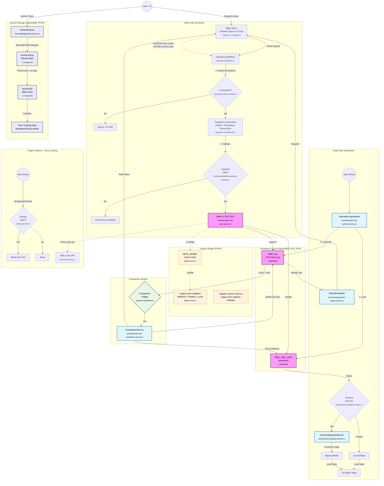

**Archive Data Flow Notes:**

- **Archive writes happen BEFORE dispatch**: When a user archives tasks, `ArchiveService` writes to IndexedDB first, then dispatches the `moveToArchive` action. This ensures data is safely stored before state updates.
- **Two-tier archive**: Recent tasks go to `archiveYoung`. Tasks older than 21 days are flushed to `archiveOld` via `flushYoungToOld` (checked every ~14 days when archiving tasks).
- **Time tracking data**: Stored with archived tasks as `timeSpentOnDay` entries.
- **Not in NgRx state**: Archive data is stored directly in IndexedDB (via PFAPI), not in the NgRx store. Only the operation (moveToArchive) is logged for sync.
- **Sync handling**: On remote clients, `ArchiveOperationHandler` writes archive data AFTER receiving the operation (see Section 8).

## 2. Operation Log Sync Architecture (Server Sync) ✅ IMPLEMENTED

This diagram details the flow for syncing individual operations with a server (`Part C`), including conflict detection, resolution strategies, and the validation loop (`Part D`).

**Implementation Status:** Complete (single-schema-version). Key services:

- `OperationLogSyncService` - Orchestration, fresh client safety checks
- `OperationLogUploadService` / `OperationLogDownloadService` - Data transfer (API + file-based fallback)
- `ConflictResolutionService` - User resolution UI, batch apply
- `VectorClockService` - Conflict detection, frontier tracking
- `DependencyResolverService` - Hard/soft dependency extraction

**Recent Additions (December 2025):**

- Server-side security: audit logging, error codes, deduplication, validation
- Gap detection in download operations
- Transaction isolation for downloads
- Full-state operations (BackupImport, Repair, SyncImport) routed via snapshot endpoint

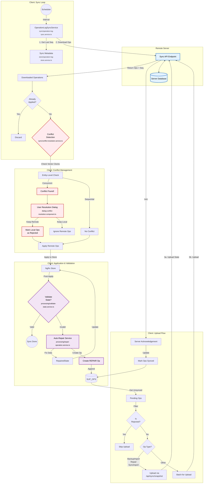

## 2b. Full-State Operations via Snapshot Endpoint ✅ IMPLEMENTED

Full-state operations (BackupImport, Repair, SyncImport) contain the entire application state and can exceed the regular `/api/sync/ops` body size limit (~30MB). These operations are routed through the `/api/sync/snapshot` endpoint instead.

**Implementation Status:** Complete. See `OperationLogUploadService._uploadFullStateOpAsSnapshot()`.

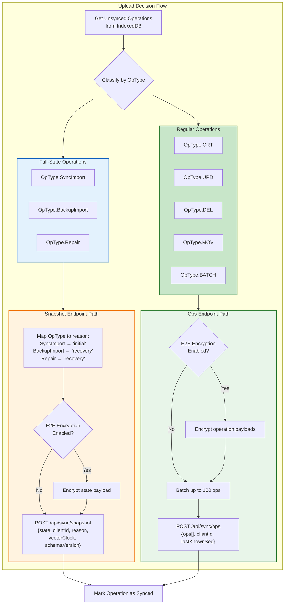

**Why This Matters:**

1. **Body Size Limits**: Regular `/api/sync/ops` has a ~30MB limit which backup imports can exceed
2. **Efficiency**: Snapshot endpoint is designed for large payloads and stores state directly
3. **Server-Side Handling**: Server creates a synthetic operation record for audit purposes

## 2c. Late-Joiner Replay with Vector Clock Dominance ✅ IMPLEMENTED

When a client receives a SYNC_IMPORT (full state from another client), it must replay any local synced operations that happened "after" the import's vector clock. This ensures local work isn't lost when receiving a full state snapshot.

**Implementation Status:** Complete. See `OperationLogSyncService._replayLocalSyncedOpsAfterImport()`.

### The Late-Joiner Problem

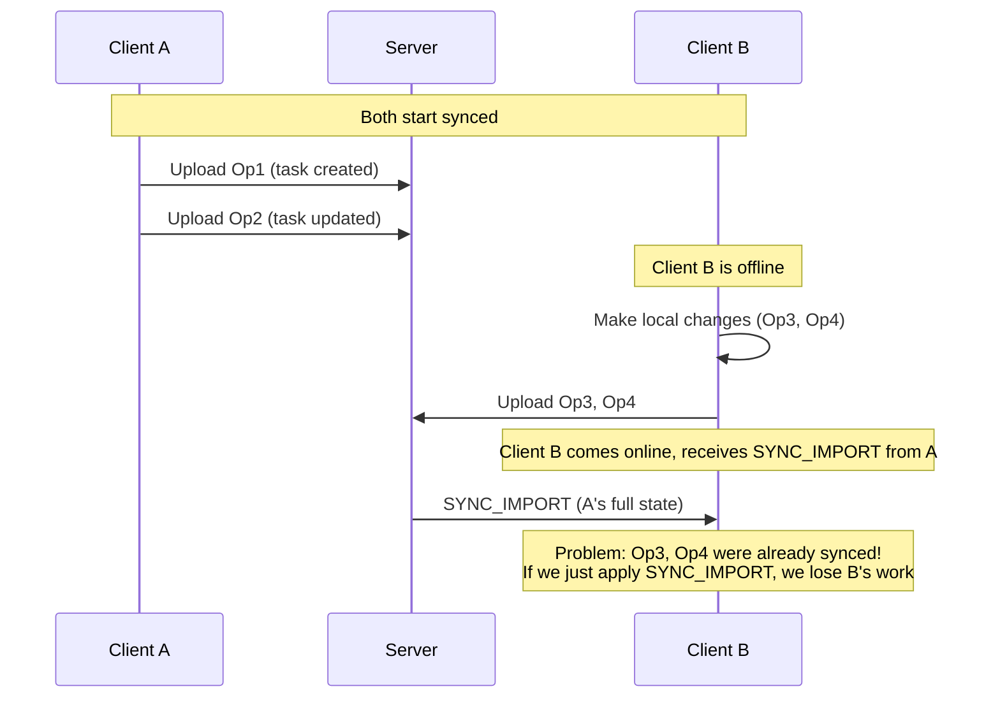

### The Solution: Vector Clock Dominance Filter

Before replaying local synced ops after a SYNC_IMPORT, we filter out ops that are "dominated" by the SYNC_IMPORT's vector clock. An op is dominated if its vector clock is `LESS_THAN` the SYNC_IMPORT's clock - meaning the op's state is already captured in the imported snapshot.

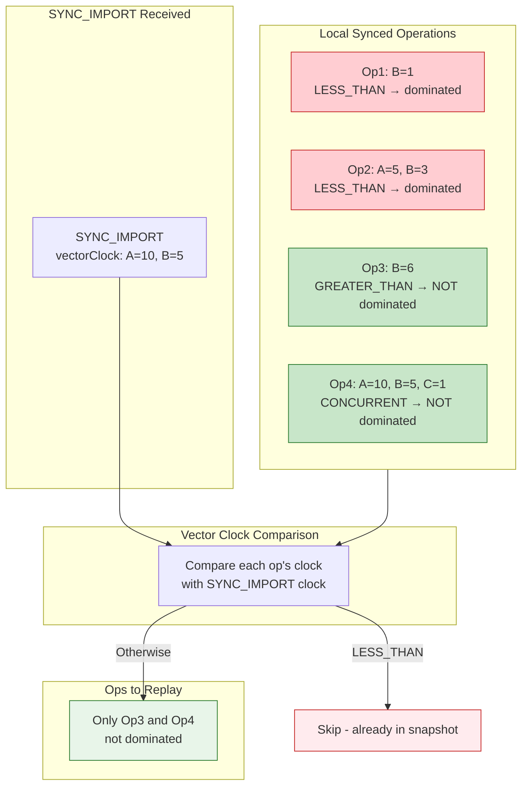

### Vector Clock Comparison Results

| Comparison     | Meaning                        | Action                             |
| -------------- | ------------------------------ | ---------------------------------- |
| `LESS_THAN`    | Op happened-before SYNC_IMPORT | Skip (state already captured)      |
| `EQUAL`        | Same causal history            | Replay (edge case, safe to replay) |
| `GREATER_THAN` | Op happened-after SYNC_IMPORT  | Replay (newer than snapshot)       |
| `CONCURRENT`   | Independent changes            | Replay (may have unique changes)   |

### Implementation Details

```typescript
// In OperationLogSyncService._replayLocalSyncedOpsAfterImport()
const localSyncedOps = allEntries.filter((entry) => {
  // Must be created by this client
  if (entry.op.clientId !== clientId) return false;
  // Must be synced (accepted by server)
  if (!entry.syncedAt) return false;
  // Must NOT be a full-state op itself
  if (entry.op.opType === OpType.SyncImport || entry.op.opType === OpType.BackupImport)
    return false;

  // Must NOT be dominated by the SYNC_IMPORT's vector clock
  const comparison = compareVectorClocks(entry.op.vectorClock, syncImportClock);
  if (comparison === VectorClockComparison.LESS_THAN) {
    return false; // Skip - state already captured in SYNC_IMPORT
  }
  return true;
});
```

**Key Points:**

- Only filters local ops (created by this client)
- Only considers synced ops (accepted by server)
- Uses vector clock comparison to determine dominance
- `LESS_THAN` means dominated (skip), all other results mean not dominated (replay)

---

## 3. Conflict-Aware Migration Strategy (The Migration Shield)

> **Note:** Sections 3, 4.1, and 4.2 describe the **cross-version migration strategy** (A.7.8) which is designed but not yet implemented. Currently `CURRENT_SCHEMA_VERSION = 1`, so all clients are on the same version. State cache snapshots are migrated via `SchemaMigrationService.migrateIfNeeded()`. Individual operation migration will be needed when schema versions diverge between clients.

This diagram visualizes the "Receiver-Side Migration" strategy. The Migration Layer acts as a shield, ensuring that _only_ operations matching the current schema version ever reach the core conflict detection and application logic.

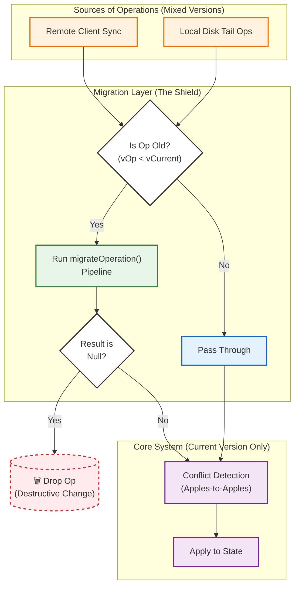

## 4. Migration Scenarios

### 4.1 Tail Ops Migration (Local Startup Consistency)

Ensures that operations occurring after a snapshot ("Tail Ops") are migrated to the current version before being applied to the migrated state.

<details>
<summary>Sequence Diagram</summary>

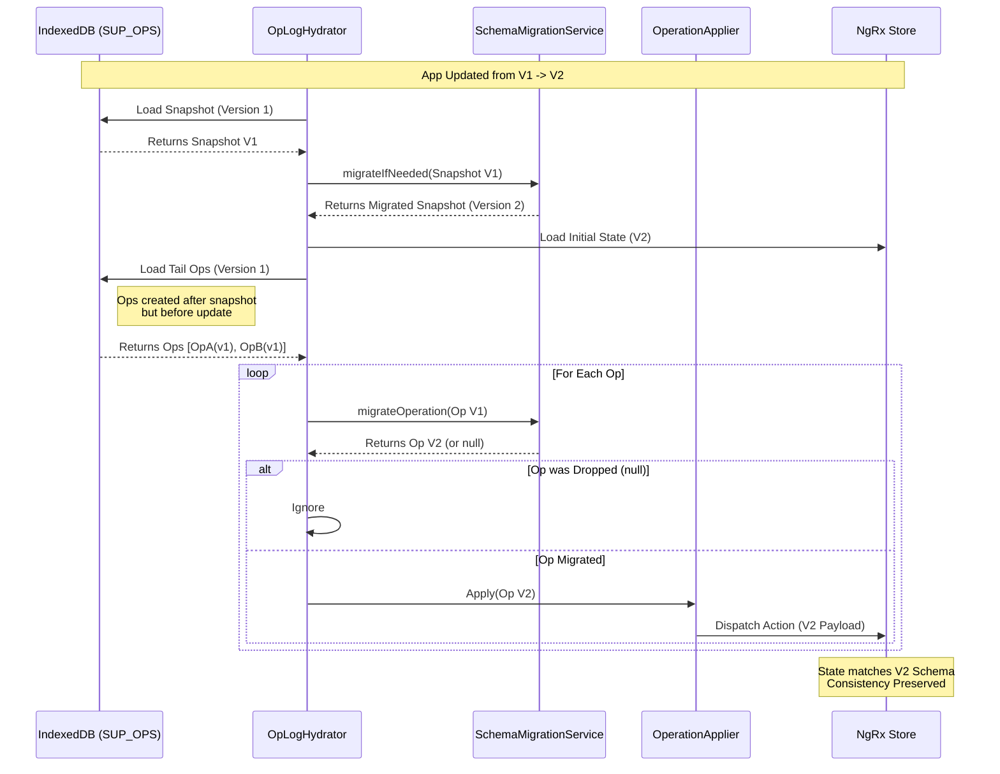

</details>

<details>
<summary>Flowchart Diagram</summary>

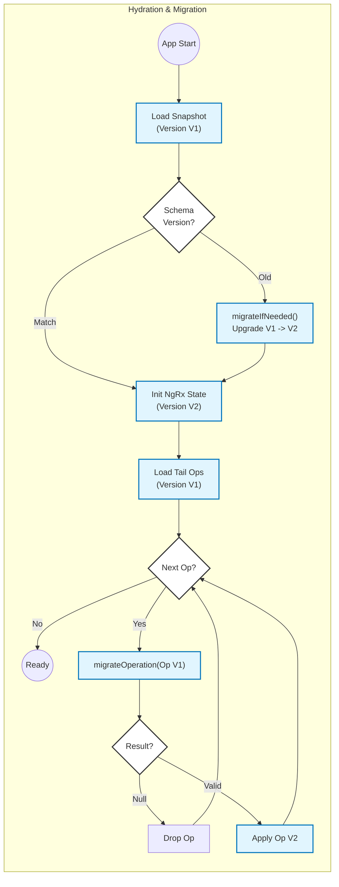

</details>

### 4.2 Receiver-Side Sync Migration

Demonstrates how a client on V2 handles incoming data from a client still on V1.

<details>
<summary>Sequence Diagram</summary>

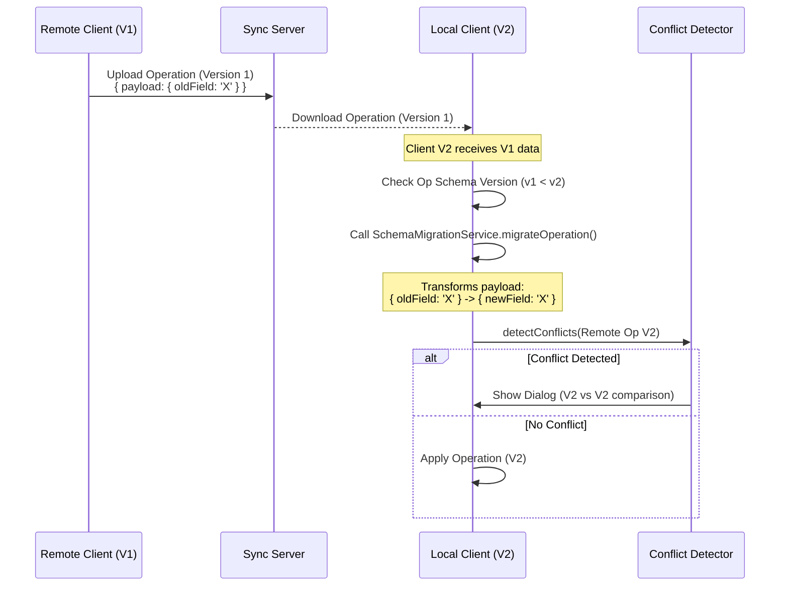

</details>

<details>
<summary>Flowchart Diagram</summary>

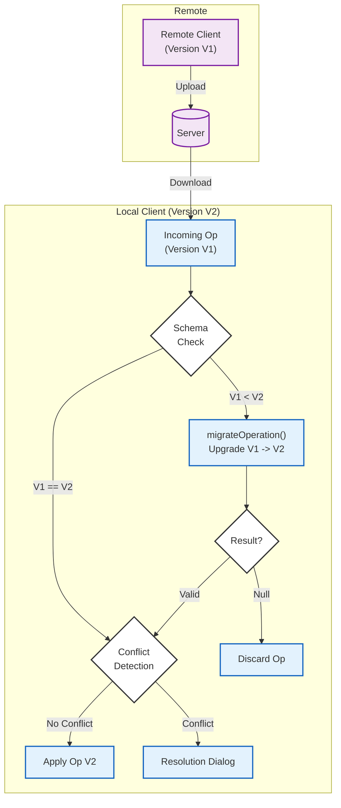

</details>

## 5. Hybrid Manifest (File-Based Sync) ✅ IMPLEMENTED

This diagram illustrates the "Hybrid Manifest" optimization (`hybrid-manifest-architecture.md`) which reduces HTTP request overhead for WebDAV/Dropbox sync by buffering small operations directly inside the manifest file.

**Implementation Status:** Complete. Managed by `OperationLogManifestService` with remote cleanup after 14 days.

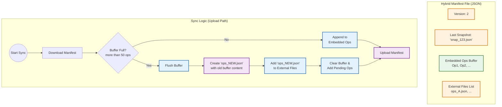

## 6. Hybrid Manifest Conceptual Overview ✅ IMPLEMENTED

This diagram shows the Hybrid Manifest architecture: how operations flow from "hot" (recent, in manifest) to "cold" (archived files) to "frozen" (snapshot), and the decision logic for each transition.

**Implementation Status:** Complete. Used by `OperationLogUploadService` and `OperationLogDownloadService` for file-based sync providers (WebDAV, Dropbox).

### 6.1 Data Lifecycle: Hot → Cold → Frozen

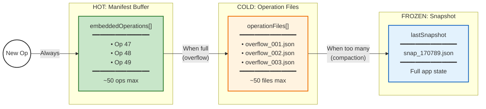

### 6.2 Manifest File Structure

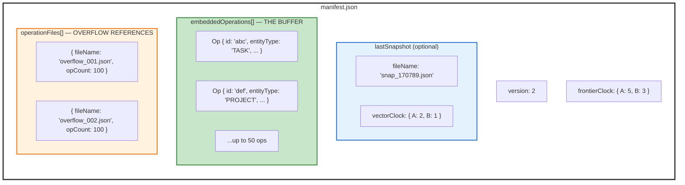

### 6.3 Write Path: Buffer vs Overflow Decision


### 6.4 Read Path: Reconstructing State


### 6.5 Compaction: Freezing State


---

## 7. Atomic State Consistency (Meta-Reducer Pattern) ✅ IMPLEMENTED

This diagram illustrates how meta-reducers ensure atomic state changes across multiple entities, preventing inconsistency during sync. See Part F in [operation-log-architecture.md](./operation-log-architecture.md).

**Implementation Status:** Complete. Key files:

- `tag-shared.reducer.ts` - Tag deletion with task/repeat-cfg/time-tracking cleanup
- `state-capture.meta-reducer.ts` - Before-state capture for multi-entity operations
- `state-change-capture.service.ts` - Computes entity changes from state diff

### 7.1 Meta-Reducer Flow for Multi-Entity Operations

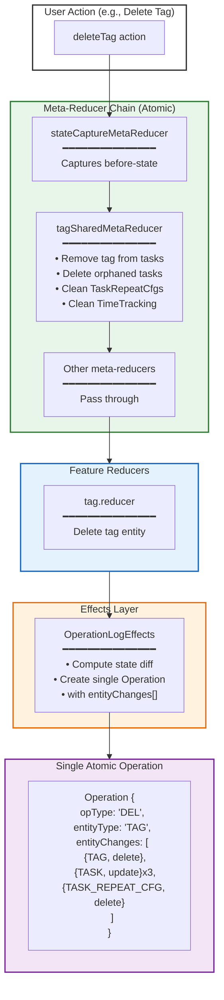

### 7.2 Why Meta-Reducers vs Effects

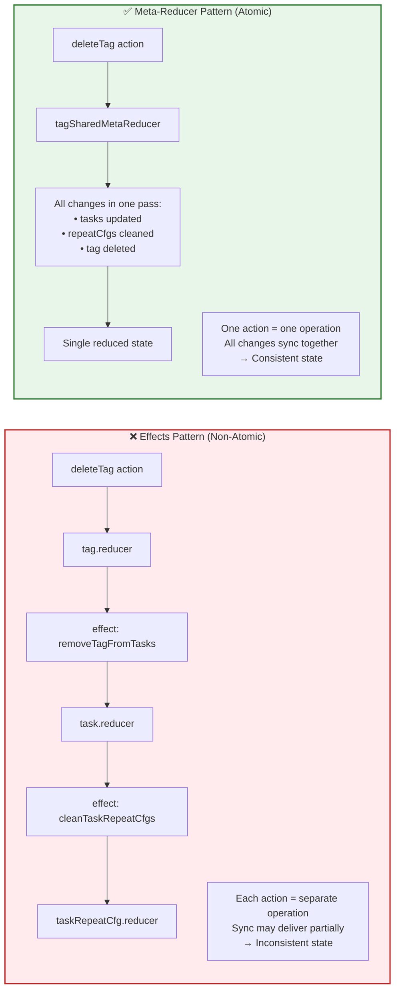

---

## 8. Archive Operations & Side Effects ✅ IMPLEMENTED

This section documents how archive-related side effects are handled, establishing the general rule that **effects should never run for remote operations**.

### 8.1 The General Rule: Effects Only for Local Actions

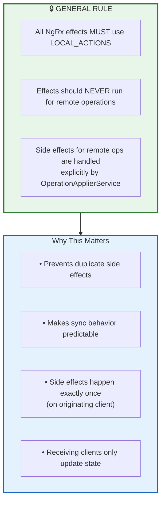

### 8.2 Dual-Database Architecture

Super Productivity uses **two separate IndexedDB databases** for persistence:

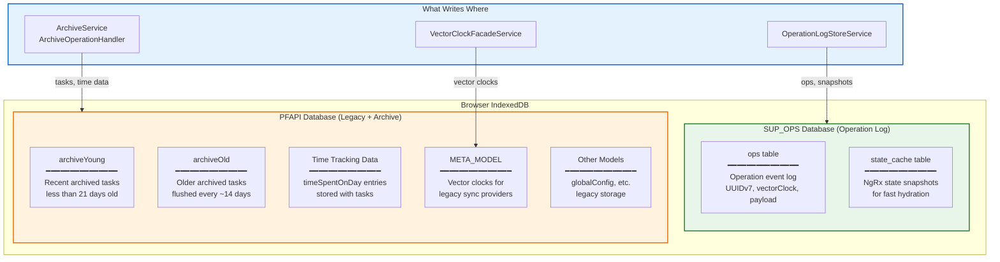

**Key Points:**

| Database  | Purpose                                           | Written By                                                  |
| --------- | ------------------------------------------------- | ----------------------------------------------------------- |
| `SUP_OPS` | Operation log (event sourcing)                    | `OperationLogStoreService`                                  |
| `PFAPI`   | Archive data, time tracking, legacy sync metadata | `ArchiveService`, `ArchiveOperationHandler`, `PfapiService` |

### 8.3 Archive Operations Flow

Archive data is stored in PFAPI's IndexedDB, **not** in NgRx state or the operation log. This requires special handling through a **unified** `ArchiveOperationHandler`:

- **Local operations**: `ArchiveOperationHandlerEffects` routes through `ArchiveOperationHandler` (using LOCAL_ACTIONS)
- **Remote operations**: `OperationApplierService` calls `ArchiveOperationHandler` directly after dispatch

Both paths use the same handler to ensure consistent behavior.

```mermaid
flowchart TD
    subgraph LocalOp["LOCAL Operation (User Action)"]
        L1[User archives tasks] --> L2["ArchiveService writes<br/>to PFAPI IndexedDB<br/>BEFORE dispatch"]
        L2 --> L3[Dispatch moveToArchive]
        L3 --> L4[Meta-reducers update NgRx state]
        L4 --> L5[ArchiveOperationHandlerEffects<br/>via LOCAL_ACTIONS]
        L5 --> L6["ArchiveOperationHandler<br/>.handleOperation<br/>(skips - already written)"]
        L4 --> L7[OperationLogEffects<br/>creates operation in SUP_OPS]
    end

    subgraph RemoteOp["REMOTE Operation (Sync)"]
        R1[Download operation<br/>from SUP_OPS sync] --> R2[OperationApplierService<br/>dispatches action]
        R2 --> R3[Meta-reducers update NgRx state]
        R3 --> R4["ArchiveOperationHandler<br/>.handleOperation"]
        R4 --> R5["Write to PFAPI IndexedDB<br/>(archiveYoung/archiveOld)"]

        NoEffect["❌ Regular effects DON'T run<br/>(action has meta.isRemote=true)"]
    end

    subgraph Storage["Storage Layer"]
        PFAPI_DB[("PFAPI IndexedDB<br/>archiveYoung<br/>archiveOld")]
        SUPOPS_DB[("SUP_OPS IndexedDB<br/>ops table")]
    end

    L2 --> PFAPI_DB
    L7 --> SUPOPS_DB
    R5 --> PFAPI_DB
    SUPOPS_DB -.->|"Sync downloads ops"| R1

    style LocalOp fill:#e8f5e9,stroke:#2e7d32,stroke-width:2px
    style RemoteOp fill:#e3f2fd,stroke:#1565c0,stroke-width:2px
    style NoEffect fill:#ffebee,stroke:#c62828,stroke-width:2px
    style PFAPI_DB fill:#fff3e0,stroke:#ef6c00,stroke-width:2px
    style SUPOPS_DB fill:#e8f5e9,stroke:#2e7d32,stroke-width:2px
```

### 8.4 ArchiveOperationHandler Integration

The `OperationApplierService` uses a **fail-fast** approach: if hard dependencies are missing, it throws `SyncStateCorruptedError` rather than attempting complex retry logic. This triggers a full re-sync, which is safer than partial recovery.

```mermaid
flowchart TD
    subgraph OperationApplierService["OperationApplierService (Fail-Fast)"]
        OA1[Receive operation] --> OA2{Check hard<br/>dependencies}
        OA2 -->|Missing| OA_ERR["throw SyncStateCorruptedError<br/>(triggers full re-sync)"]
        OA2 -->|OK| OA3[convertOpToAction]
        OA3 --> OA4["store.dispatch(action)<br/>with meta.isRemote=true"]
        OA4 --> OA5["archiveOperationHandler<br/>.handleOperation(action)"]
    end

    subgraph Handler["ArchiveOperationHandler"]
        H1{Action Type?}
        H1 -->|moveToArchive| H2[Write tasks to<br/>archiveYoung<br/>REMOTE ONLY]
        H1 -->|restoreTask| H3[Delete task from<br/>archive]
        H1 -->|flushYoungToOld| H4[Move old tasks<br/>Young → Old]
        H1 -->|deleteProject| H5[Remove tasks<br/>for project +<br/>cleanup time tracking]
        H1 -->|deleteTag/deleteTags| H6[Remove tag<br/>from tasks +<br/>cleanup time tracking]
        H1 -->|deleteTaskRepeatCfg| H7[Remove repeatCfgId<br/>from tasks]
        H1 -->|deleteIssueProvider| H8[Unlink issue data<br/>from tasks]
        H1 -->|deleteIssueProviders| H8b[Unlink multiple<br/>issue providers]
        H1 -->|other| H9[No-op]
    end

    OA5 --> H1

    style OperationApplierService fill:#e3f2fd,stroke:#1565c0,stroke-width:2px
    style Handler fill:#fff3e0,stroke:#ef6c00,stroke-width:2px
    style OA_ERR fill:#ffcdd2,stroke:#c62828,stroke-width:2px
```

**Why Fail-Fast?**

The server guarantees operations arrive in sequence order, and delete operations are atomic via meta-reducers. If dependencies are missing, something is fundamentally wrong with sync state. A full re-sync is safer than attempting partial recovery with potential inconsistencies.

### 8.5 Archive Operations Summary

| Operation              | Local Handling                                                         | Remote Handling                                              |
| ---------------------- | ---------------------------------------------------------------------- | ------------------------------------------------------------ |
| `moveToArchive`        | ArchiveService writes BEFORE dispatch; handler skips (no double-write) | ArchiveOperationHandler writes AFTER dispatch                |
| `restoreTask`          | ArchiveOperationHandlerEffects → ArchiveOperationHandler               | ArchiveOperationHandler removes from archive                 |
| `flushYoungToOld`      | ArchiveOperationHandlerEffects → ArchiveOperationHandler               | ArchiveOperationHandler executes flush                       |
| `deleteProject`        | ArchiveOperationHandlerEffects → ArchiveOperationHandler               | ArchiveOperationHandler removes tasks + cleans time tracking |
| `deleteTag/deleteTags` | ArchiveOperationHandlerEffects → ArchiveOperationHandler               | ArchiveOperationHandler removes tags + cleans time tracking  |
| `deleteTaskRepeatCfg`  | ArchiveOperationHandlerEffects → ArchiveOperationHandler               | ArchiveOperationHandler removes repeatCfgId from tasks       |
| `deleteIssueProvider`  | ArchiveOperationHandlerEffects → ArchiveOperationHandler               | ArchiveOperationHandler unlinks issue data                   |

### 8.6 Key Files

| File                                              | Purpose                                                             |
| ------------------------------------------------- | ------------------------------------------------------------------- |
| `processing/archive-operation-handler.service.ts` | **Unified** handler for all archive side effects (local AND remote) |
| `processing/archive-operation-handler.effects.ts` | Routes local actions to ArchiveOperationHandler via LOCAL_ACTIONS   |
| `processing/operation-applier.service.ts`         | Calls ArchiveOperationHandler after dispatching remote operations   |
| `features/time-tracking/archive.service.ts`       | Local archive write logic (moveToArchive writes BEFORE dispatch)    |
| `features/time-tracking/task-archive.service.ts`  | Archive CRUD operations                                             |
