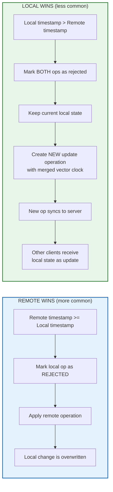

# Operation Log: Architecture Diagrams

**Last Updated:** December 16, 2025
**Status:** All core diagrams reflect current implementation

These diagrams visualize the Operation Log system architecture. For implementation details, see [operation-log-architecture.md](./operation-log-architecture.md).

---

## 1. Operation Log Architecture (Local Persistence & Legacy Bridge) ✅ IMPLEMENTED

This diagram illustrates how user actions flow through the system, how they are persisted to IndexedDB (`SUP_OPS`), how the system hydrates on startup, and how it bridges to the legacy PFAPI system.

**Implementation Status:** Complete. See Part A and Part B in [operation-log-architecture.md](./operation-log-architecture.md).

```mermaid
graph TD
    %% Styles
    classDef storage fill:#f9f,stroke:#333,stroke-width:2px,color:black;
    classDef process fill:#e1f5fe,stroke:#0277bd,stroke-width:2px,color:black;
    classDef legacy fill:#fff3e0,stroke:#ef6c00,stroke-width:2px,stroke-dasharray: 5 5,color:black;
    classDef trigger fill:#e8f5e9,stroke:#2e7d32,stroke-width:2px,color:black;
    classDef archive fill:#e8eaf6,stroke:#3949ab,stroke-width:2px,color:black;

    User((User / UI)) -->|Dispatch Action| NgRx["NgRx Store <br/> Runtime Source of Truth<br/><sub>*.effects.ts / *.reducer.ts</sub>"]

    subgraph "Write Path (Runtime)"
        NgRx -->|Action Stream| OpEffects["OperationLogEffects<br/><sub>operation-log.effects.ts</sub>"]

        OpEffects -->|1. Check isPersistent| Filter{"Is Persistent?<br/><sub>persistent-action.interface.ts</sub>"}
        Filter -- No --> Ignore[Ignore / UI Only]
        Filter -- Yes --> Transform["Transform to Operation<br/>UUIDv7, Timestamp, VectorClock<br/><sub>operation-converter.util.ts</sub>"]

        Transform -->|2. Validate| PayloadValid{"Payload<br/>Valid?<br/><sub>processing/validate-operation-payload.ts</sub>"}
        PayloadValid -- No --> ErrorSnack[Show Error Snackbar]
        PayloadValid -- Yes --> DBWrite
    end

    subgraph "Persistence Layer (IndexedDB: SUP_OPS)"
        DBWrite["Write to SUP_OPS<br/><sub>store/operation-log-store.service.ts</sub>"]:::storage

        DBWrite -->|Append| OpsTable["Table: ops<br/>The Event Log<br/><sub>IndexedDB</sub>"]:::storage
        DBWrite -->|Update| StateCache["Table: state_cache<br/>Snapshots<br/><sub>IndexedDB</sub>"]:::storage
    end

    subgraph "Archive Storage (IndexedDB: PFAPI)"
        ArchiveWrite["ArchiveService<br/><sub>time-tracking/archive.service.ts</sub>"]:::archive
        ArchiveWrite -->|Write BEFORE dispatch| ArchiveYoung["archiveYoung<br/>━━━━━━━━━━━━━━━<br/>• task: TaskArchive<br/>• timeTracking: State<br/>━━━━━━━━━━━━━━━<br/><sub>Tasks < 21 days old</sub>"]:::archive
        ArchiveYoung -->|"flushYoungToOld action<br/>(every ~14 days)"| ArchiveOld["archiveOld<br/>━━━━━━━━━━━━━━━<br/>• task: TaskArchive<br/>• timeTracking: State<br/>━━━━━━━━━━━━━━━<br/><sub>Tasks > 21 days old</sub>"]:::archive
    end

    User -->|Archive Tasks| ArchiveWrite
    NgRx -.->|moveToArchive action<br/>AFTER archive write| OpEffects

    subgraph "Legacy Bridge (PFAPI)"
        DBWrite -.->|3. Bridge| LegacyMeta["META_MODEL<br/>Vector Clock<br/><sub>pfapi.service.ts</sub>"]:::legacy
        LegacyMeta -.->|Update| LegacySync["Legacy Sync Adapters<br/>WebDAV / Dropbox / Local<br/><sub>pfapi.service.ts</sub>"]:::legacy
        noteLegacy[Updates Vector Clock so<br/>Legacy Sync detects changes]:::legacy
    end

    subgraph "Compaction System"
        OpsTable -->|Count > 500| CompactionTrig{"Compaction<br/>Trigger<br/><sub>operation-log.effects.ts</sub>"}:::trigger
        CompactionTrig -->|Yes| Compactor["CompactionService<br/><sub>store/operation-log-compaction.service.ts</sub>"]:::process
        Compactor -->|Read State| NgRx
        Compactor -->|Save Snapshot| StateCache
        Compactor -->|Delete Old Ops| OpsTable
    end

    subgraph "Read Path (Hydration)"
        Startup((App Startup)) --> Hydrator["OperationLogHydrator<br/><sub>store/operation-log-hydrator.service.ts</sub>"]:::process
        Hydrator -->|1. Load| StateCache

        StateCache -->|Check| Schema{"Schema<br/>Version?<br/><sub>store/schema-migration.service.ts</sub>"}
        Schema -- Old --> Migrator["SchemaMigrationService<br/><sub>store/schema-migration.service.ts</sub>"]:::process
        Migrator -->|Transform State| MigratedState
        Schema -- Current --> CurrentState

        CurrentState -->|Load State| StoreInit[Init NgRx State]
        MigratedState -->|Load State| StoreInit

        Hydrator -->|2. Load Tail| OpsTable
        OpsTable -->|Replay Ops| Replayer["OperationApplier<br/><sub>processing/operation-applier.service.ts</sub>"]:::process
        Replayer -->|Dispatch| NgRx
    end

    subgraph "Single Instance + Sync Locking"
        Startup2((App Startup)) -->|BroadcastChannel| SingleCheck{"Already<br/>Open?<br/><sub>startup.service.ts</sub>"}
        SingleCheck -- Yes --> Block[Block New Tab]
        SingleCheck -- No --> Allow[Allow]

        DBWrite -.->|Critical ops use| WebLocks["Web Locks API<br/><sub>sync/lock.service.ts</sub>"]
    end

    class OpsTable,StateCache storage;
    class LegacyMeta,LegacySync,noteLegacy legacy;
    class ArchiveWrite,ArchiveYoung,ArchiveOld,TimeTracking archive;
```



**Archive Data Flow Notes:**

- **Archive writes happen BEFORE dispatch**: When a user archives tasks, `ArchiveService` writes to IndexedDB first, then dispatches the `moveToArchive` action. This ensures data is safely stored before state updates.
- **ArchiveModel structure**: Each archive tier stores `{ task: TaskArchive, timeTracking: TimeTrackingState, lastTimeTrackingFlush: number }`. Both archived Task entities AND their time tracking data are stored together.
- **Two-tier archive**: Recent tasks go to `archiveYoung` (tasks < 21 days old). Older tasks are flushed to `archiveOld` via `flushYoungToOld` action (checked every ~14 days when archiving tasks).
- **Flush mechanism**: `flushYoungToOld` is a persistent action that:
  1. Triggers when `lastTimeTrackingFlush > 14 days` during `moveTasksToArchiveAndFlushArchiveIfDue()`
  2. Moves tasks older than 21 days from `archiveYoung.task` to `archiveOld.task`
  3. Syncs via operation log so all clients execute the same flush deterministically
- **Not in NgRx state**: Archive data is stored directly in IndexedDB (via PFAPI), not in the NgRx store. Only the operations (`moveToArchive`, `flushYoungToOld`) are logged for sync.
- **Sync handling**: On remote clients, `ArchiveOperationHandler` writes archive data AFTER receiving the operation (see Section 8).

## 2. Operation Log Sync Architecture (Server Sync) ✅ IMPLEMENTED

This master diagram shows the complete sync architecture: client-side flow, server API endpoints, PostgreSQL database operations, and server-side processing.

**Implementation Status:** Complete (single-schema-version). Key services:

- **Client**: `OperationLogSyncService`, `OperationLogUploadService`, `OperationLogDownloadService`, `ConflictResolutionService`
- **Server**: Fastify API (`sync.routes.ts`), `SyncService` (`sync.service.ts`), Prisma ORM

```mermaid
graph TB
    %% Styles
    classDef client fill:#fff,stroke:#333,stroke-width:2px,color:black;
    classDef api fill:#e3f2fd,stroke:#1565c0,stroke-width:2px,color:black;
    classDef db fill:#e8f5e9,stroke:#2e7d32,stroke-width:2px,color:black;
    classDef conflict fill:#ffebee,stroke:#c62828,stroke-width:2px,color:black;
    classDef validation fill:#fff3e0,stroke:#ef6c00,stroke-width:2px,color:black;

    %% ═══════════════════════════════════════════════════════════════
    %% CLIENT SIDE
    %% ═══════════════════════════════════════════════════════════════

    subgraph Client["CLIENT (Angular)"]
        direction TB

        subgraph SyncLoop["Sync Loop"]
            Scheduler((Scheduler)) -->|Interval| SyncService["OperationLogSyncService"]
            SyncService -->|1. Get lastSyncedSeq| LocalMeta["SUP_OPS IndexedDB"]
        end

        subgraph DownloadFlow["Download Flow"]
            SyncService -->|"2. GET /api/sync/ops?sinceSeq=N"| DownAPI
            DownAPI -->|Response| GapCheck{Gap Detected?}
            GapCheck -- "Yes + Empty Server" --> ServerMigration["Server Migration:<br/>Create SYNC_IMPORT"]
            GapCheck -- "Yes + Has Ops" --> ResetSeq["Reset sinceSeq=0<br/>Re-download all"]
            GapCheck -- No --> FreshCheck{Fresh Client?}
            ResetSeq --> FreshCheck
            FreshCheck -- "Yes + Has Ops" --> ConfirmDialog["Confirmation Dialog"]
            FreshCheck -- No --> FilterApplied
            ConfirmDialog -- Confirmed --> FilterApplied{Already Applied?}
            ConfirmDialog -- Cancelled --> SkipDownload[Skip]
            FilterApplied -- Yes --> Discard[Discard]
            FilterApplied -- No --> ConflictDet
        end

        subgraph ConflictMgmt["Conflict Management (LWW Auto-Resolution)"]
            ConflictDet{"Compare<br/>Vector Clocks"}:::conflict
            ConflictDet -- Sequential --> ApplyRemote
            ConflictDet -- Concurrent --> AutoCheck{"Auto-Resolve?"}

            AutoCheck -- "Both DELETE or<br/>Identical payload" --> AutoResolve["Auto: Keep Remote"]
            AutoCheck -- "Real conflict" --> LWWResolve["LWW: Compare<br/>Timestamps"]:::conflict

            AutoResolve --> MarkRejected
            LWWResolve -- "Remote newer<br/>or tie" --> MarkRejected[Mark Local Rejected]:::conflict
            LWWResolve -- "Local newer" --> LocalWins["Create Update Op<br/>with local state"]:::conflict
            LocalWins --> RejectBoth[Mark both rejected]
            RejectBoth --> CreateNewOp[New op syncs local state]
            MarkRejected --> ApplyRemote
        end

        subgraph Application["Application & Validation"]
            ApplyRemote -->|Dispatch| NgRx["NgRx Store"]
            NgRx --> Validator{Valid State?}
            Validator -- Yes --> SyncDone((Done))
            Validator -- No --> Repair["Auto-Repair"]:::conflict
            Repair --> NgRx
        end

        subgraph UploadFlow["Upload Flow"]
            LocalMeta -->|Get Unsynced| PendingOps[Pending Ops]
            PendingOps --> FreshUploadCheck{Fresh Client?}
            FreshUploadCheck -- Yes --> BlockUpload["Block Upload<br/>(must download first)"]
            FreshUploadCheck -- No --> FilterRejected{Rejected?}
            FilterRejected -- Yes --> SkipRejected[Skip]
            FilterRejected -- No --> ClassifyOp{Op Type?}

            ClassifyOp -- "SYNC_IMPORT<br/>BACKUP_IMPORT<br/>REPAIR" --> SnapshotAPI
            ClassifyOp -- "CRT/UPD/DEL/MOV/BATCH" --> OpsAPI

            OpsAPI -->|Response with<br/>piggybackedOps| ProcessPiggybacked["Process Piggybacked<br/>(→ Conflict Detection)"]
            ProcessPiggybacked --> ConflictDet
        end
    end

    %% ═══════════════════════════════════════════════════════════════
    %% SERVER API LAYER
    %% ═══════════════════════════════════════════════════════════════

    subgraph Server["SERVER (Fastify + Node.js)"]
        direction TB

        subgraph APIEndpoints["API Endpoints"]
            DownAPI["GET /api/sync/ops<br/>━━━━━━━━━━━━━━━<br/>Download operations<br/>Query: sinceSeq, limit"]:::api
            OpsAPI["POST /api/sync/ops<br/>━━━━━━━━━━━━━━━<br/>Upload operations<br/>Body: ops[], clientId"]:::api
            SnapshotAPI["POST /api/sync/snapshot<br/>━━━━━━━━━━━━━━━<br/>Upload full state<br/>Body: state, reason"]:::api
            GetSnapshotAPI["GET /api/sync/snapshot<br/>━━━━━━━━━━━━━━━<br/>Get full state"]:::api
            StatusAPI["GET /api/sync/status<br/>━━━━━━━━━━━━━━━<br/>Check sync status"]:::api
            RestoreAPI["GET /api/sync/restore/:seq<br/>━━━━━━━━━━━━━━━<br/>Restore to point"]:::api
        end

        subgraph ServerProcessing["Server-Side Processing (SyncService)"]
            direction TB

            subgraph Validation["1. Validation"]
                V1["Validate op.id, opType"]
                V2["Validate entityType allowlist"]
                V3["Sanitize vectorClock"]
                V4["Check payload size"]
                V5["Check timestamp drift"]
            end

            subgraph ConflictCheck["2. Conflict Detection"]
                C1["Find latest op for entity"]
                C2["Compare vector clocks"]
                C3{Result?}
                C3 -- GREATER_THAN --> C4[Accept]
                C3 -- CONCURRENT --> C5[Reject]
                C3 -- LESS_THAN --> C6[Reject]
            end

            subgraph Persist["3. Persistence (REPEATABLE_READ)"]
                P1["Increment lastSeq"]
                P2["Re-check conflict"]
                P3["INSERT operation"]
                P4{DEL op?}
                P4 -- Yes --> P5["UPSERT tombstone"]
                P4 -- No --> P6[Skip]
                P7["UPSERT sync_device"]
            end
        end
    end

    %% ═══════════════════════════════════════════════════════════════
    %% POSTGRESQL DATABASE
    %% ═══════════════════════════════════════════════════════════════

    subgraph PostgreSQL["POSTGRESQL DATABASE"]
        direction TB

        OpsTable[("operations<br/>━━━━━━━━━━━━━━━<br/>id, serverSeq<br/>opType, entityType<br/>entityId, payload<br/>vectorClock<br/>clientTimestamp")]:::db

        SyncState[("user_sync_state<br/>━━━━━━━━━━━━━━━<br/>lastSeq<br/>snapshotData<br/>lastSnapshotSeq")]:::db

        Devices[("sync_devices<br/>━━━━━━━━━━━━━━━<br/>clientId<br/>lastSeenAt<br/>lastAckedSeq")]:::db

        Tombstones[("tombstones<br/>━━━━━━━━━━━━━━━<br/>entityType<br/>entityId<br/>deletedAt")]:::db
    end

    %% ═══════════════════════════════════════════════════════════════
    %% CONNECTIONS: API -> Processing
    %% ═══════════════════════════════════════════════════════════════

    OpsAPI --> V1
    SnapshotAPI --> V1
    V1 --> V2 --> V3 --> V4 --> V5
    V5 --> C1 --> C2 --> C3
    C4 --> P1 --> P2 --> P3 --> P4
    P5 --> P7
    P6 --> P7

    %% ═══════════════════════════════════════════════════════════════
    %% CONNECTIONS: Processing -> Database
    %% ═══════════════════════════════════════════════════════════════

    P1 -.->|"UPDATE"| SyncState
    P3 -.->|"INSERT"| OpsTable
    P5 -.->|"UPSERT"| Tombstones
    P7 -.->|"UPSERT"| Devices

    %% ═══════════════════════════════════════════════════════════════
    %% CONNECTIONS: Read endpoints -> Database
    %% ═══════════════════════════════════════════════════════════════

    DownAPI -.->|"SELECT ops > sinceSeq"| OpsTable
    DownAPI -.->|"SELECT lastSeq"| SyncState
    GetSnapshotAPI -.->|"SELECT snapshot"| SyncState
    GetSnapshotAPI -.->|"SELECT (replay)"| OpsTable
    StatusAPI -.->|"SELECT"| SyncState
    StatusAPI -.->|"COUNT"| Devices
    RestoreAPI -.->|"SELECT (replay)"| OpsTable

    %% Subgraph styles
    style Validation fill:#fff3e0,stroke:#ef6c00,stroke-width:2px
    style ConflictCheck fill:#ffebee,stroke:#c62828,stroke-width:2px
    style Persist fill:#e8f5e9,stroke:#2e7d32,stroke-width:2px
    style PostgreSQL fill:#e8f5e9,stroke:#2e7d32,stroke-width:2px
    style APIEndpoints fill:#e3f2fd,stroke:#1565c0,stroke-width:2px
```



### Quick Reference Tables

**API Endpoints:**

| Endpoint                   | Method | Purpose                         | DB Operations                                                        |
| -------------------------- | ------ | ------------------------------- | -------------------------------------------------------------------- |
| `/api/sync/ops`            | POST   | Upload operations               | INSERT ops, UPDATE lastSeq, UPSERT device, UPSERT tombstone (if DEL) |
| `/api/sync/ops?sinceSeq=N` | GET    | Download operations             | SELECT ops, SELECT lastSeq                                           |
| `/api/sync/snapshot`       | POST   | Upload full state (SYNC_IMPORT) | Same as POST /ops + UPDATE snapshot cache                            |
| `/api/sync/snapshot`       | GET    | Get full state                  | SELECT snapshot (or replay ops if stale)                             |
| `/api/sync/status`         | GET    | Check sync status               | SELECT lastSeq, COUNT devices                                        |
| `/api/sync/restore-points` | GET    | List restore points             | SELECT ops (filter SYNC_IMPORT, BACKUP_IMPORT, REPAIR)               |
| `/api/sync/restore/:seq`   | GET    | Restore to specific point       | SELECT ops, replay to targetSeq                                      |

**PostgreSQL Tables:**

| Table             | Purpose                                    | Key Columns                                             |
| ----------------- | ------------------------------------------ | ------------------------------------------------------- |
| `operations`      | Event log (append-only)                    | id, serverSeq, opType, entityType, payload, vectorClock |
| `user_sync_state` | Per-user metadata + cached snapshot        | lastSeq, snapshotData, lastSnapshotSeq                  |
| `sync_devices`    | Device tracking                            | clientId, lastSeenAt, lastAckedSeq                      |
| `tombstones`      | Deleted entity tracking (30-day retention) | entityType, entityId, deletedAt, expiresAt              |

**Key Implementation Details:**

- **Transaction Isolation**: `REPEATABLE_READ` prevents phantom reads during conflict detection
- **Double Conflict Check**: Before AND after sequence allocation (race condition guard)
- **Idempotency**: Duplicate op IDs rejected with `DUPLICATE_OPERATION` error
- **Gzip Support**: Both upload/download support `Content-Encoding: gzip` for bandwidth savings
- **Rate Limiting**: Per-user limits (100 uploads/min, 200 downloads/min)
- **Auto-Resolve Conflicts (Identical)**: Identical conflicts (both DELETE, or same payload) auto-resolved as "remote" without user intervention
- **LWW Conflict Resolution**: Real conflicts are automatically resolved using Last-Write-Wins (timestamp comparison). See Section 2d below for detailed diagrams.
- **Fresh Client Safety**: Clients with no history blocked from uploading; confirmation dialog shown before accepting first remote data
- **Piggybacked Ops**: Upload response includes new remote ops → processed immediately to trigger conflict detection
- **Gap Detection**: Server returns `gapDetected: true` when client sinceSeq is invalid → client resets to seq=0 and re-downloads all ops
- **Server Migration**: Gap + empty server (no ops) → client creates SYNC_IMPORT to seed new server

---

## 2b. Full-State Operations via Snapshot Endpoint ✅ IMPLEMENTED

Full-state operations (BackupImport, Repair, SyncImport) contain the entire application state and can exceed the regular `/api/sync/ops` body size limit (~30MB). These operations are routed through the `/api/sync/snapshot` endpoint instead.

**Implementation Status:** Complete. See `OperationLogUploadService._uploadFullStateOpAsSnapshot()`.


**Why This Matters:**

1. **Body Size Limits**: Regular `/api/sync/ops` has a ~30MB limit which backup imports can exceed
2. **Efficiency**: Snapshot endpoint is designed for large payloads and stores state directly
3. **Server-Side Handling**: Server creates a synthetic operation record for audit purposes

## 2c. Late-Joiner Replay with Vector Clock Dominance ✅ IMPLEMENTED

When a client receives a SYNC_IMPORT (full state from another client), it must replay any local synced operations that happened "after" the import's vector clock. This ensures local work isn't lost when receiving a full state snapshot.

**Implementation Status:** Complete. See `OperationLogSyncService._replayLocalSyncedOpsAfterImport()`.

### The Late-Joiner Problem


### The Solution: Vector Clock Dominance Filter

Before replaying local synced ops after a SYNC_IMPORT, we filter out ops that are "dominated" by the SYNC_IMPORT's vector clock. An op is dominated if its vector clock is `LESS_THAN` the SYNC_IMPORT's clock - meaning the op's state is already captured in the imported snapshot.


### Vector Clock Comparison Results

| Comparison     | Meaning                        | Action                             |
| -------------- | ------------------------------ | ---------------------------------- |
| `LESS_THAN`    | Op happened-before SYNC_IMPORT | Skip (state already captured)      |
| `EQUAL`        | Same causal history            | Replay (edge case, safe to replay) |
| `GREATER_THAN` | Op happened-after SYNC_IMPORT  | Replay (newer than snapshot)       |
| `CONCURRENT`   | Independent changes            | Replay (may have unique changes)   |

### Implementation Details

```typescript
// In OperationLogSyncService._replayLocalSyncedOpsAfterImport()
const localSyncedOps = allEntries.filter((entry) => {
  // Must be created by this client
  if (entry.op.clientId !== clientId) return false;
  // Must be synced (accepted by server)
  if (!entry.syncedAt) return false;
  // Must NOT be a full-state op itself
  if (entry.op.opType === OpType.SyncImport || entry.op.opType === OpType.BackupImport)
    return false;

  // Must NOT be dominated by the SYNC_IMPORT's vector clock
  const comparison = compareVectorClocks(entry.op.vectorClock, syncImportClock);
  if (comparison === VectorClockComparison.LESS_THAN) {
    return false; // Skip - state already captured in SYNC_IMPORT
  }
  return true;
});
```

**Key Points:**

- Only filters local ops (created by this client)
- Only considers synced ops (accepted by server)
- Uses vector clock comparison to determine dominance
- `LESS_THAN` means dominated (skip), all other results mean not dominated (replay)

---

## 2d. LWW (Last-Write-Wins) Conflict Auto-Resolution ✅ IMPLEMENTED

When two clients make concurrent changes to the same entity, a conflict occurs. Rather than interrupting the user with a dialog, the system automatically resolves conflicts using **Last-Write-Wins (LWW)** based on operation timestamps.

**Implementation Status:** Complete. See `ConflictResolutionService.autoResolveConflictsLWW()`.

### 2d.1 What is a Conflict?

A conflict occurs when vector clock comparison returns `CONCURRENT` - meaning neither operation "happened before" the other. They represent independent, simultaneous edits.

```mermaid
flowchart TD
    subgraph Detection["Conflict Detection (Vector Clocks)"]
        Download[Download remote ops] --> Compare{Compare Vector Clocks}

        Compare -->|"LESS_THAN<br/>(remote is older)"| Discard["Discard remote<br/>(already have it)"]
        Compare -->|"GREATER_THAN<br/>(remote is newer)"| Apply["Apply remote<br/>(sequential update)"]
        Compare -->|"CONCURRENT<br/>(independent edits)"| Conflict["⚠️ CONFLICT<br/>Both changed same entity"]
    end

    subgraph Example["Example: Concurrent Edits"]
        direction LR
        ClientA["Client A<br/>Clock: {A:5, B:3}<br/>Marks task done"]
        ClientB["Client B<br/>Clock: {A:4, B:4}<br/>Renames task"]

        ClientA -.->|"Neither dominates"| Concurrent["CONCURRENT<br/>A has more A,<br/>B has more B"]
        ClientB -.-> Concurrent
    end

    Conflict --> Resolution["LWW Resolution"]

    style Conflict fill:#ffebee,stroke:#c62828,stroke-width:2px
    style Concurrent fill:#fff3e0,stroke:#ef6c00,stroke-width:2px
```



### 2d.2 LWW Resolution Algorithm

The winner is determined by comparing the **maximum timestamp** from each operation's vector clock. The operation with the later timestamp wins. Ties go to remote (to ensure convergence).

```mermaid
flowchart TD
    subgraph Input["Conflicting Operations"]
        Local["LOCAL Operation<br/>━━━━━━━━━━━━━━━<br/>vectorClock: {A:5, B:3}<br/>timestamps: [1702900000, 1702899000]<br/>maxTimestamp: 1702900000"]
        Remote["REMOTE Operation<br/>━━━━━━━━━━━━━━━<br/>vectorClock: {A:4, B:4}<br/>timestamps: [1702898000, 1702901000]<br/>maxTimestamp: 1702901000"]
    end

    subgraph Algorithm["LWW Comparison"]
        GetMax["Extract max timestamp<br/>from each vector clock"]
        Compare{"Compare<br/>Timestamps"}

        GetMax --> Compare

        Compare -->|"Local > Remote"| LocalWins["🏆 LOCAL WINS<br/>Local state preserved<br/>Create UPDATE op to sync"]
        Compare -->|"Remote > Local<br/>OR tie"| RemoteWins["🏆 REMOTE WINS<br/>Apply remote state<br/>Reject local op"]
    end

    Local --> GetMax
    Remote --> GetMax

    subgraph Outcome["Resolution Outcome"]
        LocalWins --> CreateOp["Create new UPDATE operation<br/>with current entity state<br/>+ merged vector clock"]
        RemoteWins --> MarkRejected["Mark local op as rejected<br/>Apply remote op"]

        CreateOp --> Sync["New op syncs to server<br/>Other clients receive update"]
        MarkRejected --> Apply["Remote state applied<br/>User sees change"]
    end

    style LocalWins fill:#e8f5e9,stroke:#2e7d32,stroke-width:2px
    style RemoteWins fill:#e3f2fd,stroke:#1565c0,stroke-width:2px
    style CreateOp fill:#c8e6c9,stroke:#2e7d32,stroke-width:2px
```



### 2d.3 Two Possible Outcomes



### 2d.4 Complete LWW Flow

```mermaid
sequenceDiagram
    participant A as Client A
    participant S as Server
    participant B as Client B

    Note over A,B: Both start with Task "Buy milk"

    A->>A: User marks task done (T=100)
    B->>B: User renames to "Buy oat milk" (T=105)

    Note over A,B: Both go offline, then reconnect

    B->>S: Upload: Rename op (T=105)
    S-->>B: OK (serverSeq=50)

    A->>S: Upload: Done op (T=100)
    S-->>A: Rejected (CONCURRENT with seq=50)
    S-->>A: Piggybacked: Rename op from B

    Note over A: Conflict detected!<br/>Local: Done (T=100)<br/>Remote: Rename (T=105)

    A->>A: LWW: Remote wins (105 > 100)
    A->>A: Mark local op REJECTED
    A->>A: Apply remote (rename)
    A->>A: Show snackbar notification

    Note over A: Task is now "Buy oat milk"<br/>(not done - A's change lost)

    A->>S: Sync (download only)
    B->>S: Sync
    S-->>B: No new ops

    Note over A,B: ✅ Both clients converged<br/>Task: "Buy oat milk" (not done)
```



### 2d.5 Local Wins Scenario (with Update Propagation)

```mermaid
sequenceDiagram
    participant A as Client A
    participant S as Server
    participant B as Client B

    Note over A,B: Both start with Task "Meeting"

    B->>B: User adds note (T=100)

    Note over B: B goes offline

    B->>S: Upload: Add note op (T=100)
    S-->>B: OK (serverSeq=50)

    Note over A: A is offline, makes change later

    A->>A: User marks urgent (T=200)

    A->>S: Sync (download first)
    S-->>A: Download: Add note op from B

    Note over A: Conflict detected!<br/>Local: Urgent (T=200)<br/>Remote: Note (T=100)

    A->>A: LWW: Local wins (200 > 100)
    A->>A: Mark BOTH ops rejected
    A->>A: Create NEW update op with<br/>current state (urgent + note merged)<br/>+ merged vector clock

    A->>S: Upload: New update op
    S-->>A: OK (serverSeq=51)

    B->>S: Sync
    S-->>B: Download: Update op from A
    B->>B: Apply update

    Note over A,B: ✅ Both clients converged<br/>Task has BOTH changes
```



### 2d.6 User Notification

After auto-resolution, users see a non-blocking snackbar notification informing them that conflicts were resolved automatically.

```mermaid
flowchart LR
    subgraph Resolution["After LWW Resolution"]
        Resolved["Conflicts resolved"]
    end

    subgraph Notification["User Notification"]
        Snack["📋 Snackbar<br/>━━━━━━━━━━━━━━━<br/>'X conflicts were<br/>auto-resolved'<br/>━━━━━━━━━━━━━━━<br/>Non-blocking<br/>Auto-dismisses"]
    end

    subgraph Backup["Safety Net"]
        BackupCreated["💾 Safety Backup<br/>━━━━━━━━━━━━━━━<br/>Created BEFORE resolution<br/>User can restore if needed"]
    end

    Resolution --> Notification
    Resolution --> Backup

    style Snack fill:#fff3e0,stroke:#ef6c00,stroke-width:2px
    style BackupCreated fill:#e8f5e9,stroke:#2e7d32,stroke-width:2px
```



### 2d.7 Key Implementation Details

| Aspect                 | Implementation                                                              |
| ---------------------- | --------------------------------------------------------------------------- |
| **Timestamp Source**   | `Math.max(...Object.values(vectorClock))` - max timestamp from vector clock |
| **Tie Breaker**        | Remote wins (ensures convergence across all clients)                        |
| **Safety Backup**      | Created via `BackupService` before any resolution                           |
| **Local Win Update**   | New `OpType.UPD` operation created with merged vector clock                 |
| **Vector Clock Merge** | `mergeVectorClocks(localClock, remoteClock)` for local-win ops              |
| **Entity State**       | Retrieved from NgRx store via entity-specific selectors                     |
| **Notification**       | Non-blocking snackbar showing count of resolved conflicts                   |

### 2d.8 Why LWW?

```mermaid
flowchart TB
    subgraph Problem["❌ Manual Resolution (Old Approach)"]
        P1["User sees blocking dialog"]
        P2["Must choose: local or remote"]
        P3["Interrupts workflow"]
        P4["Confusing for non-technical users"]
        P5["Can cause sync to stall"]
    end

    subgraph Solution["✅ LWW Auto-Resolution (New Approach)"]
        S1["Automatic, instant resolution"]
        S2["Based on objective criteria (time)"]
        S3["Non-blocking notification"]
        S4["Safety backup available"]
        S5["All clients converge to same state"]
    end

    subgraph Tradeoff["⚖️ Tradeoff"]
        T1["Occasionally 'wrong' winner<br/>(user's intent may differ from timestamp)"]
        T2["Mitigated by: undo, backup,<br/>and generally rare conflicts"]
    end

    Problem --> Solution
    Solution --> Tradeoff

    style Problem fill:#ffebee,stroke:#c62828,stroke-width:2px
    style Solution fill:#e8f5e9,stroke:#2e7d32,stroke-width:2px
    style Tradeoff fill:#fff3e0,stroke:#ef6c00,stroke-width:2px
```



---

## 3. Conflict-Aware Migration Strategy (The Migration Shield)

> **Note:** Sections 3, 4.1, and 4.2 describe the **cross-version migration strategy** (A.7.8) which is designed but not yet implemented. Currently `CURRENT_SCHEMA_VERSION = 1`, so all clients are on the same version. State cache snapshots are migrated via `SchemaMigrationService.migrateIfNeeded()`. Individual operation migration will be needed when schema versions diverge between clients.

This diagram visualizes the "Receiver-Side Migration" strategy. The Migration Layer acts as a shield, ensuring that _only_ operations matching the current schema version ever reach the core conflict detection and application logic.


## 4. Migration Scenarios

### 4.1 Tail Ops Migration (Local Startup Consistency)

Ensures that operations occurring after a snapshot ("Tail Ops") are migrated to the current version before being applied to the migrated state.

<details>
<summary>Sequence Diagram</summary>


</details>

<details>
<summary>Flowchart Diagram</summary>


</details>

### 4.2 Receiver-Side Sync Migration

Demonstrates how a client on V2 handles incoming data from a client still on V1.

<details>
<summary>Sequence Diagram</summary>


</details>

<details>
<summary>Flowchart Diagram</summary>


</details>

## 5. Hybrid Manifest (File-Based Sync) ✅ IMPLEMENTED

This diagram illustrates the "Hybrid Manifest" optimization (`hybrid-manifest-architecture.md`) which reduces HTTP request overhead for WebDAV/Dropbox sync by buffering small operations directly inside the manifest file.

**Implementation Status:** Complete. Managed by `OperationLogManifestService` with remote cleanup after 14 days.


## 6. Hybrid Manifest Conceptual Overview ✅ IMPLEMENTED

This diagram shows the Hybrid Manifest architecture: how operations flow from "hot" (recent, in manifest) to "cold" (archived files) to "frozen" (snapshot), and the decision logic for each transition.

**Implementation Status:** Complete. Used by `OperationLogUploadService` and `OperationLogDownloadService` for file-based sync providers (WebDAV, Dropbox).

### 6.1 Data Lifecycle: Hot → Cold → Frozen

```mermaid
graph LR
    subgraph "HOT: Manifest Buffer"
        direction TB
        Buffer["embeddedOperations[]<br/>━━━━━━━━━━━━━━━<br/>• Op 47<br/>• Op 48<br/>• Op 49<br/>━━━━━━━━━━━━━━━<br/>~50 ops max"]
    end

    subgraph "COLD: Operation Files"
        direction TB
        Files["operationFiles[]<br/>━━━━━━━━━━━━━━━<br/>• overflow_001.json<br/>• overflow_002.json<br/>• overflow_003.json<br/>━━━━━━━━━━━━━━━<br/>~50 files max"]
    end

    subgraph "FROZEN: Snapshot"
        direction TB
        Snap["lastSnapshot<br/>━━━━━━━━━━━━━━━<br/>snap_170789.json<br/>━━━━━━━━━━━━━━━<br/>Full app state"]
    end

    NewOp((New Op)) -->|"Always"| Buffer
    Buffer -->|"When full<br/>(overflow)"| Files
    Files -->|"When too many<br/>(compaction)"| Snap

    style Buffer fill:#c8e6c9,stroke:#2e7d32,stroke-width:2px
    style Files fill:#fff3e0,stroke:#ef6c00,stroke-width:2px
    style Snap fill:#e3f2fd,stroke:#1565c0,stroke-width:2px
    style NewOp fill:#fff,stroke:#333,stroke-width:2px
```



### 6.2 Manifest File Structure


### 6.3 Write Path: Buffer vs Overflow Decision

```mermaid
flowchart TD
    Start([Client has pending ops]) --> Download[Download manifest.json]
    Download --> CheckRemote{Remote has<br/>new ops?}

    CheckRemote -->|Yes| ApplyFirst[Download & apply<br/>remote ops first]
    ApplyFirst --> CheckBuffer
    CheckRemote -->|No| CheckBuffer

    CheckBuffer{Buffer + Pending<br/>< 50 ops?}

    CheckBuffer -->|Yes| FastPath
    CheckBuffer -->|No| SlowPath

    subgraph FastPath["⚡ FAST PATH (1 request)"]
        Append[Append pending to<br/>embeddedOperations]
        Append --> Upload1[Upload manifest.json]
    end

    subgraph SlowPath["📦 OVERFLOW PATH (2 requests)"]
        Flush[Upload embeddedOperations<br/>as overflow_XXX.json]
        Flush --> AddRef[Add file to operationFiles]
        AddRef --> Clear[Put pending ops in<br/>now-empty buffer]
        Clear --> Upload2[Upload manifest.json]
    end

    Upload1 --> CheckSnap
    Upload2 --> CheckSnap

    CheckSnap{Files > 50 OR<br/>Ops > 5000?}
    CheckSnap -->|Yes| Compact[Trigger Compaction]
    CheckSnap -->|No| Done([Done])
    Compact --> Done

    style FastPath fill:#c8e6c9,stroke:#2e7d32,stroke-width:2px
    style SlowPath fill:#fff3e0,stroke:#ef6c00,stroke-width:2px
    style Start fill:#fff,stroke:#333
    style Done fill:#fff,stroke:#333
```

### 6.4 Read Path: Reconstructing State

```mermaid
flowchart TD
    Start([Client checks for updates]) --> Download[Download manifest.json]

    Download --> QuickCheck{frontierClock<br/>changed?}
    QuickCheck -->|No| Done([No changes - done])

    QuickCheck -->|Yes| NeedSnap{Local behind<br/>snapshot?}

    NeedSnap -->|Yes| LoadSnap
    NeedSnap -->|No| LoadFiles

    subgraph LoadSnap["🧊 Load Snapshot (fresh install / behind)"]
        DownSnap[Download snapshot file]
        DownSnap --> ApplySnap[Apply as base state]
    end

    ApplySnap --> LoadFiles

    subgraph LoadFiles["📁 Load Operation Files"]
        FilterFiles[Filter to unseen files only]
        FilterFiles --> DownFiles[Download each file]
        DownFiles --> CollectOps[Collect all operations]
    end

    CollectOps --> LoadEmbed

    subgraph LoadEmbed["⚡ Load Embedded Ops"]
        FilterEmbed[Filter by op.id<br/>skip already-applied]
        FilterEmbed --> AddOps[Add to collected ops]
    end

    AddOps --> Apply

    subgraph Apply["✅ Apply All"]
        Sort[Sort by vectorClock]
        Sort --> Detect[Detect conflicts]
        Detect --> ApplyOps[Apply non-conflicting]
    end

    ApplyOps --> UpdateClock[Update local<br/>lastSyncedClock]
    UpdateClock --> Done2([Done])

    style LoadSnap fill:#e3f2fd,stroke:#1565c0,stroke-width:2px
    style LoadFiles fill:#fff3e0,stroke:#ef6c00,stroke-width:2px
    style LoadEmbed fill:#c8e6c9,stroke:#2e7d32,stroke-width:2px
    style Apply fill:#f3e5f5,stroke:#7b1fa2,stroke-width:2px
```

### 6.5 Compaction: Freezing State

```mermaid
flowchart TD
    Trigger{{"Trigger Conditions"}}
    Trigger --> C1["operationFiles > 50"]
    Trigger --> C2["Total ops > 5000"]
    Trigger --> C3["7+ days since snapshot"]

    C1 --> Start
    C2 --> Start
    C3 --> Start

    Start([Begin Compaction]) --> Sync[Ensure full sync<br/>no pending ops]
    Sync --> Read[Read current state<br/>from NgRx]
    Read --> Generate[Generate snapshot file<br/>+ checksum]
    Generate --> UpSnap[Upload snapshot file]

    UpSnap --> UpdateMan

    subgraph UpdateMan["Update Manifest"]
        SetSnap[Set lastSnapshot →<br/>new file reference]
        SetSnap --> ClearFiles[Clear operationFiles]
        ClearFiles --> ClearBuffer[Clear embeddedOperations]
        ClearBuffer --> ResetClock[Set frontierClock →<br/>snapshot's clock]
    end

    UpdateMan --> UpMan[Upload manifest.json]
    UpMan --> Cleanup[Async: Delete old files<br/>from server]
    Cleanup --> Done([Done])

    style Trigger fill:#ffebee,stroke:#c62828,stroke-width:2px
    style UpdateMan fill:#e3f2fd,stroke:#1565c0,stroke-width:2px
```

---

## 7. Atomic State Consistency (Meta-Reducer Pattern) ✅ IMPLEMENTED

This diagram illustrates how meta-reducers ensure atomic state changes across multiple entities, preventing inconsistency during sync. See Part F in [operation-log-architecture.md](./operation-log-architecture.md).

**Implementation Status:** Complete. Key files:

- `tag-shared.reducer.ts` - Tag deletion with task/repeat-cfg/time-tracking cleanup
- `state-capture.meta-reducer.ts` - Before-state capture for multi-entity operations
- `state-change-capture.service.ts` - Computes entity changes from state diff

### 7.1 Meta-Reducer Flow for Multi-Entity Operations

```mermaid
flowchart TD
    subgraph UserAction["User Action (e.g., Delete Tag)"]
        Action[deleteTag action]
    end

    subgraph MetaReducers["Meta-Reducer Chain (Atomic)"]
        Capture["stateCaptureMetaReducer<br/>━━━━━━━━━━━━━━━<br/>Captures before-state"]
        TagMeta["tagSharedMetaReducer<br/>━━━━━━━━━━━━━━━<br/>• Remove tag from tasks<br/>• Delete orphaned tasks<br/>• Clean TaskRepeatCfgs<br/>• Clean TimeTracking"]
        OtherMeta["Other meta-reducers<br/>━━━━━━━━━━━━━━━<br/>Pass through"]
    end

    subgraph FeatureReducers["Feature Reducers"]
        TagReducer["tag.reducer<br/>━━━━━━━━━━━━━━━<br/>Delete tag entity"]
    end

    subgraph Effects["Effects Layer"]
        OpEffect["OperationLogEffects<br/>━━━━━━━━━━━━━━━<br/>• Compute state diff<br/>• Create single Operation<br/>• with entityChanges[]"]
    end

    subgraph Result["Single Atomic Operation"]
        Op["Operation {<br/>  opType: 'DEL',<br/>  entityType: 'TAG',<br/>  entityChanges: [<br/>    {TAG, delete},<br/>    {TASK, update}x3,<br/>    {TASK_REPEAT_CFG, delete}<br/>  ]<br/>}"]
    end

    Action --> Capture
    Capture --> TagMeta
    TagMeta --> OtherMeta
    OtherMeta --> FeatureReducers
    FeatureReducers --> OpEffect
    OpEffect --> Result

    style UserAction fill:#fff,stroke:#333,stroke-width:2px
    style MetaReducers fill:#e8f5e9,stroke:#2e7d32,stroke-width:2px
    style FeatureReducers fill:#e3f2fd,stroke:#1565c0,stroke-width:2px
    style Effects fill:#fff3e0,stroke:#ef6c00,stroke-width:2px
    style Result fill:#f3e5f5,stroke:#7b1fa2,stroke-width:2px
```

### 7.2 Why Meta-Reducers vs Effects

```mermaid
flowchart LR
    subgraph Problem["❌ Effects Pattern (Non-Atomic)"]
        direction TB
        A1[deleteTag action] --> E1[tag.reducer]
        E1 --> A2[effect: removeTagFromTasks]
        A2 --> E2[task.reducer]
        E2 --> A3[effect: cleanTaskRepeatCfgs]
        A3 --> E3[taskRepeatCfg.reducer]

        Note1["Each action = separate operation<br/>Sync may deliver partially<br/>→ Inconsistent state"]
    end

    subgraph Solution["✅ Meta-Reducer Pattern (Atomic)"]
        direction TB
        B1[deleteTag action] --> M1[tagSharedMetaReducer]
        M1 --> M2["All changes in one pass:<br/>• tasks updated<br/>• repeatCfgs cleaned<br/>• tag deleted"]
        M2 --> R1[Single reduced state]

        Note2["One action = one operation<br/>All changes sync together<br/>→ Consistent state"]
    end

    style Problem fill:#ffebee,stroke:#c62828,stroke-width:2px
    style Solution fill:#e8f5e9,stroke:#2e7d32,stroke-width:2px
```

---

## 8. Archive Operations & Side Effects ✅ IMPLEMENTED

This section documents how archive-related side effects are handled, establishing the general rule that **effects should never run for remote operations**.

### 8.1 The General Rule: Effects Only for Local Actions

```mermaid
flowchart TD
    subgraph Rule["🔒 GENERAL RULE"]
        R1["All NgRx effects MUST use LOCAL_ACTIONS"]
        R2["Effects should NEVER run for remote operations"]
        R3["Side effects for remote ops are handled<br/>explicitly by OperationApplierService"]
    end

    subgraph Why["Why This Matters"]
        W1["• Prevents duplicate side effects"]
        W2["• Makes sync behavior predictable"]
        W3["• Side effects happen exactly once<br/>(on originating client)"]
        W4["• Receiving clients only update state"]
    end

    Rule --> Why

    style Rule fill:#e8f5e9,stroke:#2e7d32,stroke-width:3px
    style Why fill:#e3f2fd,stroke:#1565c0,stroke-width:2px
```

### 8.2 Dual-Database Architecture

Super Productivity uses **two separate IndexedDB databases** for persistence:

```mermaid
flowchart TB
    subgraph Browser["Browser IndexedDB"]
        subgraph SUPOPS["SUP_OPS Database (Operation Log)"]
            direction TB
            OpsTable["ops table<br/>━━━━━━━━━━━━━━━<br/>Operation event log<br/>UUIDv7, vectorClock, payload"]
            StateCache["state_cache table<br/>━━━━━━━━━━━━━━━<br/>NgRx state snapshots<br/>for fast hydration"]
        end

        subgraph PFAPI["PFAPI Database (Legacy + Archive)"]
            direction TB
            ArchiveYoung["archiveYoung<br/>━━━━━━━━━━━━━━━<br/>ArchiveModel:<br/>• task: TaskArchive<br/>• timeTracking: State<br/>━━━━━━━━━━━━━━━<br/>Tasks < 21 days old"]
            ArchiveOld["archiveOld<br/>━━━━━━━━━━━━━━━<br/>ArchiveModel:<br/>• task: TaskArchive<br/>• timeTracking: State<br/>━━━━━━━━━━━━━━━<br/>Tasks > 21 days old"]
            MetaModel["META_MODEL<br/>━━━━━━━━━━━━━━━<br/>Vector clocks for<br/>legacy sync providers"]
            OtherModels["Other Models<br/>━━━━━━━━━━━━━━━<br/>globalConfig, etc.<br/>legacy storage"]
        end
    end

    subgraph Writers["What Writes Where"]
        OpLog["OperationLogStoreService"] -->|ops, snapshots| SUPOPS
        Archive["ArchiveService<br/>ArchiveOperationHandler"] -->|"ArchiveModel:<br/>tasks + time tracking"| PFAPI
        Legacy["VectorClockFacadeService"] -->|vector clocks| MetaModel
    end

    style SUPOPS fill:#e8f5e9,stroke:#2e7d32,stroke-width:2px
    style PFAPI fill:#fff3e0,stroke:#ef6c00,stroke-width:2px
    style Writers fill:#e3f2fd,stroke:#1565c0,stroke-width:2px
```

**Key Points:**

| Database  | Purpose                                           | Written By                                                  |
| --------- | ------------------------------------------------- | ----------------------------------------------------------- |
| `SUP_OPS` | Operation log (event sourcing)                    | `OperationLogStoreService`                                  |
| `PFAPI`   | Archive data, time tracking, legacy sync metadata | `ArchiveService`, `ArchiveOperationHandler`, `PfapiService` |

### 8.3 Archive Operations Flow

Archive data is stored in PFAPI's IndexedDB, **not** in NgRx state or the operation log. This requires special handling through a **unified** `ArchiveOperationHandler`:

- **Local operations**: `ArchiveOperationHandlerEffects` routes through `ArchiveOperationHandler` (using LOCAL_ACTIONS)
- **Remote operations**: `OperationApplierService` calls `ArchiveOperationHandler` directly after dispatch

Both paths use the same handler to ensure consistent behavior.

```mermaid
flowchart TD
    subgraph LocalOp["LOCAL Operation (User Action)"]
        L1[User archives tasks] --> L2["ArchiveService writes<br/>to PFAPI IndexedDB<br/>BEFORE dispatch"]
        L2 --> L3[Dispatch moveToArchive]
        L3 --> L4[Meta-reducers update NgRx state]
        L4 --> L5[ArchiveOperationHandlerEffects<br/>via LOCAL_ACTIONS]
        L5 --> L6["ArchiveOperationHandler<br/>.handleOperation<br/>(skips - already written)"]
        L4 --> L7[OperationLogEffects<br/>creates operation in SUP_OPS]
    end

    subgraph RemoteOp["REMOTE Operation (Sync)"]
        R1[Download operation<br/>from SUP_OPS sync] --> R2[OperationApplierService<br/>dispatches action]
        R2 --> R3[Meta-reducers update NgRx state]
        R3 --> R4["ArchiveOperationHandler<br/>.handleOperation"]
        R4 --> R5["Write to PFAPI IndexedDB<br/>(archiveYoung/archiveOld)"]

        NoEffect["❌ Regular effects DON'T run<br/>(action has meta.isRemote=true)"]
    end

    subgraph Storage["Storage Layer"]
        PFAPI_DB[("PFAPI IndexedDB<br/>archiveYoung<br/>archiveOld")]
        SUPOPS_DB[("SUP_OPS IndexedDB<br/>ops table")]
    end

    L2 --> PFAPI_DB
    L7 --> SUPOPS_DB
    R5 --> PFAPI_DB
    SUPOPS_DB -.->|"Sync downloads ops"| R1

    style LocalOp fill:#e8f5e9,stroke:#2e7d32,stroke-width:2px
    style RemoteOp fill:#e3f2fd,stroke:#1565c0,stroke-width:2px
    style NoEffect fill:#ffebee,stroke:#c62828,stroke-width:2px
    style PFAPI_DB fill:#fff3e0,stroke:#ef6c00,stroke-width:2px
    style SUPOPS_DB fill:#e8f5e9,stroke:#2e7d32,stroke-width:2px
```

### 8.4 ArchiveOperationHandler Integration

The `OperationApplierService` uses a **fail-fast** approach: if hard dependencies are missing, it throws `SyncStateCorruptedError` rather than attempting complex retry logic. This triggers a full re-sync, which is safer than partial recovery.

```mermaid
flowchart TD
    subgraph OperationApplierService["OperationApplierService (Fail-Fast)"]
        OA1[Receive operation] --> OA2{Check hard<br/>dependencies}
        OA2 -->|Missing| OA_ERR["throw SyncStateCorruptedError<br/>(triggers full re-sync)"]
        OA2 -->|OK| OA3[convertOpToAction]
        OA3 --> OA4["store.dispatch(action)<br/>with meta.isRemote=true"]
        OA4 --> OA5["archiveOperationHandler<br/>.handleOperation(action)"]
    end

    subgraph Handler["ArchiveOperationHandler"]
        H1{Action Type?}
        H1 -->|moveToArchive| H2[Write tasks to<br/>archiveYoung<br/>REMOTE ONLY]
        H1 -->|restoreTask| H3[Delete task from<br/>archive]
        H1 -->|flushYoungToOld| H4[Move old tasks<br/>Young → Old]
        H1 -->|deleteProject| H5[Remove tasks<br/>for project +<br/>cleanup time tracking]
        H1 -->|deleteTag/deleteTags| H6[Remove tag<br/>from tasks +<br/>cleanup time tracking]
        H1 -->|deleteTaskRepeatCfg| H7[Remove repeatCfgId<br/>from tasks]
        H1 -->|deleteIssueProvider| H8[Unlink issue data<br/>from tasks]
        H1 -->|deleteIssueProviders| H8b[Unlink multiple<br/>issue providers]
        H1 -->|other| H9[No-op]
    end

    OA5 --> H1

    style OperationApplierService fill:#e3f2fd,stroke:#1565c0,stroke-width:2px
    style Handler fill:#fff3e0,stroke:#ef6c00,stroke-width:2px
    style OA_ERR fill:#ffcdd2,stroke:#c62828,stroke-width:2px
```

**Why Fail-Fast?**

The server guarantees operations arrive in sequence order, and delete operations are atomic via meta-reducers. If dependencies are missing, something is fundamentally wrong with sync state. A full re-sync is safer than attempting partial recovery with potential inconsistencies.

### 8.5 Archive Operations Summary

| Operation              | Local Handling                                                         | Remote Handling                                              |
| ---------------------- | ---------------------------------------------------------------------- | ------------------------------------------------------------ |
| `moveToArchive`        | ArchiveService writes BEFORE dispatch; handler skips (no double-write) | ArchiveOperationHandler writes AFTER dispatch                |
| `restoreTask`          | ArchiveOperationHandlerEffects → ArchiveOperationHandler               | ArchiveOperationHandler removes from archive                 |
| `flushYoungToOld`      | ArchiveOperationHandlerEffects → ArchiveOperationHandler               | ArchiveOperationHandler executes flush                       |
| `deleteProject`        | ArchiveOperationHandlerEffects → ArchiveOperationHandler               | ArchiveOperationHandler removes tasks + cleans time tracking |
| `deleteTag/deleteTags` | ArchiveOperationHandlerEffects → ArchiveOperationHandler               | ArchiveOperationHandler removes tags + cleans time tracking  |
| `deleteTaskRepeatCfg`  | ArchiveOperationHandlerEffects → ArchiveOperationHandler               | ArchiveOperationHandler removes repeatCfgId from tasks       |
| `deleteIssueProvider`  | ArchiveOperationHandlerEffects → ArchiveOperationHandler               | ArchiveOperationHandler unlinks issue data                   |

### 8.6 Key Files

| File                                              | Purpose                                                             |
| ------------------------------------------------- | ------------------------------------------------------------------- |
| `processing/archive-operation-handler.service.ts` | **Unified** handler for all archive side effects (local AND remote) |
| `processing/archive-operation-handler.effects.ts` | Routes local actions to ArchiveOperationHandler via LOCAL_ACTIONS   |
| `processing/operation-applier.service.ts`         | Calls ArchiveOperationHandler after dispatching remote operations   |
| `features/time-tracking/archive.service.ts`       | Local archive write logic (moveToArchive writes BEFORE dispatch)    |
| `features/time-tracking/task-archive.service.ts`  | Archive CRUD operations                                             |
