# Operation Log: Architecture Diagrams

## 1. Operation Log Architecture (Local Persistence & Legacy Bridge)

This diagram illustrates how user actions flow through the system, how they are persisted to IndexedDB (`SUP_OPS`), how the system hydrates on startup, and how it bridges to the legacy PFAPI system.

## 2. Operation Log Sync Architecture (Server Sync)

This diagram details the flow for syncing individual operations with a server (`Part C`), including conflict detection, resolution strategies, and the validation loop (`Part D`).

## 3. Conflict-Aware Migration Strategy (The Migration Shield)

> **Note:** Sections 3, 4.1, and 4.2 describe **planned architecture** that is not yet implemented. Currently, only state cache snapshots are migrated via `SchemaMigrationService.migrateIfNeeded()`. Individual operation migration (`migrateOperation()`) is not implemented—tail ops are replayed directly without per-operation migration.

This diagram visualizes the "Receiver-Side Migration" strategy. The Migration Layer acts as a shield, ensuring that _only_ operations matching the current schema version ever reach the core conflict detection and application logic.

## 4. Migration Scenarios

### 4.1 Tail Ops Migration (Local Startup Consistency)

Ensures that operations occurring after a snapshot ("Tail Ops") are migrated to the current version before being applied to the migrated state.

### 4.2 Receiver-Side Sync Migration

Demonstrates how a client on V2 handles incoming data from a client still on V1.

## 5. Hybrid Manifest (File-Based Sync)

This diagram illustrates the "Hybrid Manifest" optimization (`hybrid-manifest-architecture.md`) which reduces HTTP request overhead for WebDAV/Dropbox sync by buffering small operations directly inside the manifest file.

## 6. Hybrid Manifest Conceptual Overview

This diagram shows the Hybrid Manifest architecture: how operations flow from "hot" (recent, in manifest) to "cold" (archived files) to "frozen" (snapshot), and the decision logic for each transition.

### 6.1 Data Lifecycle: Hot → Cold → Frozen

```mermaid
graph LR
    subgraph "HOT: Manifest Buffer"
        direction TB
        Buffer["embeddedOperations[]<br/>━━━━━━━━━━━━━━━<br/>• Op 47<br/>• Op 48<br/>• Op 49<br/>━━━━━━━━━━━━━━━<br/>~50 ops max"]
    end

    subgraph "COLD: Operation Files"
        direction TB
        Files["operationFiles[]<br/>━━━━━━━━━━━━━━━<br/>• overflow_001.json<br/>• overflow_002.json<br/>• overflow_003.json<br/>━━━━━━━━━━━━━━━<br/>~50 files max"]
    end

    subgraph "FROZEN: Snapshot"
        direction TB
        Snap["lastSnapshot<br/>━━━━━━━━━━━━━━━<br/>snap_170789.json<br/>━━━━━━━━━━━━━━━<br/>Full app state"]
    end

    NewOp((New Op)) -->|"Always"| Buffer
    Buffer -->|"When full<br/>(overflow)"| Files
    Files -->|"When too many<br/>(compaction)"| Snap

    style Buffer fill:#c8e6c9,stroke:#2e7d32,stroke-width:2px
    style Files fill:#fff3e0,stroke:#ef6c00,stroke-width:2px
    style Snap fill:#e3f2fd,stroke:#1565c0,stroke-width:2px
    style NewOp fill:#fff,stroke:#333,stroke-width:2px
```

### 6.2 Manifest File Structure

### 6.3 Write Path: Buffer vs Overflow Decision

### 6.4 Read Path: Reconstructing State

```mermaid
flowchart TD
    Start([Client checks for updates]) --> Download[Download manifest.json]

    Download --> QuickCheck{frontierClock<br/>changed?}
    QuickCheck -->|No| Done([No changes - done])

    QuickCheck -->|Yes| NeedSnap{Local behind<br/>snapshot?}

    NeedSnap -->|Yes| LoadSnap
    NeedSnap -->|No| LoadFiles

    subgraph LoadSnap["🧊 Load Snapshot (fresh install / behind)"]
        DownSnap[Download snapshot file]
        DownSnap --> ApplySnap[Apply as base state]
    end

    ApplySnap --> LoadFiles

    subgraph LoadFiles["📁 Load Operation Files"]
        FilterFiles[Filter to unseen files only]
        FilterFiles --> DownFiles[Download each file]
        DownFiles --> CollectOps[Collect all operations]
    end

    CollectOps --> LoadEmbed

    subgraph LoadEmbed["⚡ Load Embedded Ops"]
        FilterEmbed[Filter by op.id<br/>skip already-applied]
        FilterEmbed --> AddOps[Add to collected ops]
    end

    AddOps --> Apply

    subgraph Apply["✅ Apply All"]
        Sort[Sort by vectorClock]
        Sort --> Detect[Detect conflicts]
        Detect --> ApplyOps[Apply non-conflicting]
    end

    ApplyOps --> UpdateClock[Update local<br/>lastSyncedClock]
    UpdateClock --> Done2([Done])

    style LoadSnap fill:#e3f2fd,stroke:#1565c0,stroke-width:2px
    style LoadFiles fill:#fff3e0,stroke:#ef6c00,stroke-width:2px
    style LoadEmbed fill:#c8e6c9,stroke:#2e7d32,stroke-width:2px
    style Apply fill:#f3e5f5,stroke:#7b1fa2,stroke-width:2px
```

### 6.5 Compaction: Freezing State

### 6.6 Request Count Comparison

| Scenario             | Old (v1)               | Hybrid (v2)                      | Savings |
| -------------------- | ---------------------- | -------------------------------- | ------- |
| Small sync (1-5 ops) | 3 requests             | **1 request**                    | 67%     |
| Buffer overflow      | 3 requests             | **2 requests**                   | 33%     |
| Fresh install        | N requests (all files) | **2 requests** (snap + manifest) | ~95%    |
| No changes           | 1 request (manifest)   | **1 request** (manifest)         | Same    |
